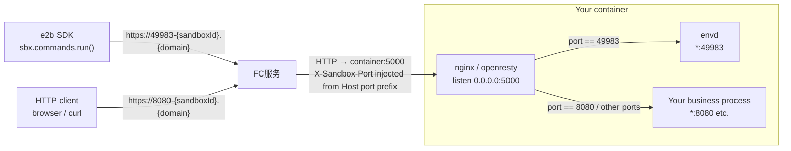
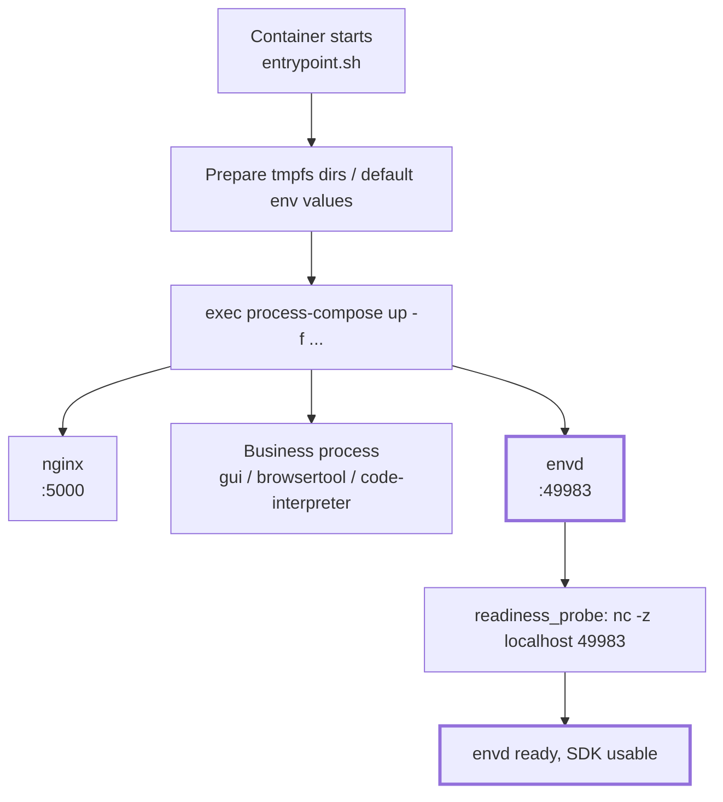
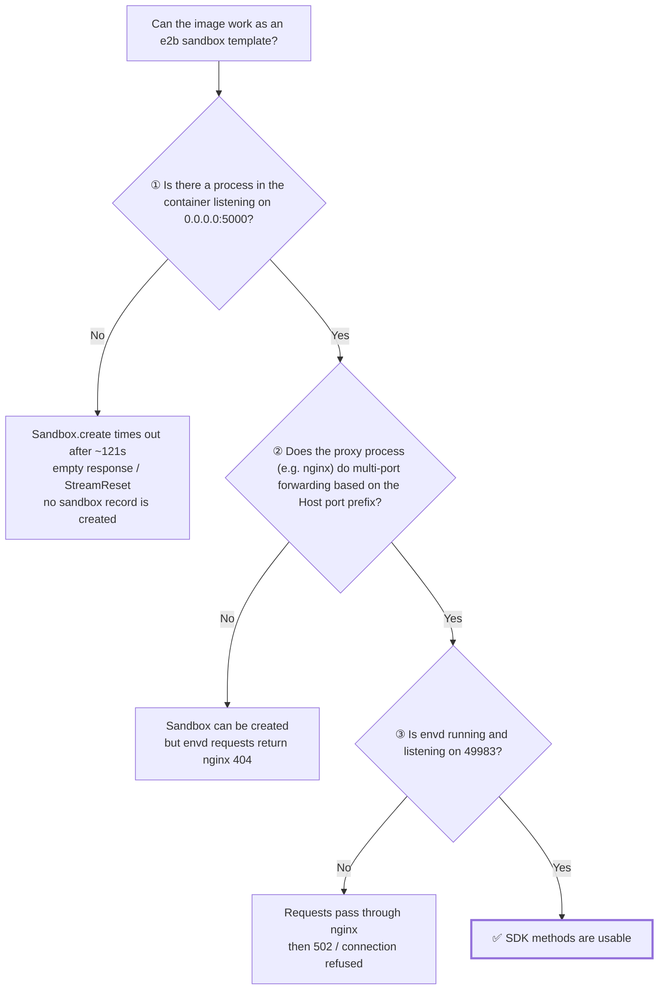
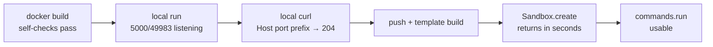

# envd Integration Tutorial: Turn Your Own Image into an e2b Sandbox Template

This guide uses the `sandbox-all-in-one` image in AgentRun as an example to walk through the full process of turning an ordinary container image into a working e2b sandbox template.
**The example is just a vehicle—what matters is understanding the principles**: as long as the three necessary conditions in this guide are met, any image can be adapted the same way.

In addition to the three envd-specific conditions, the image must also satisfy the platform's hard requirements listed in [Build Custom Image Templates](../04.Features/02.Templates/03.Build Custom Image Templates.md): `linux/amd64` architecture, ACR image acceleration disabled, writable `/etc/passwd` and `/etc/group`, and a fixed `/bin/bash` path for `commands.run` and PTY.

- Target readers: You have your own container image and want e2b SDK capabilities such as `commands.run` and `files` to work inside it.
- Prerequisites: You can `docker build` / `docker push` to ACR, and you have an e2b `API_KEY` / `API_URL` / `DOMAIN`.

---

## 1. Why envd Is Needed

Some e2b SDK capabilities do not talk directly to your business process; instead, they talk to an **agent process called `envd`** inside the sandbox:

| SDK call | What actually happens |
|---|---|
| `sbx.commands.run("ls")` | The request goes to envd inside the sandbox; envd forks the process in the container and streams back stdout/stderr. |
| `sbx.files.write(...)` | The request goes to envd, which writes it to disk. |
| `others` | ... |

Therefore: **if envd is missing from the image, or envd is running but gateway traffic cannot reach it, some SDK methods will simply not work**—even if `Sandbox.create()` succeeds and your business process is healthy.

The envd binary comes from the official runtime base image:

```
fc-e2b-registry.cn-hangzhou.cr.aliyuncs.com/runtime/base:v0.0.44  →  /.fce2b/envd
```

It listens on `0.0.0.0:49983` and returns `204` for `GET /health`.

---

## 2. How It Works

### 2.1 Request flow: all traffic enters through port 5000 and is split by port prefix

This is the most counter-intuitive and error-prone part of the whole mechanism:



Key points:

1. The gateway **only sends traffic to port 5000 of the container**, regardless of which port the target service actually listens on.
2. The real target port is carried in the **`X-Sandbox-Port` header**.
3. **nginx inside the container** parses the port and then `proxy_pass`es to `127.0.0.1:{port}`.
4. envd on port 49983 uses exactly this path—so **nginx multi-port routing is just as important as envd itself**.
5. For an HTTP client accessing port 8080, the request URL is `https://8080-{sandboxId}.{domain}`; the FC service recognizes the target port from the `8080-` prefix in the Host header and automatically injects `X-Sandbox-Port: 8080` into the request sent to the container. nginx then forwards the traffic to the business process at `127.0.0.1:8080`.

### 2.2 Startup flow: process-compose launches envd

Image metadata for `sandbox-all-in-one`:

```
Entrypoint: ["/usr/local/bin/entrypoint.sh"]
Cmd:        ["process-compose","up","--tui=false","--no-server"]
```



Integrating envd means **adding the `D3` branch to this diagram**: feed process-compose one more configuration file.

### 2.3 Three necessary conditions {#three-conditions}



Of the three conditions, **only ③ is what this tutorial adds**; ① and ② depend on what your image already looks like:

- Based on an official `sandbox-*` image: ① and ② are usually already satisfied (**exception**: the standalone `sandbox-browser-tool` image satisfies neither)
- Using **your own image**: ① and ② are likely both missing. You will need to add an nginx/openresty layer yourself; see [Section 6](#porting)

---

## 3. Hands-on: Using all-in-one as an example

You only need three files in the directory (full version in `case3-all-in-one/`):

```
case3-all-in-one/
├── Dockerfile
├── process-compose.envd.yaml
├── build.py     # docker build → push → e2b template build
└── run.py       # create sandbox and verify envd
```

### Step 1: Write the process-compose config for envd

`process-compose.envd.yaml`:

```yaml
version: "0.5"

processes:
  envd:
    # [PC-START] makes it easy to assess startup time in logs
    command: "sh -c 'echo \"[PC-START] envd $(date +%Y-%m-%dT%H:%M:%S)\"; exec /usr/local/bin/envd'"
    availability:
      restart: "always"        # envd must be restarted automatically; otherwise the whole sandbox loses SDK capabilities
      backoff_seconds: 2
    readiness_probe:
      exec:
        command: "sh -c 'nc -z localhost 49983'"
      initial_delay_seconds: 0
      period_seconds: 10
      timeout_seconds: 2
      success_threshold: 1
      failure_threshold: 3
    log_configuration:
      disable_json: true
      no_metadata: false
      add_timestamp: true
      timestamp_format: "2006-01-02 15:04:05.000"
      fields_to_append:
        - level=INFO
```

Using `exec` in `command` is key: it makes envd replace `sh` as the main process of the process group, so process-compose's restart/signal handling works directly on envd.

### Step 2: Fork the vendor entrypoint.sh and add one line {#fork-entrypoint}

The config list is assembled by the entrypoint, and **the same image may switch how it does this between versions**, so the first thing to do is extract that script verbatim (**do not copy by hand**):

```bash
IMG=serverless-registry.cn-hangzhou.cr.aliyuncs.com/functionai/sandbox-all-in-one:v0.10.1
cid=$(docker create $IMG)
docker cp "$cid":/usr/local/bin/entrypoint.sh ./entrypoint.sh && docker rm "$cid"

grep -n process-compose ./entrypoint.sh
```

What you read is what you will modify. The end of the all-in-one v0.10.1 script is:

```bash
# ── Process-compose config files (pre-generated at build time) ──
# Expand config file paths directly to avoid the overhead of a while loop reading a file
exec process-compose up \
    -f /etc/sandbox/config/process-compose.base.yaml \
    -f /etc/sandbox/config/process-compose.gui.yaml \
    -f /etc/sandbox/config/process-compose.browsertool.yaml \
    -f /etc/sandbox/config/process-compose.code-interpreter.yaml \
    --tui=false --no-server 2>&1
```

**Do not `sed` it in place**—regular expressions have to match the upstream line format, and upstream formatting changes can silently break the match.
Fork the whole file, add one line, and `COPY` it back. That makes the startup logic a file you can read from top to bottom in your own repo.

Add only two lines to the extracted copy (comments cannot go inside `\` continuations, so place the comment above `exec`):

```diff
  # ── Process-compose config files (pre-generated at build time) ──
  # Expand config file paths directly to avoid the overhead of a while loop reading a file
+ # [envd] The following -f …process-compose.envd.yaml is the only change relative to the vendor file
  exec process-compose up \
+     -f /etc/sandbox/config/process-compose.envd.yaml \
      -f /etc/sandbox/config/process-compose.base.yaml \
      -f /etc/sandbox/config/process-compose.gui.yaml \
      -f /etc/sandbox/config/process-compose.browsertool.yaml \
      -f /etc/sandbox/config/process-compose.code-interpreter.yaml \
      --tui=false --no-server 2>&1
```

Dockerfile:

```dockerfile
# Stage 1: Extract the envd binary from the runtime base image
FROM fc-e2b-registry.cn-hangzhou.cr.aliyuncs.com/runtime/base:v0.0.44 AS envd-extract

# Stage 2: Target image
FROM serverless-registry.cn-hangzhou.cr.aliyuncs.com/functionai/sandbox-all-in-one:v0.10.1

# Copy the envd binary
COPY --from=envd-extract /.fce2b/envd /usr/local/bin/envd

# Add envd's process-compose config
COPY process-compose.envd.yaml /etc/sandbox/config/process-compose.envd.yaml

# Keep a copy of the vendor original for the exact-diff guard below
RUN cp /usr/local/bin/entrypoint.sh /tmp/entrypoint.vendor.sh
COPY entrypoint.sh /usr/local/bin/entrypoint.sh

# Build-time guard: assert this copy differs from vendor by exactly the two expected added lines
RUN set -eu; \
    chmod 0755 /usr/local/bin/entrypoint.sh; \
    diff /tmp/entrypoint.vendor.sh /usr/local/bin/entrypoint.sh > /tmp/entrypoint.diff || true; \
    echo "--- diff vs vendor:"; cat /tmp/entrypoint.diff; \
    [ "$(grep -c '^<' /tmp/entrypoint.diff)" = "0" ] \
      || { echo "Lines present in vendor but missing here (usually upstream changed after the fork); please re-fork"; exit 1; }; \
    [ "$(grep -c '^>' /tmp/entrypoint.diff)" = "2" ] \
      || { echo "Expected exactly 2 added lines relative to vendor; please re-fork"; exit 1; }; \
    grep -q '^> # \[envd\]' /tmp/entrypoint.diff; \
    grep -qE '^> +-f /etc/sandbox/config/process-compose\.envd\.yaml \\$' /tmp/entrypoint.diff; \
    bash -n /usr/local/bin/entrypoint.sh; \
    rm -f /tmp/entrypoint.vendor.sh /tmp/entrypoint.diff
```

The checks after `diff` are **not decorative; they are build-time guards**. Please copy this habit:

| Check | What it catches |
|---|---|
| `grep -c '^<' = 0` | You deleted or altered vendor lines, usually because upstream changed after you forked |
| `grep -c '^>' = 2` | Your copy does not contain exactly the two expected added lines |
| `grep -q '^> # \[envd\]'` / `grep -qE '^> +-f …envd\.yaml \\$'` | The two added lines are not the expected comment and `-f` line |
| `bash -n` | Syntax errors such as broken line continuations or quotes |
| `rm` cleanup | Prevents the diff artifacts from ending up in the image layer |

**Why this pedantry is worth it**: you are patching a script inside someone else's image; upstream changes can silently break an in-place `sed`. An exact-diff guard fails the build immediately when the fork is stale or the edit is wrong, which is much cheaper than debugging after push, template build, and sandbox creation.

> Concrete pitfall: in-place `sed` can insert the envd config path as a shell command if the anchor pattern accidentally matches an existence-check loop. That path is valid shell syntax, so `bash -n` does not catch it. Only a structural or exact-diff assertion catches the damage.

### Step 3: Local validation (the cheapest round) {#local-validation}

Push and template builds are slow; **validate everything you can locally first**. Use the same specs as the template (the example uses 4C8G):

```bash
docker build --platform linux/amd64 -t my-envd-image:local .
docker run -d --name t --cpus 4 --memory 8g -p 15000:5000 my-envd-image:local

# ① Check that envd is running and that 49983 and 5000 are listening
docker exec t ps -ef | grep -E 'process-compose|envd'
docker exec t ss -ltn

# ② Direct connection to envd inside the sandbox (expect 204)
docker exec t curl -s -o /dev/null -w '%{http_code}\n' http://localhost:49983/health

# ③ Simulate the gateway: send Host-with-port-prefix traffic to 5000 and see if it reaches envd (expect 204)
curl -s -o /dev/null -w '%{http_code}\n' \
     -H 'Host: 49983-x.cn-beijing.e2b.fc.aliyuncs.com' http://127.0.0.1:15000/health

# ④ Unknown paths should return envd's own 404 text, not nginx's 404 HTML
curl -s -H 'Host: 49983-x.cn-beijing.e2b.fc.aliyuncs.com' http://127.0.0.1:15000/__nope

# ⑤ Without the port prefix, your existing business routes should be unaffected
curl -s -o /dev/null -w '%{http_code}\n' http://127.0.0.1:15000/health
```

Step ③ is the most valuable: it locally verifies all three conditions from [2.3](#three-conditions) at once.

### Step 4: Push and build the template

Note that **the push address and the template pull address are different**: push goes over the public network, while the template build service pulls the image inside the VPC. The registry endpoints must be in the **same region and same Alibaba Cloud account** as the template build service.

```python
REGISTRY     = "<your-public-acr-endpoint>.cr.aliyuncs.com"      # for push; same region/account as template build
REGISTRY_VPC = "<your-vpc-acr-endpoint>.cr.aliyuncs.com"         # for from_image; same region/account as REGISTRY
REPO, TAG = "runtime/envd-all-in-one", "v2"

IMAGE      = f"{REGISTRY}/{REPO}:{TAG}"
FROM_IMAGE = f"{REGISTRY_VPC}/{REPO}:{TAG}"

subprocess.run(["docker", "build", "--platform", "linux/amd64", "-t", IMAGE, "."], check=True)
subprocess.run(["docker", "push", IMAGE], check=True)

build = Template.build(
    Template().from_image(FROM_IMAGE),
    name="envd-all-in-one-4c8g-v2",
    cpu_count=4,
    memory_mb=8192,
    skip_cache=False,                                    # backend does not support force
    on_build_logs=default_build_logger(),
    headers={"X-E2B-Template-Build-Mode": "direct"},
    api_key=API_KEY, api_url=API_URL, domain=DOMAIN,
)
```

**Two platform-side limits: you must change the name before rerunning the script**:

| Limit | Error | Workaround |
|---|---|---|
| ACR tag cannot be overwritten | `tag[v1] is already existed` | Change tag: v1 → v2 → v3 |
| A template name can only be built once | `409 … only a single build` | Change template name |
| force is not supported | `400: force is not supported` | Keep `skip_cache=False` |

### Step 5: Create a sandbox and verify

```python
sbx = Sandbox.create(template="envd-all-in-one-4c8g-v2", timeout=900, api_key=..., api_url=..., domain=...)
try:
    # After create returns, envd may not yet be routed by the gateway (larger images cold-start slower), so retry the first command
    for i in range(12):
        try:
            sbx.commands.run("true")
            break
        except Exception as exc:
            print(f"waiting for envd ({i + 1}/12): {type(exc).__name__}")
            time.sleep(15)

    print(sbx.commands.run("ps -ef | grep -E 'process-compose|envd'").stdout)
    print(sbx.commands.run("nc -z localhost 49983 && curl -s -o /dev/null -w '%{http_code}' localhost:49983/health").stdout)
finally:
    sbx.kill()
```

Expected output (actual):

```
sandbox_id: sbx-c64b949e-2647-42ec-a796-83c2c9a7ab53
OK   envd reachable (attempt 1)
root  1  0  process-compose up -f …process-compose.envd.yaml -f …base.yaml -f …gui.yaml …
root 21  1  /usr/local/bin/envd
OK   envd process running
OK   port 49983 listening
OK   envd /health -> 204
```

The first line showing `envd.yaml` in the `process-compose up` arguments, and the second line showing the envd process, are the acceptance criteria.

---

## 4. Acceptance Checklist



- [ ] The exact-diff guard in `RUN` passes: exactly two expected lines added relative to the vendor entrypoint (and `nginx -t` if applicable)
- [ ] `docker exec … ss -ltn` shows `0.0.0.0:5000` and `*:49983`
- [ ] Inside the sandbox `curl localhost:49983/health` → 204
- [ ] Locally `-H 'Host: 49983-x.<domain>'` to 5000 → 204 (**this is the most important one**)
- [ ] Without the port prefix, existing business routes behave the same as before
- [ ] `Sandbox.create` returns in seconds (**not** hanging for ~121s then erroring)
- [ ] The first `commands.run` retries and eventually succeeds
- [ ] `finally` calls `sbx.kill()`; don't leave the sandbox running

---

## 5. Troubleshooting Guide

| Symptom | Root cause | Fix |
|---|---|---|
| `Sandbox.create` hangs for ~120s then `StreamReset` / empty response; the sandbox is not found in `GET /sandboxes` | No process in the container is listening on **5000**; the gateway disconnects before readiness | Make nginx (or any reverse proxy) `listen 0.0.0.0:5000` |
| Sandbox is created, but SDK requests return **openresty 404 HTML** | nginx lacks **multi-port routing**; the 49983 request is not forwarded | Add the multi-port config from [Section 6](#porting) |
| Requests pass through nginx then return **502 / connection refused** | envd is not running | `ps -ef` to check envd; verify the entrypoint patch took effect |
| The entrypoint `-f` list **does not** contain `envd.yaml` | The fork is based on an old vendor script, or the change did not land in the config list that actually runs | Re-fork from the vendor original as in [Step 2](#fork-entrypoint) and keep the exact-diff guard in `RUN` |
| Container exits immediately with `syntax error near unexpected token` | Entrypoint syntax was broken (usually a broken line continuation) | `bash -n` to locate; re-fork from the vendor original instead of hand-editing |
| `docker push` fails with `tag is already existed` | ACR tag cannot be overwritten | Change tag |
| Template build fails with `409 … only a single build` | A template name can only be built once | Change template name |
| `run_code` returns 502 but `commands.run` works | Gateway routing issue for the business process (5001), **not envd-related** | Self-check with `curl localhost:5001/health` inside the sandbox; troubleshoot on the business side |

**Recommended troubleshooting order**: reproduce locally with `docker run` first. Most symptoms above can be reproduced locally—only suspect the platform side if you cannot reproduce locally.

> One lesson learned: case2 (browser-tool) was once misdiagnosed as "image too large causing cold-start timeout".
> We flattened the image (8.33GB → 5.51GB) — **completely ineffective**.
> The actual counterexample: the working computer-use image (6.51GB) was larger than the failing browser-tool (5.51GB).
> The real cause was that nginx was not listening on 5000. **Don't guess by intuition; do controlled experiments: compare a working image and the failing image item by item.**

---

## 6. Porting to Your Own Image {#porting}

```mermaid
flowchart TD
    A["Your image"] --> B{"Does it have process-compose?"}
    B -->|Yes| B1["Add process-compose.envd.yaml<br/>register via mechanism A/B/C"]
    B -->|No<br/>(custom entrypoint)| B2["Start envd in the background from entrypoint<br/>or use supervisord to manage it"]
    B1 --> C{"Is there a process listening on 5000 in the container?"}
    B2 --> C
    C -->|Has nginx/openresty| C1{"Does it do multi-port forwarding?"}
    C -->|No| C2["Add an openresty layer<br/>listen 5000 + multi-port routing"]
    C1 -->|Yes| D["✅ Just integrate envd"]
    C1 -->|No| C3["Add multi-port routing config"]
    C2 --> D
    C3 --> D
```

### 6.1 No process-compose: run envd directly in the entrypoint

You don't have to introduce process-compose just for envd. The minimal change for an image with its own `entrypoint.sh`:

```dockerfile
COPY --from=envd-extract /.fce2b/envd /usr/local/bin/envd
```

Add a daemon loop before your business process in your own entrypoint:

```bash
# Auto-restart envd when it crashes (equivalent to process-compose restart: always)
( while true; do /usr/local/bin/envd; echo "envd exited($?), restarting" >&2; sleep 2; done ) &
```

For production, prefer a process manager such as supervisord / s6; the semantics only need to align with `restart: always`.
The key point is: **envd must stay resident and be restarted automatically when it crashes**—if it dies, all SDK capabilities of the sandbox disappear.

### 6.2 No multi-port reverse proxy on 5000: add an openresty layer

This config was verified on `sandbox-browser-tool` and can be reused directly (it requires openresty because it uses lua).

`nginx.conf` server block:

```nginx
server {
    listen 0.0.0.0:5000;      # ① The gateway only recognizes 5000
    server_name _;
    include conf.d/*.conf;    # multi-port routing + your own business routes
}
```

`http` block level (place in `http.d/00-multiport.conf` or similar, included into the http block):

```nginx
map $http_upgrade $connection_upgrade {
    default upgrade;
    '' close;
}

# Let rewrite_by_lua run before ngx_rewrite's return/rewrite,
# otherwise envd's /health will be answered early by your own `location = /health { return 200 ... }`
rewrite_by_lua_no_postpone on;
```

`server` block level (place in `conf.d/00-multiport-routes.conf`; the `00-` prefix ensures it is included first):

```nginx
set $target_port "";

# Placed at server level → inherited by all locations → port-prefixed requests can be hijacked
# before exact/prefix locations like location = /health or location ~ ^/api/
rewrite_by_lua_block {
    local port = ngx.var.http_x_sandbox_port
    if not port or port == "" then
        port = string.match(ngx.var.host or "", "^(%d+)%-")
    end
    if not port then return end
    local port_num = tonumber(port)
    -- Tighten the lower bound as needed to avoid exposing internal ports to the public internet
    if not port_num or port_num <= 2999 or port_num > 65535 then return end
    ngx.var.target_port = port
    ngx.exec("@multiport")
}

location @multiport {
    # Must override the inherited server-level rewrite_by_lua_block,
    # otherwise the internal redirect re-enters ngx.exec → redirect loop
    rewrite_by_lua_block { return }

    proxy_pass http://127.0.0.1:$target_port;
    proxy_set_header Host localhost:$target_port;
    proxy_set_header X-Real-IP $remote_addr;
    proxy_set_header X-Forwarded-For $proxy_add_x_forwarded_for;
    proxy_set_header X-Forwarded-Proto $scheme;

    proxy_connect_timeout 7d;
    proxy_send_timeout 7d;
    proxy_read_timeout 7d;

    # envd uses the connect protocol and requires HTTP/1.1 with buffering off
    proxy_http_version 1.1;
    proxy_set_header Upgrade $http_upgrade;
    proxy_set_header Connection $connection_upgrade;
    proxy_buffering off;
    proxy_request_buffering off;
}
```

When adding it to the Dockerfile, include the same build-time self-checks:

```dockerfile
COPY nginx-multiport-http.conf   /etc/nginx/http.d/00-multiport.conf
COPY nginx-multiport-routes.conf /etc/nginx/conf.d/00-multiport-routes.conf
RUN nginx -t
```

> Scope note: this config was verified on vendor images that already have openresty.
> If your image has no nginx at all, the same config should work in principle, but you need to install openresty into the image yourself.
> That path has not been tested—be sure to verify locally with Step ③ from [Step 3](#local-validation) before pushing.

### 6.3 Porting Checklist

| Item | Official `sandbox-*` images | Your own image |
|---|---|---|
| envd binary | `COPY --from=base:v0.0.44 /.fce2b/envd` | Same |
| envd residency | Add `process-compose.envd.yaml` + register | process-compose / supervisord / entrypoint daemon loop |
| 5000 listener | Usually present (browser-tool exception) | Add reverse proxy yourself |
| Multi-port routing | Usually present (browser-tool exception) | Add yourself (see 6.2) |
| Build-time self-checks | `grep -c` + `bash -n` + `nginx -t` | Same |

---

## 7. One-Sentence Summary

**envd integration = place the binary + keep it running + make the reverse proxy on 5000 forward port-49983 traffic to it based on the Host port prefix.**

The first two steps are the same for every image; the third depends on what your image's reverse proxy looks like, and it is the source of almost all hard-to-diagnose failures.
A single local command `curl -H 'Host: 49983-x.<domain>' http://127.0.0.1:15000/health` expecting `204` is the single criterion for whether all three steps were done correctly.
