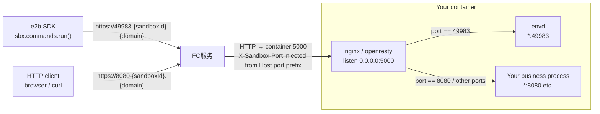
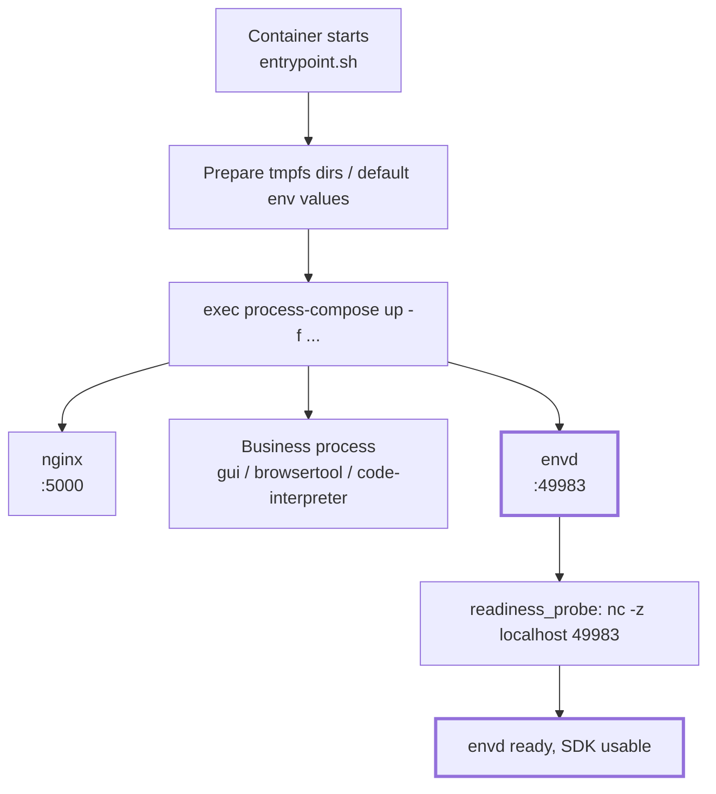
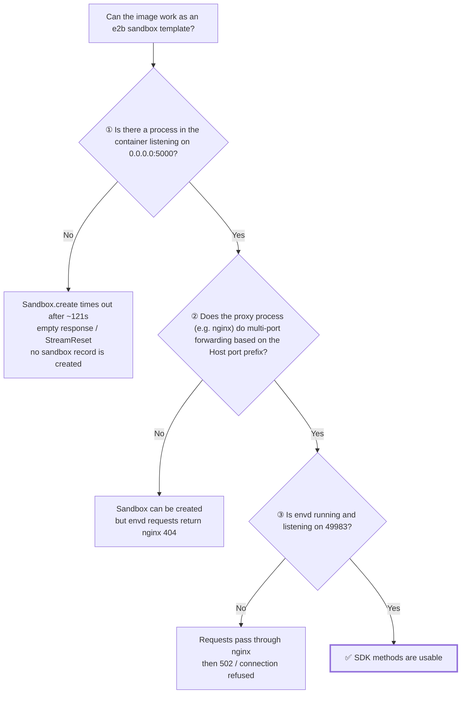
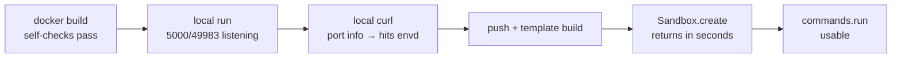
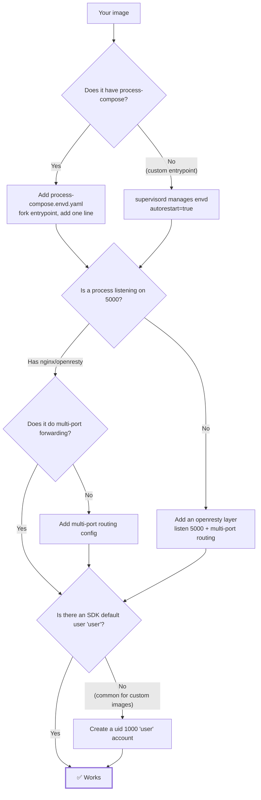

# envd Integration Tutorial: Turn Your Own Image into an e2b Sandbox Template

This guide uses the `sandbox-all-in-one` image in AgentRun as an example to walk through the full process of turning an ordinary container image into a working e2b sandbox template.
**The example is just a vehicle—what matters is understanding the principles**: as long as the three necessary conditions in this guide are met, any image can be adapted the same way.

In addition to the three envd-specific conditions, the image must also satisfy the platform's hard requirements listed in [Build Custom Image Templates](../04.Features/02.Templates/03.Build Custom Image Templates.md): `linux/amd64` architecture, ACR EE image acceleration disabled, writable `/etc/passwd` and `/etc/group`, and a fixed `/bin/bash` path for `commands.run` and PTY.

- Target readers: You have your own container image and want e2b SDK capabilities such as `commands.run` and `files` to work inside it.
- Prerequisites: You can `docker build` / `docker push` to ACR, and you have an e2b `API_KEY` / `API_URL` / `DOMAIN`.

---

## 1. Why envd Is Needed

Some e2b SDK capabilities do not talk directly to your business process; instead, they talk to an **agent process called `envd`** inside the sandbox:

| SDK call | What actually happens |
|---|---|
| `sbx.commands.run("ls")` | The request goes to envd inside the sandbox; envd forks the process in the container and streams back stdout/stderr. |
| `sbx.files.write(...)` | The request goes to envd, which writes it to disk. |
| `others` | ... |

Therefore: **if envd is missing from the image, or envd is running but gateway traffic cannot reach it, some SDK methods will simply not work**—even if `Sandbox.create()` succeeds and your business process is healthy.

The envd binary comes from the official runtime base image:

```
fc-e2b-registry.cn-hangzhou.cr.aliyuncs.com/runtime/base:v0.0.44  →  /.fce2b/envd
```

It listens on `0.0.0.0:49983` and returns `204` for `GET /health`.

> **The envd here can also be a fully custom implementation of your own.**

---

## 2. How It Works

### 2.1 Request flow: all traffic enters through port 5000 and is split by port prefix

This is the most counter-intuitive and error-prone part of the whole mechanism:



Key points:

1. The gateway **only sends traffic to port 5000 of the container**, regardless of which port the target service actually listens on.
2. The real target port is carried in the **`X-Sandbox-Port` header**.
3. **nginx inside the container** parses the port and then `proxy_pass`es to `127.0.0.1:{port}`.
4. envd on port 49983 uses exactly this path—so **nginx multi-port routing is just as important as envd itself**.
5. For an HTTP client accessing port 8080, the request URL is `https://8080-{sandboxId}.{domain}`; the FC service recognizes the target port from the `8080-` prefix in the Host header and automatically injects `X-Sandbox-Port: 8080` into the request sent to the container. nginx then forwards the traffic to the business process at `127.0.0.1:8080`.

### 2.2 Startup flow: process-compose launches envd

Image metadata for `sandbox-all-in-one`:

```
Entrypoint: ["/usr/local/bin/entrypoint.sh"]
Cmd:        ["process-compose","up","--tui=false","--no-server"]
```



Integrating envd means **adding the `D3` branch to this diagram**: feed process-compose one more configuration file.

### 2.3 Three necessary conditions {#three-conditions}



Of the three conditions, **only ③ is what this tutorial adds**; ① and ② depend on what your image already looks like:

- Built on AgentRun's official `sandbox-all-in-one` series: ① and ② are usually already satisfied
- Using **your own image**: ① and ② are likely both missing, so you need to add an nginx/openresty layer yourself; see [Section 6](#porting)

---

## 3. Hands-on: Using all-in-one as an example

Put just these files in the directory:

```
case-all-in-one/
├── Dockerfile
├── process-compose.envd.yaml   # envd process definition
├── entrypoint.sh               # a fork of the vendor original, with only the two envd lines added
├── build.py                    # docker build → push → e2b template build
└── run.py                      # create sandbox and verify envd
```

### Step 1: Write the process-compose config for envd

`process-compose.envd.yaml`:

```yaml
version: "0.5"

processes:
  envd:
    # [PC-START] makes it easy to assess startup time in logs
    command: "sh -c 'echo \"[PC-START] envd $(date +%Y-%m-%dT%H:%M:%S)\"; exec /usr/local/bin/envd'"
    availability:
      restart: "always"        # envd must be restarted automatically; otherwise the whole sandbox loses SDK capabilities
      backoff_seconds: 2
    readiness_probe:
      exec:
        command: "sh -c 'nc -z localhost 49983'"
      initial_delay_seconds: 0
      period_seconds: 10
      timeout_seconds: 2
      success_threshold: 1
      failure_threshold: 3
    log_configuration:
      disable_json: true
      no_metadata: false
      add_timestamp: true
      timestamp_format: "2006-01-02 15:04:05.000"
      fields_to_append:
        - level=INFO
```

Using `exec` in `command` is key: it makes envd replace `sh` as the main process of the process group, so process-compose's restart/signal handling works directly on envd.

### Step 2: Fork the vendor entrypoint.sh and add one line {#fork-entrypoint}

The config list is assembled by the entrypoint, and **the same image may switch how it does this between versions**, so the first thing to do is extract that script verbatim (**do not copy by hand**):

```bash
IMG=serverless-registry.cn-hangzhou.cr.aliyuncs.com/functionai/sandbox-all-in-one:v0.10.1
cid=$(docker create $IMG)
docker cp "$cid":/usr/local/bin/entrypoint.sh ./entrypoint.sh && docker rm "$cid"

grep -n process-compose ./entrypoint.sh
```

What you read is what you will modify. The end of the all-in-one v0.10.1 script is:

```bash
# ── Process-compose config files (pre-generated at build time) ──
# Expand config file paths directly to avoid the overhead of a while loop reading a file
exec process-compose up \
    -f /etc/sandbox/config/process-compose.base.yaml \
    -f /etc/sandbox/config/process-compose.gui.yaml \
    -f /etc/sandbox/config/process-compose.browsertool.yaml \
    -f /etc/sandbox/config/process-compose.code-interpreter.yaml \
    --tui=false --no-server 2>&1
```

**Do not `sed` it in place**—regular expressions have to match the upstream line format, and upstream formatting changes can silently break the match.
Fork the whole file, add one line, and `COPY` it back. That makes the startup logic a file you can read from top to bottom in your own repo.

Add only two lines to the extracted copy (comments cannot go inside `\` continuations, so place the comment above `exec`):

```diff
  # ── Process-compose config files (pre-generated at build time) ──
  # Expand config file paths directly to avoid the overhead of a while loop reading a file
+ # [envd] The following -f …process-compose.envd.yaml is the only change relative to the vendor file
  exec process-compose up \
+     -f /etc/sandbox/config/process-compose.envd.yaml \
      -f /etc/sandbox/config/process-compose.base.yaml \
      -f /etc/sandbox/config/process-compose.gui.yaml \
      -f /etc/sandbox/config/process-compose.browsertool.yaml \
      -f /etc/sandbox/config/process-compose.code-interpreter.yaml \
      --tui=false --no-server 2>&1
```

Dockerfile:

```dockerfile
# Stage 1: Extract the envd binary from the runtime base image
FROM fc-e2b-registry.cn-hangzhou.cr.aliyuncs.com/runtime/base:v0.0.44 AS envd-extract

# Stage 2: Target image
FROM serverless-registry.cn-hangzhou.cr.aliyuncs.com/functionai/sandbox-all-in-one:v0.10.1

# Copy the envd binary
COPY --from=envd-extract /.fce2b/envd /usr/local/bin/envd

# Add envd's process-compose config
COPY process-compose.envd.yaml /etc/sandbox/config/process-compose.envd.yaml

# Keep a copy of the vendor original for the exact-diff guard below
RUN cp /usr/local/bin/entrypoint.sh /tmp/entrypoint.vendor.sh
COPY entrypoint.sh /usr/local/bin/entrypoint.sh

# Build-time guard: assert this copy differs from vendor by exactly the two expected added lines
RUN set -eu; \
    chmod 0755 /usr/local/bin/entrypoint.sh; \
    diff /tmp/entrypoint.vendor.sh /usr/local/bin/entrypoint.sh > /tmp/entrypoint.diff || true; \
    echo "--- diff vs vendor:"; cat /tmp/entrypoint.diff; \
    [ "$(grep -c '^<' /tmp/entrypoint.diff)" = "0" ] \
      || { echo "Lines present in vendor but missing here (usually upstream changed after the fork); please re-fork"; exit 1; }; \
    [ "$(grep -c '^>' /tmp/entrypoint.diff)" = "2" ] \
      || { echo "Expected exactly 2 added lines relative to vendor; please re-fork"; exit 1; }; \
    grep -q '^> # \[envd\]' /tmp/entrypoint.diff; \
    grep -qE '^> +-f /etc/sandbox/config/process-compose\.envd\.yaml \\$' /tmp/entrypoint.diff; \
    bash -n /usr/local/bin/entrypoint.sh; \
    rm -f /tmp/entrypoint.vendor.sh /tmp/entrypoint.diff
```

`ENTRYPOINT` / `CMD` both use what the image ships with—no change needed.

**That `RUN` guard is not decoration; it is the precondition that makes this whole approach viable.**
The cost of forking is "you now own this file, and you won't know when upstream bumps a version"—the guard turns that cost into a single build failure:

| Check | What it catches |
|---|---|
| `^<` count is 0 | Lines in vendor but not in your copy → upstream added a prep step / env-var default / config file and you are still carrying the old script |
| `^>` count is 2 | You added something extra, or upstream deleted a line (e.g. dropped some `-f`) |
| The two `grep`s | Those 2 lines really are envd's comment and `-f`, not some other change |
| `bash -n` | A fork transcribed or edited by hand broke the syntax (line continuations, quotes), so the container exits on start |

Four upstream-drift scenarios were tested; the guard caught all of them:

| Simulated upstream change | Guard result |
|---|---|
| Normal case | PASS |
| Upstream adds a process-compose config file | FAIL: `^<` is not 0 |
| Upstream adds an env-var default | FAIL: `^<` is not 0 |
| Upstream deletes two lines | FAIL: `^>` is not 2 |

> **Don't want to fork?** There is another path: leave the script alone and change `CMD`. The v0.10.1 `entrypoint.sh` leaves an escape hatch **after** all the prep work (tmpfs dirs, 20+ env-var defaults, `trap`):
> ```bash
> if [ $# -gt 0 ] && [ "$1" != "process-compose" ]; then exec "$@"; fi
> [ "$1" = "process-compose" ] && shift
> ```
> So `CMD ["bash","-c","exec process-compose up -f …envd.yaml -f …base.yaml … --tui=false --no-server"]` gets all the prep work for free. **But the first argument must never be `process-compose`**—it would hit the `shift` above, your arguments would be dropped, the vendor's hard-coded list would still run, and it would silently do nothing. This path was also tested and works; the cost is one duplicated config list, plus readers having to understand the escape hatch first.
>
> The one thing you should **not** do is replace `entrypoint.sh` with a script written from scratch: you would have to copy all 100 lines of prep work, and you would never know when upstream changes.

### Step 3: Local validation (the cheapest round) {#local-validation}

Push and template builds are slow; **validate everything you can locally first**. Use the same specs as the template (the example uses 4C8G):

In `-p 15000:5000`, the left side is the **host** port and the right side is the **in-container** port: nginx inside the container listens only on 5000 (and the gateway only recognizes 5000). Which host port you map to is arbitrary; 15000 just avoids colliding with a 5000 already taken on your machine. So below, on the host you `curl 127.0.0.1:15000`, while inside the container via `docker exec` it is `localhost:5000`.

```bash
docker build --platform linux/amd64 -t my-envd-image:local .
docker run -d --name t --cpus 4 --memory 8g -p 15000:5000 my-envd-image:local

# ① Is envd running, and are 49983 and 5000 listening?
docker exec t ps -ef | grep -E 'process-compose|envd'
docker exec t ss -ltn

# ② Direct connection to envd inside the sandbox (expect 204)
docker exec t curl -s -o /dev/null -w '%{http_code}\n' http://localhost:49983/health

# ③ Simulate the gateway: put the target port in the X-Sandbox-Port header, send it to 5000, and see if it reaches envd
#    Expect envd's own plaintext "404 page not found", not openresty's 404 HTML
curl -s -H 'X-Sandbox-Port: 49983' http://127.0.0.1:15000/__nope

# ④ Without any port info, your existing business routes are unaffected
curl -s -o /dev/null -w '%{http_code}\n' http://127.0.0.1:15000/health
```

Step ③ is the most valuable: it locally verifies conditions ①, ②, and ③ from [2.3](#three-conditions) in one shot.

> **Why does ③ use `/__nope` and not `/health`?**
> The nginx that ships with all-in-one has `location = /health { return 200 … }`, and it does **not** enable `rewrite_by_lua_no_postpone on`, so a `/health` request carrying port info gets answered early by that exact location—it actually returns **200 (the vendor's), not 204 (envd's)**, so using it as the criterion would mislead you. Pick a path the vendor does not define (`/__nope`) and the response body is envd's plaintext `404 page not found`.

### Step 4: Push and build the template

Note that **the push address and the template pull address are different**: push goes over the public network, while the template build service pulls the image inside the VPC.

```python
REGISTRY     = "<your-public-acr-ee-endpoint>.cr.aliyuncs.com"   # for push; same account/region as the template build service
REGISTRY_VPC = "<your-vpc-acr-ee-endpoint>.cr.aliyuncs.com"      # for from_image; same account/region as REGISTRY
REPO, TAG = "runtime/envd-all-in-one", "v2"

IMAGE      = f"{REGISTRY}/{REPO}:{TAG}"
FROM_IMAGE = f"{REGISTRY_VPC}/{REPO}:{TAG}"

subprocess.run(["docker", "build", "--platform", "linux/amd64", "-t", IMAGE, "."], check=True)
subprocess.run(["docker", "push", IMAGE], check=True)

build = Template.build(
    Template().from_image(FROM_IMAGE),
    name="envd-all-in-one-4c8g-v2",
    cpu_count=4,
    memory_mb=8192,
    skip_cache=False,
    on_build_logs=default_build_logger(),
    headers={"X-E2B-Template-Build-Mode": "direct"},
    api_key=API_KEY, api_url=API_URL, domain=DOMAIN,
)
```

**Two platform-side limits: you must change the name before rerunning the script**:

| Limit | Error | Workaround |
|---|---|---|
| ACR EE tag, if configured as immutable | `tag[v1] is already existed` | Change tag: v1 → v2 → v3 |
| A template name can only be built once | `409 … only a single build` | Change template name |

### Step 5: Create a sandbox and verify

```python
sbx = Sandbox.create(template="envd-all-in-one-4c8g-v2", timeout=900, api_key=..., api_url=..., domain=...)
try:
    # After create returns, envd may not yet be routed by the gateway (larger images cold-start slower), so retry the first command.
    # Probe with `echo` rather than `true`: it also verifies stdout comes back —
    # if envd can fork the process but the output stream is broken, a command with no output would still pass
    for i in range(12):
        try:
            assert sbx.commands.run("echo envd-ok").stdout.strip() == "envd-ok"
            break
        except Exception as exc:
            print(f"waiting for envd ({i + 1}/12): {type(exc).__name__}")
            time.sleep(15)

    print(sbx.commands.run("ps -ef | grep -E 'process-compose|envd'").stdout)
    print(sbx.commands.run("nc -z localhost 49983 && curl -s -o /dev/null -w '%{http_code}' localhost:49983/health").stdout)
finally:
    sbx.kill()
```

Expected output (actual):

```
sandbox_id: sbx-4ef4c439-6cda-4f40-908b-293ad543ad68
OK   envd reachable, stdout comes back (attempt 1)
root  1  0  process-compose up -f …process-compose.envd.yaml -f …base.yaml -f …gui.yaml …
root 21  1  /usr/local/bin/envd
OK   envd process running
OK   port 49983 listening
OK   envd /health -> 204
```

The first line showing `envd.yaml` in the `process-compose up` arguments, and the second line showing the envd process, are the acceptance criteria.

---

## 4. Acceptance Checklist



- [ ] Exact diff / `bash -n` (and `nginx -t` when applicable) live in `RUN`, so the build fails outright when the patch or fork breaks
- [ ] `docker exec … ss -ltn` shows `0.0.0.0:5000` and `*:49983`
- [ ] Inside the sandbox `curl localhost:49983/health` → 204
- [ ] Locally `-H 'X-Sandbox-Port: 49983'` to an undefined path on 5000 → envd's plaintext 404 (**this is the most important one**)
- [ ] Without any port info, existing business routes behave the same as before
- [ ] `Sandbox.create` returns in seconds (**not** hanging for ~121s then erroring)
- [ ] The first `commands.run` retries and eventually succeeds
- [ ] `finally` calls `sbx.kill()`; don't leave the sandbox running

---

## 5. Troubleshooting Guide

| Symptom | Root cause | Fix |
|---|---|---|
| `Sandbox.create` hangs for ~120s then `StreamReset` / empty response; the sandbox is not found in `GET /sandboxes` | No process in the container is listening on **5000**; the gateway disconnects before readiness | Make nginx (or any reverse proxy) `listen 0.0.0.0:5000` |
| Sandbox is created, but SDK requests return **openresty 404 HTML** | nginx lacks **multi-port routing**; the 49983 request is not forwarded | Add the multi-port config from [Section 6](#porting) |
| Requests pass through nginx then return **502 / connection refused** | envd is not running | `ps -ef` to check envd; then verify the entrypoint patch took effect |
| The entrypoint `-f` list **does not** contain `envd.yaml` | The fork is based on an old script, or the change did not land in the config list that actually runs | Re-fork from the vendor original as in [Step 2](#fork-entrypoint), and add the exact-diff guard into `RUN` |
| Container exits on start with `syntax error near unexpected token` | Entrypoint syntax was broken (usually a broken line continuation) | `bash -n` to locate; re-fork from the vendor original |
| `docker push` fails with `tag is already existed` | ACR EE tag cannot be overwritten | Change tag |
| Template build fails with `409 … only a single build` | A template name can only be built once | Change template name |

**Recommended troubleshooting order**: reproduce locally with `docker run` first. Most symptoms above can be reproduced locally—only suspect the platform side when you cannot.

---

## 6. Porting to Your Own Image {#porting}



**Every conclusion in this section was verified on the standalone sample project [`e2b-custom-image`](https://github.com/aliyun-fc/fc-e2b-samples/tree/main/e2b-custom-image)** (clone and run it directly): starting from `debian:bookworm-slim`, you install openresty, write the multi-port routing, and manage envd with supervisord yourself. The full path works end to end: build → local validation → push → template build → sandbox creation → `commands.run` / `files`. The final image is **235MB** (versus 2.34GB–6.51GB for the vendor-image-based variants).

```
e2b-custom-image/
├── Dockerfile                    # debian-slim + openresty + supervisor + envd + user account
├── nginx.conf                    # ① listen 0.0.0.0:5000
├── nginx-multiport-http.conf     # ② http level: map + rewrite_by_lua_no_postpone
├── nginx-multiport-routes.conf   # ② server level: multi-port routing
├── nginx-app-routes.conf         # business routes (incl. location = /health, the intentional early-answer trap)
├── supervisord.conf              # ③ main config: nodaemon + socket + include conf.d
├── supervisor-envd.conf          # ③ envd — the one file you can copy wholesale into your image
├── supervisor-openresty.conf     # reverse proxy (daemon off + stopsignal=QUIT)
├── supervisor-app.conf           # example business process
├── entrypoint.sh                 # only prepares dirs + exec supervisord
├── app.py                        # example business process (127.0.0.1:8000)
├── verify-local.sh               # Step 3 local validation, ①–⑦ seven assertion groups
├── build.py                      # docker build → push → template build
├── run.py                        # create sandbox and verify envd / supervisord status / user / files
├── requirements.txt              # e2b SDK + python-dotenv
└── env.example                   # E2B_API_KEY / _API_URL / _DOMAIN, copy to .env
```

An image built from scratch (the sample uses `debian:bookworm-slim`) means adding the four things below yourself, versus AgentRun's official `sandbox-*` images that ship with them. **The full config, build-time guardrails, and observed failure output for each live in the project.** See the project [README](https://github.com/aliyun-fc/fc-e2b-samples/blob/main/e2b-custom-image/README.md) §1–§4 for the per-file design rationale; here we keep only "the one thing you must remember" and the corresponding file.

### 6.1 Four things to add

| What to add | The one thing you must remember | Full config |
|---|---|---|
| **① Keep envd resident**<br/>supervisord instead of process-compose | If envd dies, all sandbox SDK capabilities are lost. `autorestart=true` **is not enough**: supervisord defaults to `startretries=3`, so after 3 rapid failures it enters **FATAL and never restarts again** → "fine for the first few minutes, then all SDK calls 502". You must raise `startretries` to a huge value | [`supervisor-envd.conf`](https://github.com/aliyun-fc/fc-e2b-samples/blob/main/e2b-custom-image/supervisor-envd.conf) · [`supervisord.conf`](https://github.com/aliyun-fc/fc-e2b-samples/blob/main/e2b-custom-image/supervisord.conf) |
| **② Multi-port reverse proxy on 5000**<br/>install openresty yourself | Must be openresty, not nginx (multi-port routing needs `rewrite_by_lua`, and Debian's `nginx` package has no lua). It also needs `rewrite_by_lua_no_postpone on;`, otherwise envd's `/health` gets answered by your own `location = /health` | [`nginx.conf`](https://github.com/aliyun-fc/fc-e2b-samples/blob/main/e2b-custom-image/nginx.conf) · [`nginx-multiport-http.conf`](https://github.com/aliyun-fc/fc-e2b-samples/blob/main/e2b-custom-image/nginx-multiport-http.conf) · [`nginx-multiport-routes.conf`](https://github.com/aliyun-fc/fc-e2b-samples/blob/main/e2b-custom-image/nginx-multiport-routes.conf) |
| **③ SDK default user `user`**<br/>the 4th condition beyond the three in [2.3](#three-conditions) | Without `user=`, every `commands.run` drops privileges to the `user` account; without that account → `AuthenticationException: unknown user`. Yet the sandbox is created, envd is running, and `/health` returns 204 — all three necessary conditions green, making this the easiest to misdiagnose | [`Dockerfile`](https://github.com/aliyun-fc/fc-e2b-samples/blob/main/e2b-custom-image/Dockerfile) (`useradd --uid 1000`) |
| **④ China-region build + runtime guardrails** | Four "builds fine, blows up only at runtime" traps: `deb.debian.org` unreachable in China, `python3-minimal` missing stdlib keeps the business port at 502 forever, slim has no `ss`, and bookworm mirror swaps must use deb822. General fix: for anything like this, add an assertion into `RUN` | [`Dockerfile`](https://github.com/aliyun-fc/fc-e2b-samples/blob/main/e2b-custom-image/Dockerfile) |

> **Acceptance must verify "it recovers after a crash", not just "it's running now".** Item ⑦ in the project's [`verify-local.sh`](https://github.com/aliyun-fc/fc-e2b-samples/blob/main/e2b-custom-image/verify-local.sh): after `pkill -9 envd`, port 49983 is listening again within 6s **and** `supervisorctl status envd` returns to **RUNNING** (before entering FATAL, supervisord also restarts a few times, so checking only the port misses it; `STARTING`/`BACKOFF` are transient states, so poll rather than sample once). Also, `files` and `commands` go through different envd interfaces, so [`run.py`](https://github.com/aliyun-fc/fc-e2b-samples/blob/main/e2b-custom-image/run.py) does a `files.write` / `files.read` round-trip in addition to `whoami`.

### 6.2 Porting Checklist

| Item | Official `sandbox-*` images | Your own image |
|---|---|---|
| envd binary | `COPY --from=base:v0.0.44 /.fce2b/envd` | Same (statically linked, works across distros) |
| envd residency | Add `process-compose.envd.yaml` + register | supervisord-managed + raise `startretries` |
| 5000 listener | Usually present (browser-tool exception) | Install openresty yourself |
| Multi-port routing | Usually present (browser-tool exception) | Write the lua route yourself |
| `user` account | Built in | **Must create it yourself** |
| Build-time self-checks | Exact diff vs vendor original + `bash -n` + `nginx -t` | `openresty -t` + semantic `grep` + `id user` + dependency `import` |

> Full source and per-item design rationale: standalone project [`e2b-custom-image`](https://github.com/aliyun-fc/fc-e2b-samples/tree/main/e2b-custom-image); clone it to reproduce the whole flow.

---

## 7. One-Sentence Summary

**envd integration = place the binary + keep it running + make the reverse proxy on 5000 forward port-49983 traffic to it based on the Host port prefix (or the `X-Sandbox-Port` header).**

The first two steps are the same for every image; the third depends on what that reverse-proxy layer in your image looks like, and it is the source of almost all hard-to-diagnose failures.

After starting the container locally (`-p 15000:5000`), a single command is the one criterion for all three—pick a path your business **does not** define, or your own `location` will answer it early (see [Step 3](#local-validation)):

```bash
curl -s -H 'X-Sandbox-Port: 49983' http://127.0.0.1:15000/__nope   # expect envd's plaintext 404 page not found
```
