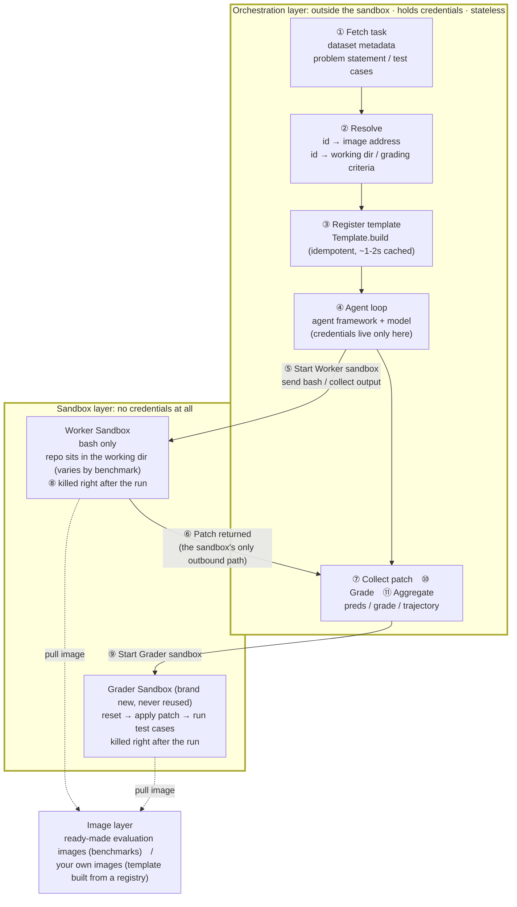

# Build a SWE Agent

A SWE Agent (software engineering agent) automates development tasks such as fixing issues and generating pull requests: give it a defect description for a real repository, and it reads code, edits files, and runs tests inside a sandbox, finally producing a patch. The industry-standard way to evaluate one is to run a benchmark such as SWE-bench—each task provides an image containing the repository at the defect commit, and test cases decide whether the patch actually fixed the problem.

This guide walks through the full loop of "agent fixes → produces a patch → we decide whether it is fixed" on Agent Sandbox, using one real SWE-bench-style task as the example, then extends it to batch evaluation and explains how to onboard images for your own repositories. The code in this guide can be copied and run as-is.

## Scenarios

- You need a reproducible evaluation base to compare different models and prompts on real repository defects under one consistent standard.
- The agent executes repository code and tests, so it needs strong isolation to avoid affecting your local machine or CI runners.
- Batch evaluation runs dozens or hundreds of instances at once, so it needs per-instance isolation, immediate teardown, and controllable cost.
- You want to build a private evaluation set from your own repositories, reusing the same agent and grading pipeline.

## Prerequisites

- Agent Sandbox is enabled and you have an `E2B_API_KEY` for the target region. This guide uses China (Shanghai) as the example; its domain is `cn-shanghai.e2b.fc.aliyuncs.com`, from which the SDK derives the API address `https://api.cn-shanghai.e2b.fc.aliyuncs.com`.
- A working model API key (this guide uses an OpenAI-compatible endpoint).
- Python 3.10 or later.

> An API key is bound to its region. Using it against another region returns 401.

## Architecture



The model runs in the orchestration layer and the sandbox only executes bash, so neither the model key nor repository credentials ever enter the sandbox. Even if the repository content the agent reads contains malicious instructions, the worst it can do is submit an invalid patch; it cannot obtain any credentials.

## A task has three parts

The example task in this guide is `getmoto__moto-7365`: moto's DynamoDB `update_item` used floating-point arithmetic for `ADD` expressions, so an amount came out as `Decimal('11.700000000000003')`; it should use exact `Decimal` arithmetic.

| Part | Content | Source |
| --- | --- | --- |
| Environment | Image `fc-e2b-registry.cn-shanghai.cr.aliyuncs.com/swebench/sweb.eval.x86_64:envd_v_0_0_41_getmoto_s_moto-7365-latest_202607231510`, with the repository and dependencies installed | Ready-made evaluation image |
| Task | The problem statement (`problem_statement`) and defect baseline (`base_commit`) | Upstream dataset |
| Grading | `FAIL_TO_PASS` (must pass after the fix), `PASS_TO_PASS` (must not regress), `test_patch` | Upstream dataset |

The image is only the environment; the task, correct baseline, and test cases live in the metadata. With the image alone and no metadata, there is no task to run. The image's `HEAD` must also match `base_commit`; image immutability alone does not prove that the baseline is correct.

## Install dependencies and configure credentials

```bash
mkdir swe-demo && cd swe-demo
python -m venv .venv
.venv/bin/pip install pyyaml \
  "mini-swe-agent[e2b] @ git+https://github.com/aliyun-fc/mini-swe-agent@v2.4.6-fc.1"

# The SDK derives the endpoint from the domain (https://api.<domain>); no separate api_url needed
export E2B_API_KEY="<your-e2b-api-key>"
export E2B_DOMAIN="cn-shanghai.e2b.fc.aliyuncs.com"
# The model credential is used in the orchestration layer only; it never enters the sandbox.
# The variable name follows from the `openai/` prefix on `model_name` below -- put your
# OpenAI-compatible endpoint's key in it. Using the name LiteLLM recognises is what lets the
# single-task scripts and the batch entry point share one credential
export OPENAI_API_KEY="<your-model-api-key>"
export MSWEA_CONFIGURED=true MSWEA_SILENT_STARTUP=1
```

Check what you got:

```bash
.venv/bin/python -c "import minisweagent; print(minisweagent.__version__)"
# 2.4.6+fc.1
```

> On a restricted network, `git clone https://github.com/aliyun-fc/mini-swe-agent` first, then `git checkout v2.4.6-fc.1`, then `pip install -e ".[e2b]"`.

## Execution environment: use the built-in `e2b`

The agent loop uses the community-standard implementation [mini-SWE-agent](https://github.com/SWE-agent/mini-swe-agent) directly, keeping its official prompts and submission protocol, and only replacing the execution backend with Agent Sandbox. The version installed above ships an `e2b` execution environment, so one line of configuration is all you need -- there is nothing to implement:

```yaml
environment:
  environment_class: e2b
```

What it does: the first time an image is used it is registered as a persistent template (`Template.build`) and reused from cache afterwards; each instance gets its own sandbox, commands are dispatched through `commands.run`, and the patch comes back over the official submission protocol.

Agent Sandbox differs from local docker in five ways, and the built-in class handles all of them. You will still hit them if you implement your own backend or debug a failing run:

| Difference | Consequence if unhandled | How it is handled |
| --- | --- | --- |
| A sandbox does not create the working directory (`docker run -w` does) | The failure lands at process creation **without an exit code**, so every command is recorded as an infrastructure error | `mkdir -p <cwd>` at startup. But probe first and report: otherwise a misconfigured working directory is silently created empty, the agent submits an empty patch and scores 0; `require_existing_cwd: true` turns that into a startup failure |
| git refuses to operate when the repository owner differs from the running user | `dubious ownership`; `git diff` produces nothing, so no patch can be submitted | `git config --global --add safe.directory <cwd>` at startup |
| A non-zero exit is raised as an exception by the SDK | Failing tests and empty `grep` results -- **normal signals** -- get treated as execution faults | Convert to `returncode`, hand back the output verbatim |
| The timeout exception carries no stdout/stderr | Thousands of lines printed before the deadline are lost, and a slow test suite on a large repository is exactly what times out | Collect through the streaming callbacks; hand back what was produced and name the timeout |
| Evaluation images own the repository as root and usually ship without `sudo` | A non-root user cannot even write a file | `run_as_user: root` (matching the official docker harness) |

Three more things about template builds, which matter most when onboarding your own images or writing your own backend:

- **The template name is derived from the image address *and* the resource spec.** The built-in implementation hashes "image address + `cpu_count`/`memory_mb`"; a name that omits the spec silently hands you a template built with the old memory setting.
- **Concurrent first builds of one image have to be serialised.** Otherwise they all find no template and all build the same alias: measured, 4 threads produced 3 failures (`409 ... resource conflict`), and each loser left an orphan template record behind.
- **A failed name does not heal itself.** The alias endpoint carries no status, so the existence check keeps saying yes while `Sandbox.create` refuses the template and a second build is rejected outright. Recovery has to branch on the real status: wait if someone else is building, delete and rebuild only for `error` or genuinely missing (deletion is asynchronous, so wait for the alias to disappear first). Derive the name from content -- never bump a version suffix by hand.

## Configuration: always change the image and the working directory together

```yaml
# demo.yaml — layered on top of mini-SWE-agent's official swebench.yaml, keeping its prompts and submission protocol
environment:
  environment_class: e2b
  image: fc-e2b-registry.cn-shanghai.cr.aliyuncs.com/swebench/sweb.eval.x86_64:envd_v_0_0_41_getmoto_s_moto-7365-latest_202607231510
  cwd: /testbed          # must be changed together with the image, see "What to change for another benchmark"
  require_existing_cwd: true   # fail at startup if cwd is not in the image, instead of creating it empty and scoring 0
  run_as_user: root
  timeout: 120
  memory_mb: 8192        # evaluation images are large; the 2048 default will not start
model:
  model_name: openai/<your-model>
  model_kwargs:
    api_base: <OpenAI-compatible endpoint>
    temperature: 0.0
  cost_tracking: ignore_errors   # self-hosted models are not in the price table, otherwise cost tracking raises
agent:
  # The official swebench.yaml value. Measured at 40: three of four instances hit the limit,
  # and one of them had already fixed the bug and was a single step short of submitting,
  # scored 0. A low step limit understates scores across the board
  step_limit: 250
  # Steps do not bound time: measured, one instance was still going after 35 minutes, holding
  # a concurrency slot and a billed sandbox. The field is wall_time_limit_seconds -- a
  # misspelling raises nothing and is silently ignored
  wall_time_limit_seconds: 1800
  cost_limit: 0     # a self-hosted model is not in the price table, so a cost ceiling is meaningless
```

The `require_existing_cwd` option itself defaults to off (matching upstream), but the batch entry point `mini-extra swebench` turns it on automatically for e2b; a single-instance script has to set it. **Turn it on for every repository-based benchmark** -- it is the only net under this class of silent failure.

## Drive the agent: `run.py`

```python
# run.py
import argparse, json
from pathlib import Path

import yaml
from minisweagent.agents.default import DefaultAgent
from minisweagent.config import builtin_config_dir
from minisweagent.environments import get_environment
from minisweagent.models.litellm_model import LitellmModel
from minisweagent.utils.serialize import recursive_merge

p = argparse.ArgumentParser()
p.add_argument("-c", "--config", type=Path, default=Path("demo.yaml"))
p.add_argument("-t", "--task", type=Path, default=Path("task.md"))
p.add_argument("-o", "--output", type=Path, default=Path("out.patch"))
p.add_argument("--traj", type=Path, default=Path("traj.json"))
a = p.parse_args()

# the official swebench.yaml supplies prompts and the submission protocol;
# the local yaml only overrides the image, the model, and the limits
official = yaml.safe_load((builtin_config_dir / "benchmarks" / "swebench.yaml").read_text())
cfg = recursive_merge(official, yaml.safe_load(a.config.read_text()))

env = get_environment(cfg["environment"])      # environment_class: e2b

# No api_key injection here: LiteLLM resolves it from the standard environment variable
# (`openai/` prefix -> OPENAI_API_KEY), which is what lets this script and the official batch
# entry point share one credential. A variable only this script understands would make a batch
# run configured the same way end in Missing credentials.
agent = DefaultAgent(LitellmModel(**cfg["model"]), env,
                     **recursive_merge(cfg.get("agent", {}), {"output_path": a.traj}))
try:
    result = agent.run(a.task.read_text())
finally:
    env.cleanup()

patch = result.get("submission") or ""
a.output.write_text(patch)
print(json.dumps({"exit_status": result.get("exit_status"), "patch_bytes": len(patch),
                  "model_calls": agent.n_calls, "template": env.template,
                  "sandbox_id": env.sandbox.sandbox_id},
                 ensure_ascii=False))
```

> **Do not drive batch evaluation through the interactive CLI.** mini-SWE-agent's `mini` command asks for one interactive confirmation as the agent wraps up, and `-y` does not skip it; in a non-interactive environment it ends with `EOFError` and the patch is lost entirely—even though the agent had actually solved the task. For scripted runs, drive `DefaultAgent` directly as shown above.

## Grading: `grade.py`

The grading criteria match SWE-bench upstream: every `FAIL_TO_PASS` case passes and no `PASS_TO_PASS` case regresses.

Grade in a brand-new sandbox, never in the agent's worker sandbox. After the agent finishes, that sandbox is no longer the original scene: it may have installed extra packages (which can make tests pass by accident), modified test files or `conftest.py`, or left temporary files behind. Starting from the same immutable image removes those traces, but **does not guarantee that the image's `HEAD` is the task's `base_commit`**; explicitly reset and verify the metadata baseline before grading. The template is already cached, so the second sandbox starts in a few seconds.

```python
# grade.py
import argparse, json, re, shlex
from collections import Counter
from pathlib import Path

import yaml
from minisweagent.config import builtin_config_dir
from minisweagent.environments import get_environment
from minisweagent.utils.serialize import recursive_merge

def as_list(v):
    if isinstance(v, str):
        try:
            return json.loads(v)
        except json.JSONDecodeError:
            return [v] if v else []
    return list(v or [])

def files_of(names):        # test case name → file name
    # Keep only names that carry a file prefix (pytest node ids). In multi-language benchmarks a
    # case name may be a plain description or a test class name with no file prefix; passing the
    # whole string to pytest as a file name produces "file not found".
    return {n.strip().strip("'\"").split("::")[0] for n in names
            if "::" in n or n.strip().strip("'\"").endswith(".py")}

def patched_files(diff):    # files touched by a patch
    return sorted(set(re.findall(r"^\+\+\+ b/(\S+)", diff, flags=re.M)))

p = argparse.ArgumentParser()
p.add_argument("--instance", type=Path, default=Path("instance.json"))
p.add_argument("--config", type=Path, default=Path("demo.yaml"))
p.add_argument("--patch", type=Path)
p.add_argument("--gold", action="store_true", help="self-check using the dataset's own patch")
a = p.parse_args()

inst = json.loads(a.instance.read_text())[0]
patch = inst["patch"] if a.gold else a.patch.read_text()
if not patch.strip():
    raise SystemExit(json.dumps({"resolved": False, "reason": "empty patch"}))

# The same layering as run.py: image, working directory and environment variables all come
# from one place (the acceptance script below reads it too). A grader that assembles its own
# environment drifts away from the agent's -- changing cwd in the config while the grader keeps
# the old value is the classic case; and dropping the official BASH_ENV makes a healthy image
# report "No module named pytest", which reads as an unusable image.
cfg = recursive_merge(
    yaml.safe_load((builtin_config_dir / "benchmarks" / "swebench.yaml").read_text()),
    yaml.safe_load(a.config.read_text()),
)
f2p, p2p = as_list(inst["FAIL_TO_PASS"]), as_list(inst["PASS_TO_PASS"])

env = get_environment(dict(cfg["environment"], timeout=1800))
try:
    # 1) Do not trust the image's current HEAD; reset to the task's unique defect baseline
    base_commit = inst.get("base_commit") or ""
    assert base_commit, "metadata is missing base_commit"
    out = env.execute({"command": f"git reset --hard {shlex.quote(base_commit)} && git clean -fd"},
                      timeout=300)
    assert out["returncode"] == 0, f"cannot reset to base_commit: {out['output'][-200:]}"

    # 2) Apply the patch under evaluation; failing to apply is itself a result
    env.sandbox.files.write("/tmp/model.patch", patch)
    out = env.execute({"command": "git apply -v /tmp/model.patch"}, timeout=300)
    if out["returncode"] != 0:
        out = env.execute({"command": "patch -p1 -i /tmp/model.patch"}, timeout=300)
        assert out["returncode"] == 0, f"patch does not apply: {out['output'][-200:]}"

    # 3) Restore test files to the baseline first, then apply test_patch — test content
    #    must not be tamperable by the agent
    tf = patched_files(inst["test_patch"])
    if tf:
        env.execute({"command": f"git checkout -- {' '.join(map(shlex.quote, tf))} || true"})
    env.sandbox.files.write("/tmp/test.patch", inst["test_patch"])
    out = env.execute({"command": "git apply -v /tmp/test.patch"}, timeout=300)
    assert out["returncode"] == 0, f"test_patch does not apply: {out['output'][-200:]}"

    # 4) Run whole test files, then match by name against the -rA report.
    # Do not pass case names as pytest command-line arguments: parameterized names may contain
    # spaces and brackets, which leads to "not found".
    # Do not truncate the report with tail either: large repositories emit thousands of lines,
    # and truncation silently drops cases that did pass.
    files = sorted(set(tf) | files_of(f2p + p2p))
    cmd = ("python -m pytest -rA --no-header -q " + " ".join(map(shlex.quote, files))
           + " > /tmp/res.log 2>&1; grep -E '^(PASSED|FAILED|ERROR) ' /tmp/res.log;"
             " echo '===TAIL==='; tail -3 /tmp/res.log")
    res = env.execute({"command": cmd}, timeout=1800)
    report = res["output"]

    # When the grading command produces nothing, it must not be scored as "tests failed" —
    # that would charge an infrastructure failure to the model's score. Command timeouts under
    # high concurrency are a real scenario. Whatever was printed before the deadline is kept,
    # which tells you whether it stalled during collection or on a particular case.
    if not report.strip() or res["returncode"] == -1:
        raise SystemExit(json.dumps({"resolved": False, "graded": False,
                                     "reason": "grading did not complete (likely a timeout); "
                                               "lower the concurrency and retry",
                                     "exception_info": res.get("exception_info", ""),
                                     "partial_output": report.strip()[-300:]},
                                    ensure_ascii=False))

    passed = Counter(re.findall(r"^PASSED (\S+)", report, flags=re.M))

    def score(names):
        """Exact matches count directly; the rest are grouped by truncated head and satisfied
        **by count**.

        "The head appears in the passed list, so it passed" is wrong: one parameterized head may
        cover 4 cases of which only 2 passed, while the criteria require just 2 of them — counting
        all of them as passed would score failures as passes. The reverse rule ("any failure under
        the head fails everything") wrongly kills the cases that did pass. Satisfying by count is
        the only option between the two that does not systematically favor either side (truncated
        output cannot tell us which parameter is which).
        """
        groups, ok = {}, []
        for name in names:
            n = name.strip().strip("'\"")
            if passed.get(n):
                ok.append(name)
            else:
                groups.setdefault(n.split()[0] if n.split() else n, []).append(name)
        for head, members in groups.items():
            avail = sum(c for p, c in passed.items() if p.startswith(head))
            ok += members[:avail]
        return ok

    f2p_ok, p2p_ok = score(f2p), score(p2p)
    print(json.dumps({
        "resolved": len(f2p_ok) == len(f2p) and len(p2p_ok) == len(p2p) and bool(f2p),
        "FAIL_TO_PASS": f"{len(f2p_ok)}/{len(f2p)}",
        "PASS_TO_PASS": f"{len(p2p_ok)}/{len(p2p)}",
        "summary": report.strip().splitlines()[-1][:120],
    }, ensure_ascii=False))
finally:
    env.cleanup()
```

## Run it

`task.md` holds the problem statement body; `instance.json` is a single-element array whose fields come from the upstream dataset:

```json
[{"instance_id": "getmoto__moto-7365",
  "problem_statement": "DynamoDB's `update_item` performs floating-point arithmetic …",
  "base_commit": "7f6c9cb1…",
  "FAIL_TO_PASS": ["tests/test_dynamodb/test_dynamodb_update_expressions.py::test_update_item_add_float"],
  "PASS_TO_PASS": ["tests/test_dynamodb/test_dynamodb_update_expressions.py::test_update_different_map_elements_in_single_request"],
  "test_patch": "diff --git a/tests/... (verbatim from the upstream dataset)",
  "patch": "diff --git a/moto/... (the dataset's own correct patch, used only to self-check the grader)"}]
```

**Self-check the grader before running the agent.** Put the dataset's own correct patch through grading; it must come out `resolved: true`, and it costs no model tokens:

```bash
.venv/bin/python grade.py --gold
# {"resolved": true, "FAIL_TO_PASS": "1/1", "PASS_TO_PASS": "1/1", "summary": "2 passed, 21 warnings in 0.71s"}
```

If the self-check fails, this pipeline itself is broken (image, working directory, how test cases are introduced, case-name matching), and any score the agent gets is meaningless. Once it passes, run the agent and grade its output:

```bash
.venv/bin/python run.py
# {"exit_status": "Submitted", "patch_bytes": 1843, "model_calls": 32,
#  "template": "fc-e2b-registry-…-46a01131", "sandbox_id": "sbx-…"}

.venv/bin/python grade.py --patch out.patch
# {"resolved": true, "FAIL_TO_PASS": "1/1", "PASS_TO_PASS": "1/1", "summary": "2 passed, 21 warnings in 0.76s"}
```

The first run registers the image as a template (idempotent; later runs hit the cache in 1-2 seconds). Models are non-deterministic, so `model_calls` and `patch_bytes` will vary.

## Extending to batch evaluation

Going from one task to N tasks does not require writing your own orchestration -- mini-SWE-agent ships a batch evaluation entry point, `mini-extra swebench`, which handles per-instance isolation, concurrency, writing `preds.json`, and reclaiming sandboxes when it is done. There is exactly one thing you have to do: **feed it the image address for each task.**

### Resolution layer: the image address must come from a lookup table

Evaluation image tags usually carry build-batch information (for example `..._202607231510`) and therefore **cannot be derived from `instance_id`**, which makes a lookup mandatory. `mini-extra swebench` reads an instance's `image_name` field first, so writing the resolved address into that field is enough:

```python
# prepare.py -- emit a local dataset carrying image_name
import json
from pathlib import Path

# The manifests are tab-separated text; the first two columns are instance_id and the image
# address (see "Getting the image manifests")
IMAGES = dict(l.rstrip("\n").split("\t")[:2] for l in open("swegym-images.tsv"))
instances = json.loads(Path("instances.json").read_text())

out = Path("dataset"); out.mkdir(exist_ok=True)
with (out / "train.jsonl").open("w") as f:
    for inst in instances:
        if inst["instance_id"] not in IMAGES:      # drop unmapped instances before the run
            continue
        inst["image_name"] = IMAGES[inst["instance_id"]]
        f.write(json.dumps(inst, ensure_ascii=False) + "\n")
```

> `--subset` expects a **directory** (holding `train.jsonl` or a parquet file). Passing a single file path fails with `Couldn't find any data file`.

Resolution is pure table lookup with no network or sandbox cost, so it can be done once before the run starts. Instances that fail to resolve should be dropped before the run rather than failing halfway through.

### Run the batch

```bash
.venv/bin/mini-extra swebench \
    --subset ./dataset --split train \
    -c swebench.yaml -c demo.yaml \
    --workers 6 -o ./results
```

`-c` is a **list**, and supplying your own config displaces the default, so the official `swebench.yaml` must be listed first -- passing only `-c demo.yaml` fails with `ValidationError: system_template Field required` because the prompts are missing. The `image` key in `demo.yaml` can be left out here; it is injected per instance.

Two things bite here:

- **Credentials have to use the variable name LiteLLM recognises.** The batch entry point injects
  no api_key; LiteLLM resolves it per provider (`openai/...` reads `OPENAI_API_KEY`). A name it
  does not know means **three retries, 60 seconds apart**, before it reports `Missing credentials`.
- **The batch's exit code is always 0**, even when every instance fails -- the exception goes into
  each instance's `exit_status` and the batch runs to completion (which is what you want, see the
  table below). The cost is that an outer wrapper cannot judge the run by its exit code: check
  whether `model_patch` in `preds.json` is empty. Measured with three instances all failing on a
  credential error: exit code 0, all three entries present, every patch empty.

Results land in `results/preds.json` (`instance_id → model_patch`), and each instance also gets a trajectory recording its `sandbox_id` and `template`, so any run can be traced back to the exact execution.

A single batch may only contain images from one family: `cwd` and `run_as_user` are shared across the whole batch in the config, while different benchmarks use different working directories (see "What to change for another benchmark"), so run one batch per image family with its own `demo.yaml`.

Of the four orchestration constraints, the built-in entry point already satisfies the first two; the last two are still yours to set:

| Constraint | Status |
| --- | --- |
| One failing instance must not sink the batch | Built in: the exception is recorded as that instance's `exit_status` and the rest continue |
| Sandboxes must always be reclaimed | Built in, on five paths: normal completion, an agent exception, a failing startup command, a dropped environment object, and a `SIGTERM`. The last one releases **immediately, without waiting for the in-flight instances** -- the scheduler follows its own window with SIGKILL (Kubernetes defaults to 30s, less than one agent step on a large repository), so waiting first risks never sending the kill requests. The kills go out concurrently under a 20-second ceiling; size your grace period from that. Their work is lost, but `preds.json` is written per instance, so re-running the same command only picks up the ones that did not finish. Relying on the TTL costs extra and holds concurrency slots |
| Set limits on the agent side | Yours: `step_limit`, `cost_limit`, `wall_time_limit_seconds`, or a single hard task can burn the whole batch's budget. **A misspelled field name raises nothing and is silently ignored** |
| Tier your output truncation | Yours: 15k characters for the terminal, 20k for a single file, 50k for a batch, so the context is not swamped |

Keep concurrency around 6. Concurrent first builds of one image are already serialised per template name by the built-in environment class (see "Execution environment"), so that is not yours to handle. One reason to hold concurrency down remains: large images can time out during sandbox creation at a concurrency of 10, and a serial retry usually succeeds. So when sandbox creation fails, retry once serially before declaring an instance unusable, otherwise concurrency pressure gets misrecorded as an image problem.

### Decouple grading from the agent

The agent stage only produces `preds.json`; the grading stage reads it and grades each entry concurrently in a brand-new sandbox. That way, changing the grading logic and re-grading does not require re-running the agent, saving a whole round of model spend.

**The first thing to do when onboarding any new benchmark is to grade every one of the dataset's own correct patches; the pass rate must be close to 100%.** All five of the problems below silently depress scores without raising an error, and this step is the only thing that surfaces them:

| Problem | Symptom | Fix |
| --- | --- | --- |
| A dataset field contains a literal `\n` (backslash plus n, not a newline) | bash treats it as an escape, the command is mangled, and the whole reset fails | Restore newlines for that field only, never globally |
| Grading evidence truncated by `tail -N` | Large repositories emit thousands of report lines, passing cases get dropped, and the score comes out low | Filter the verdict lines first, then take the summary tail separately |
| Parameterized case names contain spaces or newlines | The pytest report truncates names at the first whitespace, so exact matching misses everything | Match on the truncated prefix and satisfy by count |
| Case names passed to pytest as command-line arguments | Names contain spaces and brackets, giving "not found" and ultimately "no tests ran" | Run whole test files, then match by name against the report |
| Image `HEAD` differs from metadata `base_commit` | The patch can be applied to the wrong code state, making the result unrelated to the task | Run `git reset --hard <base_commit>` and `git clean -fd` before grading; stop if the reset fails |
| Pytest remains unavailable after the environment is correctly activated | A repository-native test harness is mistaken for a broken image; representative Django and SymPy images are examples | Read the benchmark's or repository's real test command instead of hard-coding pytest for every Python repository |
| A grading command that timed out with empty output scored as "tests failed" | A large test suite times out under high concurrency and the instance is recorded as zero passes; a serial re-run passes everything | When output is empty or the exit code is abnormal, mark it as **grading not completed**, exclude it from the denominator, and retry at lower concurrency |

The last three are especially easy to miss: a wrong baseline or executor produces evidence for the wrong task, while a timeout charges an infrastructure failure to the model. None should be recorded as an ordinary zero score.

## Ready-made evaluation images in the Shanghai region

The China (Shanghai) region comes preloaded with 80,298 open-source evaluation images across 19 image families, with the repository scene and dependencies already in place: take the image address, build a template, and use it—no need to move anything yourself. All image addresses share the prefix `fc-e2b-registry.cn-shanghai.cr.aliyuncs.com/swebench/`.

The image solves only the environment. For a task to enter trustworthy evaluation, three things must all be present: the image starts, the task metadata (problem statement, correct baseline, and deciding cases) is obtainable, and the grading pipeline passes gold self-checks in the real runtime. By those three, these images fall into three categories:

| Category | Images | State | What you need to do |
| --- | --- | --- | --- |
| 1. Grading criteria verified | **29,112** | All three present, and grading self-checks pass with the dataset's own correct patches | Swap the image address and working directory and start running (Scale-SWE also needs a different way of introducing test cases, see below) |
| 2. Metadata complete; grading pipeline or runtime incomplete | **30,431** | Sandbox starts, problem statement is obtainable, and join keys are verified, but the grader, repository test entry point, baseline reset, or full gold self-check is incomplete | Complete the benchmark's real execution recipe and gold validation |
| 3. Images only | **20,755** | Images start, but the task-to-image correspondence cannot be established | Usable only as repository environments with dependencies preinstalled; grading requires finding metadata yourself |
| Total | **80,298** | | |

If you just want to get something running, take category 1. Category 2 has complete images and task metadata, but its outputs are not yet trustworthy scores: some families lack a grader, while others already have one but still need repository-native commands, the correct baseline, or enough gold validation. Category 3 cannot automatically join images to tasks.

> The metadata datasets are hosted on HuggingFace, which **may not be reachable from inside the sandbox**. Export the fields you need (`problem_statement` / `base_commit` / `FAIL_TO_PASS` / `PASS_TO_PASS` / `test_patch` / gold `patch`) to local files from an environment with outbound access, then ship them with the evaluation task. Do not fetch them on the fly during batch evaluation—one fetch failure stalls the whole batch.

### 1. Grading criteria verified: 29,112 images

For the three benchmarks below, the metadata is publicly available, the "image ↔ dataset" join key has been verified **row by row** (not sampled), and grading the dataset's own correct patches passes completely.

| Benchmark | Images | Repos | Task type | Metadata dataset | Join key | Working directory |
| --- | --- | --- | --- | --- | --- | --- |
| Scale-SWE | **19,473** | 1,180 | Real PR fixes: the repository is reset to the PR's parent commit and the task is to implement that PR | [AweAI-Team/Scale-SWE](https://huggingface.co/datasets/AweAI-Team/Scale-SWE) | `instance_id` is the instance name inside the image tag | `/workspace/<repo>`, from the dataset's `workdir` field |
| SWE-rebench V2 (python subset) | **7,238** | 689 | Real PR fixes | [nebius/SWE-rebench-V2](https://huggingface.co/datasets/nebius/SWE-rebench-V2), filtered to `language=python` | `image_name` is the original image address, character for character | The repository sits at the root under its original name (for example `/OpenTripPlanner`) and must be probed at runtime |
| SWE-Gym | **2,401** | 11 | Real issue fixes, standard SWE-bench shape | [SWE-Gym/SWE-Gym](https://huggingface.co/datasets/SWE-Gym/SWE-Gym) | `instance_id` (**image tags are forced to lowercase**, so normalize case when matching) | `/testbed` |

All three grade on `FAIL_TO_PASS` + `PASS_TO_PASS`, but **they introduce test cases differently**:

- **SWE-Gym and SWE-rebench V2 (python)**: identical to this guide's `grade.py`—apply `test_patch` to introduce the cases, then run pytest. The python subset of SWE-rebench V2 uses `pytest --no-header` throughout, so the criteria line up directly; switching to it only requires changing the image address and probing the working directory at runtime.
- **Scale-SWE**: there is **no `test_patch`**. `FAIL_TO_PASS` points at an injected new test file whose content is in the `f2p_script` field (or a `f2p_patch` applied to an existing test file), and the reset is handled by `pre_commands`. You need to change the part of `grade.py` that introduces test cases, and the order matters—`git clean -fd` inside `pre_commands` deletes untracked files, so writing the test before resetting throws it away.

Repository diversity varies a lot: Scale-SWE covers 1,180 repositories and the SWE-rebench V2 python subset 689, while SWE-Gym has only 11 (dominated by pandas, moto, and a few others). Look at the "Repos" column when picking a baseline for cross-repository generalization. SWE-Gym alone has a ceiling, since no matter how many tasks there are they concentrate in the same few repositories.

### 2. Metadata complete; grading pipeline or runtime incomplete: 30,431 images

The images below start, the problem statements are obtainable, and the join keys have been verified to 100% (99.7% for `SWE-smith`), but at least one of the grader, repository test entry point, baseline reset, or full gold self-check is incomplete.

| Benchmark | Count | Task type | Metadata dataset | Join key | Grading method and what is missing |
| --- | --- | --- | --- | --- | --- |
| SWE-bench (complete official test set) | **2,294** | Real issue fixes across 12 Python repositories | The `test` split of [princeton-nlp/SWE-bench](https://huggingface.co/datasets/princeton-nlp/SWE-bench) | `instance_id`; the 2,294 images and 2,294 official tasks have zero differences in either direction | The existing `test_patch` + F2P/P2P grader is reusable, but this family is not ready for category 1: Shanghai Template Build, sandbox startup, `/testbed`, git, and Python checks pass 12/12; pytest is available in 10/12 after the correct `BASH_ENV`; `HEAD == base_commit` holds for 9/12; representative gold passes 7/12. Django and SymPy need repository-native commands; Requests, Xarray, and Pytest must first reset to the official `base_commit`; a full gold self-check is still required afterward |
| SWE-rebench V2 (the 19 languages other than python) | **24,836** | Real PR fixes, the broadest repository coverage (3,614 repositories across the whole family) | [nebius/SWE-rebench-V2](https://huggingface.co/datasets/nebius/SWE-rebench-V2) | `image_name` is the original image address | Also `FAIL_TO_PASS` + `PASS_TO_PASS`, but case-name shapes vary by test framework, so **grading must be routed per language**. The dataset's `install_config.test_cmd` and `log_parser` give the run command and the parsing method per instance |
| CyberGym | **1,507** | Vulnerability discovery: trigger and fix a known vulnerability in a real OSS project (from OSS-Fuzz / ARVO) | [sunblaze-ucb/cybergym](https://huggingface.co/datasets/sunblaze-ucb/cybergym) | `task_id`, equal to the image tag with the trailing `-vul` removed | Does not use `FAIL_TO_PASS`; the verdict is whether the vulnerability can be triggered and whether it stops triggering after the fix, which needs a fuzz reproduction pipeline |
| SWE-bench Pro | **731** | Enterprise-repository issue fixes, longer context, includes Go / Node and other languages | [ScaleAI/SWE-bench_Pro](https://huggingface.co/datasets/ScaleAI/SWE-bench_Pro), or [AweAI-Team/AweAgent-Meta-SWE-Bench-Pro](https://huggingface.co/datasets/AweAI-Team/AweAgent-Meta-SWE-Bench-Pro) | `dockerhub_tag` | Also `FAIL_TO_PASS` + `PASS_TO_PASS`, routed by `repo_language`. **Prefer the AweAI one**: same row count but it additionally carries `run_script_sh` / `parser_py`, so both the run and the parsing scripts are provided |
| SWE-bench Multilingual | **300** | Real issue fixes across 41 repositories and nine non-Python languages: C, C++, Go, Java, JavaScript, TypeScript, PHP, Ruby, and Rust | [SWE-bench/SWE-bench_Multilingual](https://huggingface.co/datasets/SWE-bench/SWE-bench_Multilingual) | `instance_id`; the 300 images and 300 official tasks have zero differences in either direction | Also `FAIL_TO_PASS` + `PASS_TO_PASS`, with `/testbed` as the working directory, but the pytest grader does not apply. Run the official per-instance `eval.sh`, then parse the real test log using `log_parser` / `eval_type` from `task.yaml`; the script exit code alone is not a verdict. A Rust gold run passes, while Go is blocked by dependency-network access and some Maven tasks require unavailable SNAPSHOT artifacts, so this stays in category 2 until the full gold self-check is complete |
| SWE-smith | **363 environment images** (covering **79,418 upstream tasks**) | Synthetic defect fixes; one image carries many tasks for the same repository | [SWE-bench/SWE-smith-py](https://huggingface.co/datasets/SWE-bench/SWE-smith-py) and the other 6 language subsets (py / java / js / ts / rs / cpp / php, 7 in total). Upstream also has a go subset, for which there is **no corresponding image** | `image_name` | Grading evidence is the same as SWE-bench, but **task selection has to be wired up yourself**: run `git checkout <instance_id>` inside the image's `/testbed` to move to the matching defect state |
| SEC-bench | **300** | Security vulnerability reproduction and fixing (CVEs) | [SEC-bench/SEC-bench](https://huggingface.co/datasets/SEC-bench/SEC-bench) | `instance_id` | Does not use `FAIL_TO_PASS`; it reads the sanitizer report and the exit code. The dataset ships `work_dir` / `build_sh` / `secb_sh`, so both the run and the verdict scripts are provided |
| Terminal-Bench 2.x | **89** | Terminal tasks (not code fixes): complete an instruction in a shell; no git repository and no patch | [harborframework/terminal-bench-2.0](https://huggingface.co/datasets/harborframework/terminal-bench-2.0) | The task directory name is the image tag | Runs the task's own `tests/test.sh`, so **you do not write the grader**; but the agent loop has to change—these tasks produce no patch |
| SWE-Atlas QnA | **11** | Repository question answering, produces no patch | [ScaleAI/SWE-Atlas-QnA](https://huggingface.co/datasets/ScaleAI/SWE-Atlas-QnA) | `docker_image` | Scored against a rubric, which needs a model as judge rather than a test run |

SWE-smith's image count and its task count are not the same thing. The 363 are environment images, one per repository, and they carry 79,418 upstream tasks selected by checking out branches. Once task selection is wired up, it is the largest source of tasks in this collection.

Although the complete official SWE-bench family is entirely Python, "Python" does not imply "pytest." One representative image from each of its 12 repositories built and started successfully, but only 10 provide pytest after correct environment activation; Django and SymPy use repository-native harnesses. Three images also have a `HEAD` different from the official `base_commit`, so the generic pytest grader completes only 7/12 representative gold checks and cannot establish that the whole family is ready to run.

Multi-language benchmarks must route grading per language. Take SWE-rebench V2: case-name shapes follow the test framework. Python uses pytest node ids (`tests/test_x.py::TestA::test_b`), TS / JS use jest and mocha case descriptions, and Java uses test class names. Applying one pytest parsing path to every language marks **every non-python instance as failed**. The `swerebenchv2-languages.tsv` list (id → language) can be used to filter. Test commands are more concentrated than languages: Go is always `go test`, Rust always `cargo test`, Java is either Maven or Gradle, and JS / TS are npm-based jest / mocha / vitest and friends, so four or five groups of parsers cover most of it. The same applies to SWE-bench Pro, routed by `repo_language`.

For SWE-bench Multilingual, follow each task's `eval.sh` and the `log_parser` / `eval_type` fields in `task.yaml`. Merge the image's PID 1 `PATH` so preinstalled toolchains such as Cargo remain visible; do not unconditionally set the Python-image convention `BASH_ENV=/root/.bashrc`. Parse the real test log rather than trusting the script exit code, which can hide test failures.

### 3. Images only: metadata must be matched yourself, 20,755 images

The images below are equally usable (building templates, creating sandboxes, and working inside the container all behave normally), but **the platform does not provide the correspondence between tasks and grading test cases**. Before using them you need to find the metadata source yourself and establish the mapping to the images; otherwise they can only serve as real repository environments with dependencies preinstalled, with no automated grading.

| Benchmark | Images | Image content | Why you must match it yourself |
| --- | --- | --- | --- |
| TMax | 14,490 | General terminal task environments (varied domains, including audio/video and data processing) | The upstream dataset's task identifiers and the image tags (12 hex characters) come from different sources, with no overlap in testing, so no mapping can be established |
| TerminalTraj | 5,646 | Terminal task containers with only `tmux` / `asciinema` preinstalled; the task description is not in the image | Upstream ships task bundles (tar); you must unpack them and trace the image identifier back from each task's Dockerfile |
| ProgramBench | 200 | Clean-room implementation tasks: repository code has been emptied, leaving only the target artifacts and a description | No public metadata dataset was found. Note also that these are "implement from scratch" rather than "fix a defect" tasks, so agent prompts need adjusting |
| SEC-bench Pro | 183 | Security task environments | The image tags are plain numeric identifiers with no matching record in the known public datasets |
| DeepSWE | 114 | SWE-bench-shaped repository environments | The image tags are irreversible random strings, so upstream instances cannot be traced back |
| NL2RepoBench | 104 | Implement repository features from natural-language descriptions | No public metadata dataset was found |
| Frontier | 17 | Performance optimization tasks: the image holds training and timing scripts, with no git repository | No public metadata dataset was found. The verdict is a benchmark score rather than a test run |
| Toolathlon | 1 | Tool-calling task environment | Upstream publishes only trajectory data, not the task set |

### Getting the image lists

Whichever category you use, you need a mapping from `instance_id` (or image tag) to image address: **image tags carry build-batch information and cannot be derived from `instance_id`**.

To avoid maintaining many download links whenever images are added, each batch publishes only one complete
`swe-images-<release-date>.tar.gz` archive. Tier, benchmark, and language-specific lists remain inside the archive for scripts to select as needed, but are no longer documented as separate downloads.

| Current batch | Images | Complete archive | Status |
| --- | ---: | --- | --- |
| 20260903 | 80,298 | [`swe-images-20260903.tar.gz`](https://images.devsapp.cn/e2b/swe-bench/swe-images-20260903.tar.gz) | Published |

The archive has a stable internal layout:

| File inside archive | Content |
| --- | --- |
| `all-images.tsv` | Complete four-column list: `instance_id` / image address / benchmark / category |
| `tier-{A,B,C}-images.tsv` | One file per category above; the third column can still select one benchmark |
| `<family>-images.tsv` | Per-benchmark `instance_id<TAB>image address` lists, including `swebench-images.tsv` and `swebmultilingual-images.tsv` |
| `swerebenchv2-languages.tsv` | SWE-rebench V2 language routing table |
| `image-registry.json` | Working directory, run-as user, grading method, and metadata source for runners |
| `MANIFEST.tsv` | Line count, byte size, and SHA-256 for every file in the archive |
| `README.md` | Batch totals, benchmark joins, and known boundaries |

```bash
tar -xzf swe-images-20260903.tar.gz
cd swe-images-20260903
```

Every new batch uses a new dated filename and never overwrites a published archive. Future releases only upload the complete archive, then update the single row above.

**The shape of `instance_id` differs per benchmark.** Look at the actual content before writing a filter, and do not reuse one regular expression across benchmarks:

| Benchmark | `instance_id` shape | Example |
| --- | --- | --- |
| SWE-bench (official test set) | `owner__repo-number` | `django__django-11099` |
| SWE-Gym | `owner__repo-number` | `getmoto__moto-7365` |
| SWE-bench Multilingual | `owner__repo-number` | `apache__druid-13704` |
| Scale-SWE | `user_repo_prNumber` | `geopandas_geopandas_pr2027` |
| SWE-rebench V2 | `owner-repo:PR-commit prefix` | `keras-team-keras:19955-ca9519b` |

```bash
# look up the image address for one task
grep '^getmoto__moto-7365' swegym-images.tsv | cut -f2

# pull every task for one repository (use that benchmark's own id shape)
grep '^pandas-dev__' swegym-images.tsv | cut -f1 > my-instances.txt
grep '^geopandas_geopandas_' scaleswe-images.tsv | cut -f1 >> my-instances.txt

# take just one benchmark out of the category-1 list (the third column is the benchmark name)
awk -F'\t' '$3=="scaleswe"{print $2}' tier-A-images.tsv | head

# verify download integrity (on macOS use shasum -a 256 -c)
awk -F'\t' 'NR>1{print $4"  "$1}' MANIFEST.tsv > sums && sha256sum -c sums
```

## What to change for another benchmark

Evaluation images from different sources are **not homogeneous**, starting with the working directory:

| Image shape | Working directory | How to get it |
| --- | --- | --- |
| Python standard shape such as SWE-bench / SWE-Gym | `/testbed` | Fixed value; first activate conda `testbed` with `BASH_ENV=/root/.bashrc`, then select the repository's real test command. Django and SymPy still do not provide pytest after correct activation and must not be classified as broken images |
| SWE-bench Multilingual | `/testbed` | Fixed value; use the non-Python toolchains by merging PID 1's `PATH`, do not assume `/root/.bashrc` exists, and do not route to pytest |
| One directory per repository | `/workspace/<repo>` | From the dataset's `workdir` field, different for each instance |
| Single application directory | `/app` | Fixed value |
| Original repository name at the root | For example `/OpenTripPlanner`, `/ApplicationInsights-node.js` | **Cannot be derived from the image tag** (tags are lowercase, directories keep their original case); must be probed at runtime |

The last shape has to be probed inside the container:

```bash
for d in /*/; do [ -d "$d/.git" ] && echo "${d%/}" && break; done   # e.g. yields /cfn-lint
```

Write the probed value back into `demo.yaml`. Resolution happens once, and `run.py` and `grade.py` only accept concrete values. In a batch run this belongs to the resolution layer, done once before the run starts rather than per instance. The acceptance script below accepts `cwd: auto` and probes it for you, printing what it found.

The image address and working directory must be changed **as a pair**. With `require_existing_cwd: true` set, getting it wrong fails at startup:

```text
RuntimeError: Working directory /testbed was not in the image and has been created empty.
For a repository-based task this means it is misconfigured: …
```

**Without that switch this error is not reported at all**: a working directory that does not exist is created as an empty one, the agent runs a full loop inside it, submits an empty patch, and scores zero. So the first thing to do after switching benchmarks is to run `grade.py --gold` with the dataset's own patch — it confirms, among other things, that the target repository really is at that working directory.

Two practices to avoid:

- **Hard-coding the working directory in the evaluation config.** It only holds for some benchmarks and is guaranteed to break on a switch; look it up as described above.
- **Choosing the grading executor from the language tag in image metadata.** One batch of images often mixes Go, Node, Java, and Python repositories; route by the dataset's `repo_language` field instead.

## Onboarding your own images

Your own repositories, internal frameworks, and private evaluation sets follow this path; once onboarded, the agent and grading pipeline above can be reused as-is, with only the image layer swapped.

The full process for turning your own image into a usable template is in [Build Custom Image Templates](../04.Features/02.Templates/03.Build Custom Image Templates.md), which covers the platform's hard requirements for images (`linux/amd64` architecture, writable `/etc/passwd` and `/etc/group`, a fixed `/bin/bash` path for `commands.run` and PTY, and so on). Two common scenarios have their own guides:

- The image lives in a registry that requires authentication: [Build a Sandbox Template from a GHCR Custom Image](./07.Build a Sandbox Template from a GHCR Custom Image.md), which passes registry credentials through the `X-E2B-Template-Source-Username` / `X-E2B-Template-Source-Password` headers
- Wiring template builds into a pipeline: [Publish a Sandbox Template with GitHub Actions](./09.Publish a Sandbox Template with GitHub Actions.md)

On top of that, evaluation scenarios have five more things to watch:

| Constraint | Symptom | What to do |
| --- | --- | --- |
| A template name may only be built once | Retrying after a failed build returns `409: template build is not allowed in current status CREATE_FAILED`, and that name is permanently unusable | Always retry under a new name. Derive template names from a hash of the image, without a version number |
| The build stage does not support execution steps | Declaring `run_cmd` / `set_user` / `set_workdir` returns `400: steps are not supported` | Dependencies and environment must already be in the source image; permissions and working directory can only be handled at runtime via `user="root"` |
| A source image that does not meet envd injection requirements fails to build | The platform injects envd into the image during the build. If the image does not meet the prerequisites, the log prints `template build failed: envd inject failed` while still printing `Build finished` (building `python:3.11-slim` directly reproduces this) | Check the image against [Build Custom Image Templates](../04.Features/02.Templates/03.Build Custom Image Templates.md) (`linux/amd64`, writable `/etc/passwd` and `/etc/group`, a fixed `/bin/bash` path, and so on). **Note that `Build finished` does not mean success—look for `envd inject failed`** |
| The SDK may hang for a long time on a failed build | After a failure the client keeps polling the build status, and with large logs it can take a long time before raising `ReadTimeout` | A timeout around `Template.build` is mandatory; do not rely on it to return. The built-in `e2b` environment class already does this (`build_timeout`, 30 minutes by default) |
| Large images time out on sandbox creation | High concurrency reports `TimeoutException` | Keep concurrency around 6 and retry once serially on failure |

Once an image is onboarded, do not stop acceptance testing at "the sandbox started". Sample some instances and run all five steps below; failing any one means it is not ready for direct evaluation:

1. Building the template and creating the sandbox succeed.
2. The repository directory exists, is a git repository, and `HEAD` resolves.
3. `HEAD` matches the instance metadata's `base_commit`; if not, the grader must be able to reset explicitly.
4. The repository's real test executor is available instead of one guessed from the language.
5. The deciding cases can actually be collected or executed (`pytest --collect-only -q` for pytest benchmarks).

The script below implements the pytest path: one sandbox, no model tokens. When sampling tens or hundreds of images it is an order of magnitude cheaper than `grade.py --gold`, which has to apply a patch and run whole test files. With `cwd: auto` it probes the repository directory inside the sandbox (see "What to change for another benchmark").

It is a **preflight for the pytest grading path**, not a universal acceptance tool for every Python benchmark: the executor is hard-coded to `python -m pytest` and case names are parsed as pytest node ids. On one representative image from each of the complete official SWE-bench set's 12 repositories, only 7/12 simultaneously satisfy pytest, the correct `base_commit`, and representative gold; Django and SymPy need repository-native harnesses, while Requests, Xarray, and Pytest need a baseline reset first. Go / Java / JS benchmarks likewise need different execution and parsing. **Do not use it to accept SWE-bench Multilingual**; that benchmark must run each task's `eval.sh` and matching `log_parser` / `eval_type`.

```python
# preflight.py
import argparse, json, re, shlex, sys
from pathlib import Path

import yaml
from minisweagent.config import builtin_config_dir
from minisweagent.environments import get_environment
from minisweagent.utils.serialize import recursive_merge

PROBE = 'for d in /*/; do [ -d "$d/.git" ] && echo "${d%/}" && break; done'

def as_list(v):
    """The same rule as grade.py: the field may be a JSON string, or just a plain string."""
    if isinstance(v, str):
        try:
            return json.loads(v)
        except json.JSONDecodeError:
            return [v] if v else []
    return list(v or [])

def test_files(instance):
    """Files holding the deciding cases. Only names carrying a file prefix, as in grade.py."""
    names = as_list(instance.get("FAIL_TO_PASS")) + as_list(instance.get("PASS_TO_PASS"))
    return sorted({n.strip().strip("'\"").split("::")[0] for n in names
                   if "::" in n or n.strip().strip("'\"").endswith(".py")})

p = argparse.ArgumentParser("preflight")
p.add_argument("-c", "--config", type=Path, default=Path("demo.yaml"))
p.add_argument("--instance", type=Path, default=Path("instance.json"))
a = p.parse_args()

# The same layering as run.py and grade.py, so the environment variables match by construction
cfg = recursive_merge(
    yaml.safe_load((builtin_config_dir / "benchmarks" / "swebench.yaml").read_text()),
    yaml.safe_load(a.config.read_text()),
)
instance = json.loads(a.instance.read_text())[0]
env_cfg = cfg["environment"]
report = {}

# With `auto`, the sandbox starts at / (which always exists); once the repository directory is
# probed, every command carries a cwd override, so this costs a single sandbox. With a concrete
# value, `require_existing_cwd` catches the misconfiguration at construction instead.
auto = env_cfg.get("cwd") == "auto"
env = get_environment(dict(env_cfg, cwd="/" if auto else env_cfg["cwd"], timeout=600))
report |= {"template": env.template, "sandbox_id": env.sandbox.sandbox_id}
try:
    cwd = env_cfg["cwd"]
    if auto:
        found = env.execute({"command": PROBE})["output"].strip().splitlines()
        cwd = found[-1].strip() if found else ""
        report["probed_cwd"] = cwd or "(no git repository at the root)"
        if not cwd:
            raise SystemExit(json.dumps(report | {"ok": False}, ensure_ascii=False))
    report["cwd"] = cwd

    head = env.execute({"command": "git rev-parse HEAD"}, cwd)
    report["is_git_repo"] = head["returncode"] == 0
    report["head"] = head["output"].strip()[:40]

    # Say it out loud when the field is missing. Skipping silently reads as "this check passed",
    # and a mismatch between image and metadata is a common cause of grading everything to 0
    # without an error anywhere.
    expected = instance.get("base_commit") or ""
    report["base_commit_match"] = report["head"] == expected if expected else "(no baseline commit in the metadata; not checked)"

    ver = env.execute({"command": "python -m pytest --version"}, cwd)
    report["pytest"] = ver["output"].strip().splitlines()[0][:60] if ver["returncode"] == 0 else ""

    # The image may still carry history past HEAD, which means the answer can be dug out of git.
    # Reported, not failed: see below.
    future = env.execute({"command": "git rev-list --all --not HEAD --count"}, cwd)
    report["future_commits"] = future["output"].strip()[:12] if future["returncode"] == 0 else "?"

    # A deciding file may not exist at the baseline yet -- test_patch creates it. And pytest
    # aborts collection entirely on an unknown path, so the two have to be separated first;
    # otherwise every "new test file" task looks like a broken environment.
    wanted = test_files(instance)
    present = []
    if wanted:
        probe = env.execute({"command": "for f in " + " ".join(map(shlex.quote, wanted))
                                        + '; do [ -f "$f" ] && echo "$f"; done'}, cwd)
        present = [ln.strip() for ln in probe["output"].strip().splitlines() if ln.strip() in wanted]
    report["test_files"] = f"{len(present)}/{len(wanted)} present at the baseline"

    if present:
        out = env.execute({"command": "python -m pytest --collect-only -q "
                                      + " ".join(map(shlex.quote, present))}, cwd, timeout=600)
        found = re.search(r"(\d+) tests? collected", out["output"])
        report["collected"] = int(found.group(1)) if found else 0
    else:
        report["collected"] = None   # every deciding file is created by test_patch
finally:
    env.cleanup()

report["ok"] = bool(report["is_git_repo"] and report["base_commit_match"] is not False
                    and report["pytest"] and report["collected"] != 0 and wanted)
print(json.dumps(report, ensure_ascii=False))
sys.exit(0 if report["ok"] else 1)
```

```bash
.venv/bin/python preflight.py
# {"cwd": "/testbed", "is_git_repo": true, "head": "7f6c9cb1…", "base_commit_match": true,
#  "pytest": "pytest 8.3.2", "future_commits": "486", "test_files": "1/1 present at the baseline",
#  "collected": 1, "ok": true}
```

Three things to watch when reading that output:

- **A deciding file missing at the baseline is normal**, `test_patch` creates it — so "collected 0" is not a verdict of unusable.
- **`base_commit_match: false`** means the image and this metadata record are not a pair, and the deciding cases do not belong to this repository state.
- **`future_commits` above zero means the answer may be in the image**: some benchmarks keep the history past `HEAD` (on tags or other branches), and the agent can dig the fix out of git instead of solving anything. Measured: one SWE-Gym moto image carries 237 tags and commits a year and a half newer than `HEAD`, and the class name added by the gold patch can be found with `git grep`; SWE-rebench V2 images report 0. **This inflates scores and is completely invisible** — the same class of problem as a misconfigured working directory, pointing the other way. Scale-SWE's `pre_commands` already strip refs and the reflog during reset; for other benchmarks, either strip them yourself in `env_startup_command` or at least know that the number includes this.

**Acceptance testing must run under exactly the same environment variables as the grader.** Four common misjudgements make a perfectly good image look unusable:

| Cause of misjudgement | Consequence |
| --- | --- |
| `BASH_ENV` omitted during acceptance testing | The conda environment is not activated and `python -m pytest` reports "No module named pytest" |
| Treating "correct `BASH_ENV`" as "this repository must provide pytest" | Healthy images such as Django and SymPy, which use repository-native harnesses, are still misclassified |
| Go installed in `/usr/local/go/bin`, not on the default PATH | A perfectly good Go repository image is judged to have "no test executor" |
| Java projects ship `./gradlew` instead of a global mvn/gradle | A perfectly good image is misjudged |

The script above reads the same configuration as `grade.py`, so it does not omit a configured `BASH_ENV`; however, it still verifies only the pytest path and cannot replace repository-level test-command routing. Environment activation and grading routing must be checked separately.

## Production recommendations

- **Credential management**: inject `E2B_API_KEY` and the model API key through environment variables or a secrets manager; never hard-code them or commit them to a repository. Keep model calls in the orchestration layer and no credentials inside the sandbox.
- **Restrict outbound traffic**: set `deny_out: ["0.0.0.0/0"]` on the sandbox plus an allowlist, opening only code hosting, image registries, and the model endpoint. Note that domain filtering only applies to the Host header on port 80 and SNI on 443—other ports need CIDRs; `allow` takes precedence over `deny`; and a rejected TCP connection looks successful from inside the sandbox, so judge by the application-layer response.
- **Two layers of timeout**: distinguish the sandbox TTL from the per-command timeout. Do not use `timeout=0`, since a stuck process will not recover on its own; for long tasks use `on_timeout="pause"` together with `auto_resume`, which neither bills nor holds a concurrency slot while paused.
- **The patch is the only outbound artifact**: the sandbox needs only read access to the repository. Once the orchestration layer has the patch, it rebuilds a clean repository, verifies it, runs the tests, and only then creates a PR. Do not push or open PRs from inside the sandbox.
- **Destroy promptly**: call `sandbox.kill()` in `finally`; per-second billing only counts running time. But neither `finally` nor `atexit` covers a process cut short by a signal — a batch entry point has to release the sandboxes immediately on `SIGTERM` (the built-in `mini-extra swebench` does), and whatever else you do, set the sandbox TTL to the largest waste you are willing to accept: however the process dies, the platform reclaims the sandbox when the TTL expires, and that is the last line of defence.
- **Keep it traceable**: record `sandbox_id`, the template name, and the source image address on every trajectory (the built-in `e2b` environment class's `serialize()` already includes all three) for reproduction and troubleshooting.
- **Cost accounting**: record start and end times in the orchestration layer and read the specification via `get_info()` to compute cost yourself.

## Related features

- [Build Custom Image Templates](../04.Features/02.Templates/03.Build Custom Image Templates.md)
- [Build a Sandbox Template from a GHCR Custom Image](./07.Build a Sandbox Template from a GHCR Custom Image.md)
- [Publish a Sandbox Template with GitHub Actions](./09.Publish a Sandbox Template with GitHub Actions.md)
- [Use Claude Code Sandbox](./05.Use Claude Code Sandbox.md)
- [Run Commands](../04.Features/03.Commands/02.Run Commands.md)
- [Read and Write Files](../04.Features/04.Filesystem/02.Read and Write Files.md)
