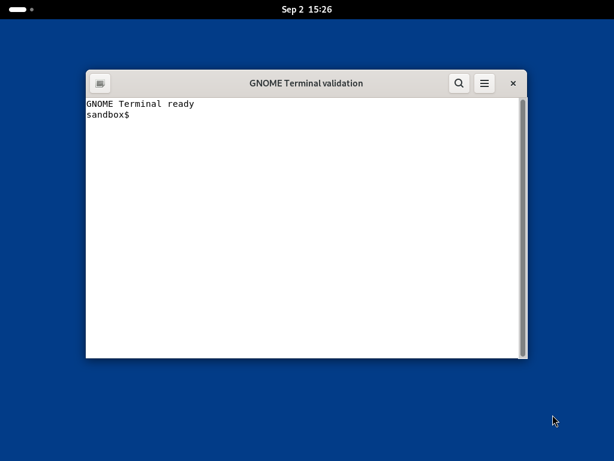

# AgentBay Linux 桌面迁移 FC Sandbox Desktop 指南
> 从无影 AgentBay（`linux_latest`）迁移到 FC Sandbox e2b-desktop 的指南。

## 1. 能力映射说明
> 方法名/签名以 e2b-desktop SDK 发布为准。部分能力通过沙箱内 shell 命令补齐，标注为"shell 对齐"。

| 无影Agentbay `session.computer.*` | `e2b-desktop` 对应 | 说明 |
|-------------------------------|--------------------|------|
| **鼠标** |  |  |
| `click_mouse(x, y)` | `left_click(x, y)` | 直接传坐标；<br>`move_mouse` + `left_click()` 两步式亦可 |
| `click_mouse(x, y, button="right")` | `right_click(x, y)` | 同上 |
| `move_mouse(x, y)` | `move_mouse(x, y)` | 同名 |
| `drag_mouse(x1, y1, x2, y2)` | `drag((x1, y1), (x2, y2))` | 签名不同，元组参数 |
| `double_click()` | `double_click()` | 同名 |
| `scroll(x, y, direction, amount)` | `move_mouse(x, y)` + `scroll(direction, amount)` | 无坐标参数，先移动再滚动 |
| `get_cursor_position()` | `commands.run("xdotool getmouselocation")` | shell 对齐 |
| **键盘** |  |  |
| `input_text(text)` | `write(text)` | 方法名不同 |
| `press_keys(keys)` | `press(key)` / `press(["ctrl", "c"])` | 单个键或组合键列表 |
| `release_keys` | `commands.run("xdotool keyup <key>")` | shell 对齐 |
| **截图** |  |  |
| `screenshot()` | `screenshot()` | 同名，PNG 字节 |
| `beta_take_screenshot(format)` | `commands.run("scrot -q 80 /tmp/s.jpg")` + `files.read(path, format="bytes")` | shell 对齐（scrot 支持 jpg/png；jpg 必须显式按 bytes 读） |
| **屏幕信息** |  |  |
| `get_screen_size()` | `commands.run("xdpyinfo -display :0 | grep dimensions")` | shell 对齐 |
| `get_current_window_id()` | `get_current_window_id()` | 同名 |
| **窗口管理** |  |  |
| `list_root_windows` | `commands.run('xdotool search --onlyvisible --name ""')` | shell 对齐 |
| `activate_window` | `commands.run("xdotool windowactivate --sync <id>")` | shell 对齐 |
| `maximize_window` | `commands.run("xprop -id <id> -f _NET_WM_STATE 32a -set _NET_WM_STATE _NET_WM_STATE_MAXIMIZED_VERT,_NET_WM_STATE_MAXIMIZED_HORZ")` | shell 对齐 |
| `minimize_window` | `commands.run("xdotool windowminimize <id>")` | shell 对齐 |
| `resize_window` | `commands.run("xdotool windowsize --sync <id> <w> <h>")` | shell 对齐（终端类应用按字符单元格取整） |
| `close_window` | `commands.run("xdotool windowclose <id>")` | shell 对齐 |
| `focus_mode` | `commands.run("xfconf-query -c xfwm4 -p /general/click_to_focus -s ...")` | shell 对齐 |
| **应用管理** |  |  |
| `start_app(app, work_directory)` | `commands.run("cd <workdir> && setsid nohup <app> >/tmp/app.log 2>&1 </dev/null &")` | shell 对齐；让 GUI 进程脱离短生命周期的命令通道 |
| `stop_app` | `commands.run("pkill <app>")` | shell 对齐 |
| `get_installed_apps` | `commands.run("ls /usr/share/applications/")` | shell 对齐 |
| `list_visible_apps` | `commands.run('xdotool search --onlyvisible --name ""')` | shell 对齐 |
| **Agent（差异项）** |  |  |
| `execute_task` | 无 | C-1：暂不支持 |
| `get_task_status` | 无 | C-2：暂不支持 |
| `terminate_task` | 无 | C-3：暂不支持 |
| **桌面观察** |  |  |
| `get_link_url` / VNC | `stream.start()` + `get_url()` | 内置鉴权，见 §5 |
- C-1~C-3（自然语言 Agent）暂无提供计划，不在 FC Sandbox 产品设计范畴内；其余均可通过 SDK 或 shell 命令对齐。
- 不用 Computer Use 的场景：只操作网页优先用 Browser Use（CDP）；纯批处理用 commands/code。
- 上述 SDK 能力映射曾以 `e2b-desktop==2.4.1` 和 `desktop:v0.0.44` 完成 35/35 验证；当前推荐镜像版本见 §4。
- 模板已预装 `xdotool` / `scrot` / `xdpyinfo` / `xprop` / `xwininfo` / `xfconf-query`，**未预装** `wmctrl`（窗口管理用 xdotool/xprop 等价命令，如上表；如需 wmctrl 语义可 `apt-get install -y wmctrl`，沙箱可访问 Debian 源）。
- §6.2 前端已在真实 Chrome 中验证（RFB 连接、画面渲染、桌面变化实时刷新均通过）。

## 2. 能力范围限制

Linux 桌面（Computer Use）迁移采用 **e2b-desktop SDK**：
- 鼠标 / 键盘 / 截图为已有的 SDK 方法（两步式）；VNC 实时流内置且带鉴权。
- 必须使用其 `Sandbox` 子类创建沙箱，沙箱生命周期语义与 e2b 一致（仍按 `create/connect/list/kill` 使用）。
- 窗口 / 应用管理等超集能力不在本 SDK 范围，见 §1 能力映射。

## 3. 内置模板映射

| AgentBay | FC E2B | 说明 |
|--------|------|------|
| `linux_latest`（Computer Use） | Desktop 模板（镜像 `fc-e2b-registry.cn-beijing.cr.aliyuncs.com/runtime/desktop:v0.0.48`） | `v0.0.48` 是当前推荐的默认版本，通过 `Template.build()` 构建，见 §4 |

## 4. 前置准备：Desktop 模板

Desktop 模板不是开通即用的内置模板。推荐直接使用 FC 已发布的 Desktop 镜像制作 Template；只有需要预装额外软件、修改桌面环境或固化企业配置时，才需要自行构建镜像。

### 4.1 推荐：使用 FC Desktop `v0.0.48` 镜像

FC Desktop `v0.0.48` 已包含桌面环境、Chrome、Xvfb、x11vnc、noVNC/websockify，以及 `e2b-desktop` 所需的兼容入口。

#### 4.1.1 设置环境变量

```bash
export E2B_API_KEY="your-api-key"
export E2B_API_URL=https://api.cn-beijing.e2b.fc.aliyuncs.com
export E2B_DOMAIN=cn-beijing.e2b.fc.aliyuncs.com
export E2B_DESKTOP_IMAGE=fc-e2b-registry.cn-beijing.cr.aliyuncs.com/runtime/desktop:v0.0.48
export E2B_DESKTOP_TEMPLATE=custom-desktop-v0048-20260901
```

- 镜像仓库、`E2B_API_URL`、`E2B_DOMAIN` 和目标资源必须属于同一地域。其他地域需要同时替换这些地址中的地域。
- `E2B_DESKTOP_TEMPLATE` 应包含业务名、镜像版本或日期。每次更换镜像或配置时使用新的 Template 名称；已有同名 Template 可能被直接复用，无法验证本次变更。
- 不要使用 `desktop-v*` 作为 Template 名称前缀，该前缀为系统保留；例如使用 `custom-desktop-v0048-20260901`。
- API Key 只通过环境变量或密钥管理服务注入，不要写入脚本、Dockerfile、镜像层或日志。

#### 4.1.2 构建并验证 Template

```bash
pip install e2b==2.31.0 e2b-desktop==2.4.1 python-dotenv
```

```python
# build.py
import os
from urllib.parse import urlparse

from dotenv import load_dotenv
from e2b import Template, default_build_logger
from e2b_desktop import Sandbox

load_dotenv()

image = os.environ["E2B_DESKTOP_IMAGE"]
template_name = os.environ["E2B_DESKTOP_TEMPLATE"]

build = Template.build(
    Template().from_image(image),
    name=template_name,
    cpu_count=4,
    memory_mb=8192,
    skip_cache=False,
    on_build_logs=default_build_logger(),
)
print(f"template_id: {build.template_id}")

# 不要只以构建成功作为验收结果；实际创建 Sandbox 并验证桌面实时流。
desktop = Sandbox.create(template=build.template_id, timeout=900)
stream_started = False
try:
    desktop.stream.start(require_auth=True)
    stream_started = True
    auth_key = desktop.stream.get_auth_key()
    stream_url = desktop.stream.get_url(auth_key=auth_key)
    parsed_stream_url = urlparse(stream_url)
    if parsed_stream_url.scheme != "https" or parsed_stream_url.path != "/vnc.html":
        raise RuntimeError(f"unexpected desktop stream URL: {stream_url}")

    desktop.move_mouse(1, 1)
    desktop.press("shift")
    image = desktop.screenshot()
    if len(image) < 1024 or not image.startswith(b"\x89PNG\r\n\x1a\n"):
        raise RuntimeError("desktop screenshot is not a valid PNG")

    print(f"sandbox_id: {desktop.sandbox_id}")
    print("desktop SDK smoke test passed; browser RFB verification is still required")
finally:
    if stream_started:
        desktop.stream.stop()
    desktop.kill()
```

```bash
python build.py
```

推荐规格为 4 vCPU、8192 MB 内存。使用 FC Desktop 镜像时，无需配置启动命令或就绪命令，Desktop SDK 会自动启动桌面环境和实时流。

以上脚本验证 Sandbox 创建、实时流 URL、鼠标、键盘和 PNG 截图，但 URL 检查不等同于浏览器已经建立 RFB 连接。生产使用前还需要通过 §6 的 noVNC 客户端实际连接 `stream_url`，确认画面渲染、桌面变化实时刷新和浏览器键鼠输入。`stream_url` 可能包含临时访问凭证，只应通过受控后端传递，不要写入日志或工单。

### 4.2 进阶：基于 Ubuntu 24.04 自行构建镜像

当默认镜像无法满足软件、字体、桌面插件或企业配置要求时，可以基于 Docker Hub 官方 Ubuntu 24.04 镜像制作源镜像。自建镜像由您维护，需自行负责软件版本、安全补丁、镜像大小和桌面启动稳定性。

建议按职责组织构建目录：

```text
desktop-image/
├── Dockerfile
├── scripts/
│   └── start-desktop
└── assets/
    ├── applications/
    └── icons/
```

以下 Dockerfile 是镜像骨架，用于明确基础依赖和兼容契约。实际使用时还需提供 `scripts/start-desktop`，在 Xvfb 就绪后通过 D-Bus 启动 GNOME 会话；不要依赖完整 `systemd`、USB 设备或宿主机桌面能力。

```dockerfile
ARG UBUNTU_IMAGE=docker.io/library/ubuntu:24.04
FROM ${UBUNTU_IMAGE}

ARG TARGETARCH
RUN test "${TARGETARCH}" = "amd64"

ENV DEBIAN_FRONTEND=noninteractive \
    DISPLAY=:0 \
    LANG=C.UTF-8 \
    LC_ALL=C.UTF-8

RUN apt-get update && apt-get install -y --no-install-recommends \
      bash ca-certificates curl git python3 sudo dbus-x11 systemd \
      xvfb x11-utils x11-apps xauth x11vnc xdotool scrot \
      gnome-session gnome-shell gnome-terminal nautilus \
      hicolor-icon-theme librsvg2-common \
      fonts-liberation fonts-noto-core fonts-noto-cjk fonts-noto-color-emoji \
      novnc websockify \
    && rm -rf /var/lib/apt/lists/* \
    && if id ubuntu >/dev/null 2>&1; then \
         mv /home/ubuntu /home/user \
         && usermod --login user --home /home/user ubuntu \
         && groupmod --new-name user ubuntu; \
       else \
         useradd --create-home --user-group --shell /bin/bash --uid 1000 user; \
       fi \
    && mkdir -p /home/user/.config /home/user/Desktop /tmp/.X11-unix \
                /run/user/1000 /var/log/desktop /opt \
    && ln -s /usr/share/novnc /opt/noVNC \
    && sed -i 's/org\.gnome\.SettingsDaemon\.UsbProtection;//' \
         /usr/share/gnome-session/sessions/gnome.session \
    && printf 'user ALL=(ALL) NOPASSWD:ALL\n' > /etc/sudoers.d/user \
    && chmod 0440 /etc/sudoers.d/user \
    && chmod 1777 /tmp/.X11-unix \
    && chmod 0700 /run/user/1000 \
    && chown -R user:user /home/user /run/user/1000 /var/log/desktop

COPY --chmod=0755 scripts/start-desktop /usr/local/bin/start-desktop

# e2b-desktop 2.4.1 当前通过该命令启动桌面会话；脚本内部可以启动 GNOME。
RUN ln -s /usr/local/bin/start-desktop /usr/local/bin/startxfce4

# Template builder 需要以 root 修改 /etc/passwd、/etc/group 并注入运行时文件。
# 保留 user 账号供 Sandbox 内的 SDK 命令使用，但源镜像默认用户必须是 root。
USER root
WORKDIR /home/user
EXPOSE 5900 6080
```

`scripts/start-desktop` 使用以下内容。Desktop SDK 会先启动 Xvfb，确认显示服务就绪后再通过兼容命令 `startxfce4` 调用该脚本：

```bash
#!/usr/bin/env bash
set -euo pipefail

export DISPLAY="${DISPLAY:-:0}"
export XDG_CURRENT_DESKTOP=GNOME
export XDG_SESSION_DESKTOP=gnome
export XDG_SESSION_TYPE=x11
export DESKTOP_SESSION=gnome
export GDK_BACKEND=x11
export LIBGL_ALWAYS_SOFTWARE=1
export XDG_RUNTIME_DIR="${XDG_RUNTIME_DIR:-/run/user/$(id -u)}"
export LANG="${LANG:-C.UTF-8}"
export LC_ALL="${LC_ALL:-C.UTF-8}"

# Sandbox 不以 systemd 作为 PID 1，因此按需启动 GNOME 依赖的 system bus。
if [[ ! -S /run/dbus/system_bus_socket ]]; then
  sudo mkdir -p /run/dbus /run/systemd/seats /run/systemd/sessions \
    /run/systemd/users /run/systemd/inhibit
  sudo setsid dbus-daemon --system --nofork --nopidfile \
    > /var/log/desktop/system-dbus.log 2>&1 &
  for _ in {1..50}; do
    [[ -S /run/dbus/system_bus_socket ]] && break
    sleep 0.1
  done
  if [[ ! -S /run/dbus/system_bus_socket ]]; then
    echo "system D-Bus did not become ready" >&2
    exit 1
  fi
fi

login1_is_ready() {
  busctl --system --no-legend list 2>/dev/null |
    awk '$1 == "org.freedesktop.login1" && $2 != "-" { found=1 } END { exit !found }'
}

if ! login1_is_ready; then
  sudo setsid /lib/systemd/systemd-logind \
    > /var/log/desktop/logind.log 2>&1 &
  for _ in {1..50}; do
    login1_is_ready && break
    sleep 0.1
  done
  if ! login1_is_ready; then
    echo "systemd-logind did not become ready" >&2
    exit 1
  fi
fi

# 无头 Xvfb 环境下，GNOME 初始化时可能暂时进入 Activities 概览。
# 在受限的启动窗口内退出该初始状态，使新建 Sandbox 直接展示完整桌面。
dismiss_initial_overview() {
  for _ in {1..50}; do
    pgrep -x gnome-shell >/dev/null 2>&1 && break
    sleep 0.2
  done

  for _ in {1..20}; do
    DISPLAY="$DISPLAY" xdotool key Escape >/dev/null 2>&1 || true
    sleep 0.5
  done
}
dismiss_initial_overview &

if [[ -n "${DBUS_SESSION_BUS_ADDRESS:-}" ]]; then
  exec gnome-session --session=gnome
fi
exec dbus-run-session -- gnome-session --session=gnome
```

在无头 Xvfb 环境中，GNOME 可能在 Shell 启动后才进入 Activities（类似 Launchpad）概览。上述启动阶段逻辑只在受限的初始化窗口内发送 Escape，因此新建 Sandbox 默认展示完整桌面，用户无需手动按键；它仅属于通用 GNOME 会话初始化，不包含 AgentBay 或业务应用配置。

以下截图来自基于该 Ubuntu + GNOME `start-desktop` 示例新建的 Sandbox。验证脚本未模拟键盘输入；它使用与 GNOME 会话相同的 D-Bus 环境启动 `gnome-terminal`，窗口中显示 `GNOME Terminal ready` 和交互 Shell，确认桌面和 Terminal 均正常显示，而非 Activities 概览：



FC runtime 还提供 Custom Bootstrap，用于在 gatewayd 启动时托管桌面插件、浏览器辅助服务等扩展进程。以下路径是待替换的示例，只有在镜像已经复制对应脚本后才启用它；不需要扩展进程时，省略该 `COPY` 和 `ENV`：

```dockerfile
# 将 scripts/start-desktop-extensions 替换为您提供的扩展启动脚本。
COPY --chmod=0755 scripts/start-desktop-extensions /usr/local/bin/start-desktop-extensions
ENV FC_E2B_CUSTOM_BOOTSTRAP=/usr/local/bin/start-desktop-extensions \
    FC_E2B_CUSTOM_BOOTSTRAP_MODE=sync \
    MAX_STARTUP_WAIT=60s
```

- `FC_E2B_CUSTOM_BOOTSTRAP` 是脚本路径或 shell 命令，gatewayd 通过 `/bin/bash -lc` 执行并负责异常重启和 Sandbox 关闭时的清理。
- `FC_E2B_CUSTOM_BOOTSTRAP_MODE` 支持 `async`（默认，不等待扩展就绪）和 `sync`（动态用户端口在扩展就绪前返回可重试的 503）。
- `sync` 模式下，脚本确认扩展服务就绪后必须向 stdout 输出完整一行 `FC_E2B_CUSTOM_BOOTSTRAP_READY`，然后继续以前台方式等待关键子进程；`MAX_STARTUP_WAIT` 使用 Go duration 格式，例如 `60s`。

Custom Bootstrap 适合扩展进程，不要用它替代上述 GNOME 主会话脚本。`e2b-desktop==2.4.1` 会先创建 Xvfb，再执行 `startxfce4`；若 Custom Bootstrap 提前启动 GNOME，可能与 Desktop SDK 的显示服务启动时序冲突。`Template.set_start_cmd()` 同样不适合在此处提前启动 GNOME。

#### 在构建时注册应用 SVG 图标

通用 Ubuntu + GNOME 基础镜像只包含桌面运行环境，**不应包含 AgentBay 或任何业务应用配置**。将每个应用的二进制文件、`.desktop` 条目和 SVG 图标放在从该基础镜像派生的业务镜像中，并在 `docker build` 时写入；不要在创建 Sandbox 后通过 `commands.run()` 安装图标或修改桌面配置。

以下片段加入业务镜像的 Dockerfile。`hicolor/scalable/apps` 是 GNOME 图标主题的标准 SVG 目录，`Icon` 只填写文件基名，不带 `.svg`：

```dockerfile
COPY assets/icons/my-desktop-app.svg \
  /usr/share/icons/hicolor/scalable/apps/my-desktop-app.svg
COPY assets/applications/com.example.MyDesktopApp.desktop \
  /usr/share/applications/com.example.MyDesktopApp.desktop
RUN gtk-update-icon-cache -f /usr/share/icons/hicolor
```

`assets/applications/com.example.MyDesktopApp.desktop` 示例：

```ini
[Desktop Entry]
Type=Application
Name=My Desktop App
Exec=/usr/local/bin/my-desktop-app
Icon=my-desktop-app
Terminal=false
StartupWMClass=my-desktop-app
Categories=Utility;
```

- SVG 应同时声明方形 `width`、`height` 和 `viewBox`，例如 `width="256" height="256" viewBox="0 0 256 256"`；`librsvg2-common` 提供 GTK 解析 SVG 所需的 GdkPixbuf loader，缺失时即使图标已注册也会回退为低清占位图。
- `StartupWMClass` 必须与应用窗口的实际 WM_CLASS 一致；可在测试镜像中用 `xprop -id <window-id> WM_CLASS` 取得实际值。不要假定它必然是二进制文件名或应用 ID：解释型应用的实际值也可能是 Python、Java 等运行时名称。GTK 应用还应设置稳定的 `application_id`，并把 `set_default_icon_name()` 和窗口的 `set_icon_name()` 配置为与 `.desktop` 条目一致的图标名称。
- 图标和 `.desktop` 条目改动后必须重新构建、推送并创建新的 Template；已运行的 Sandbox 不会继承镜像外的临时配置。

还需要满足以下兼容约束：

- 镜像必须包含 `linux/amd64` 变体、固定路径 `/bin/bash`，以及可写的标准 `/etc/passwd`、`/etc/group`。源镜像默认用户必须是 `root`；同时保留 UID 1000 的 `user` 账号，供 Sandbox 内的 SDK 命令使用。
- `startxfce4` 是 `e2b-desktop==2.4.1` 当前使用的命令兼容入口；使用 GNOME 时可让它转调自定义 GNOME 启动脚本，这不表示镜像需要安装 Xfce。
- `e2b-desktop==2.4.1` 从 `/opt/noVNC` 启动代理；Ubuntu 的 `novnc` 包安装到 `/usr/share/novnc`，示例通过符号链接提供兼容布局。noVNC 使用 6080 端口，x11vnc 使用 5900 端口连接 Xvfb 桌面。
- Chrome 或其他 GUI 应用需要在源镜像中单独安装并固定版本；不要在启动 Sandbox 后临时下载生产依赖。
- Custom Bootstrap 脚本以 `user` 身份运行。示例为启动 GNOME 配置了免密 `sudo`；生产镜像应按实际命令进一步收紧 sudoers。不要通过 Sandbox 创建参数接收并拼接不可信命令。
- 不要在源镜像中自行设置 `ENTRYPOINT ["/.fce2b/entrypoint"]` 或复制 `/.fce2b`。使用普通业务镜像时，`Template.build()` 的 builder 模式会注入这些运行时文件并设置入口；预先声明一个尚不存在的入口会导致 `envd inject failed`。完整镜像要求、ACR EE 网络和 builder 配置见[通过 OpenAPI 构建和管理模板](../02.模板/03.通过 OpenAPI 构建和管理模板.md)。

构建时固定目标架构；生产环境建议把 `ubuntu:24.04` 替换为经过验证的 digest，以免基础镜像变化导致不可复现：

```bash
docker buildx build \
  --platform linux/amd64 \
  --tag desktop-ubuntu24.04:20260831 \
  --load \
  .
```

推送前先在本地启动 Xvfb、桌面会话、x11vnc 和 noVNC，确认浏览器可以访问 `http://127.0.0.1:<port>/vnc.html`，并验证截图、键鼠输入和 Chrome 启动。然后为镜像使用不可变的新 tag，推送到与云沙箱同账号、同地域且已确认可被 Template Builder 访问的镜像仓库。

将 `E2B_DESKTOP_IMAGE` 替换为该镜像地址，并为 `E2B_DESKTOP_TEMPLATE` 设置新名称，再复用 §4.1.2 的脚本完成 Template 转换和 SDK 冒烟验证。不要根据公网地址自行猜测或拼接 VPC Registry 地址；以平台提供并经实际 Template 构建验证可访问的地址为准。随后必须按 §6 使用浏览器 noVNC 客户端建立真实 RFB 连接；自建镜像只有在画面渲染、实时刷新、截图和浏览器键鼠输入均通过后，才应进入生产环境。

## 5. 主要迁移示例

### 5.1 常见交互循环（截图+action）
```python
# === 迁移前：AgentBay ===
session = agent_bay.create(CreateSessionParams(image_id="linux_latest")).session
session.computer.move_mouse(640, 400)
session.computer.click_mouse(640, 400)
session.computer.input_text("echo hello")
session.computer.press_keys(["enter"])
png = session.computer.screenshot()

# === 迁移后：e2b-desktop SDK ===
import os

from e2b_desktop import Sandbox

desktop = Sandbox.create(
    template=os.environ["E2B_DESKTOP_TEMPLATE"],
    timeout=600,
)
try:
    # 启动 Chrome 并等待渲染
    desktop.launch("google-chrome", "https://example.com")
    desktop.wait(10000)

    # 鼠标：E2B SDK 为两步式（move + click）；拖拽用 drag 元组
    desktop.move_mouse(640, 400)
    desktop.left_click()
    desktop.double_click()
    desktop.drag((100, 100), (300, 300))
    desktop.scroll("down", 5)

    # 启动预装 GUI 程序。setsid + nohup 防止命令通道结束时回收子进程。
    desktop.commands.run(
        "setsid nohup xmessage -center 'desktop ready' "
        ">/tmp/xmessage.log 2>&1 </dev/null &"
    )
    desktop.wait(3000)

    # 截图（PNG 字节，交给视觉模型）
    image = desktop.screenshot()
    with open("desktop.png", "wb") as f:
        f.write(image)
finally:
    desktop.kill()
```

### 5.2 VNC 实时流（人工接管）
```python
# 对应无影桌面场景的 link_url 观察方式；E2B SDK stream 内置鉴权
desktop.stream.start(require_auth=True)
stream_url = desktop.stream.get_url()
auth_key = desktop.stream.get_auth_key()
# 将 stream_url 和 auth_key 仅交给受控后端 / 浏览器 noVNC
desktop.stream.stop()
```

## 6. WebSDK 集成

浏览器端通过 noVNC（CDN JS）直连沙箱 VNC 实时流，无需控制面 SDK 或 npm 构建。沙箱生命周期由后端（Python）管理，前端仅负责桌面渲染。

### 6.1 后端：获取 VNC 流地址
```python
# 后端 Python：创建沙箱并获取 noVNC 流地址
import os

from e2b_desktop import Sandbox

desktop = Sandbox.create(
    template=os.environ["E2B_DESKTOP_TEMPLATE"],
    timeout=600,
)
desktop.stream.start()
stream_url = desktop.stream.get_url()

# 若 FC E2B 侧对数据面要求 traffic access token，通过 query 参数携带

# token = getattr(desktop, "traffic_access_token", None)
# if token:
#     stream_url += f"&traffic_access_token={token}"

# 将 stream_url 返回给前端（如通过 API 响应或 WebSocket）
```

### 6.2 前端：HTML + CDN noVNC
```html
<!DOCTYPE html>
<html>
<head>
  <meta charset="utf-8">
  <title>FC Desktop</title>
  <style>
    #vnc-screen { width: 100vw; height: 100vh; }
  </style>
</head>
<body>
  <div id="vnc-screen"></div>

  <script type="module">
    // ESM 引入 noVNC 官方构建（固定版本）
    import RFB from 'https://cdn.jsdelivr.net/gh/novnc/noVNC@v1.6.0/core/rfb.js';

    async function initVNC() {
      // 从后端 API 获取 stream_url
      const resp = await fetch('/api/sandbox/vnc-url');
      const { streamUrl, authKey } = await resp.json();

      const rfb = new RFB(
        document.getElementById('vnc-screen'),
        streamUrl,           // https://{sandbox-host}/vnc.html?autoconnect=true&resize=scale
                             // 同一 URL 双重角色：浏览器直接打开是该 noVNC 页面文件；RFB 会把它升级为
                             // wss://{sandbox-host}/vnc.html 作为 WebSocket 端点（由 websockify 代理到 x11vnc）
        { credentials: { password: authKey } }
      );

      rfb.scaleViewport = true;
      rfb.resizeSession = false;
    }

    initVNC();
  </script>
</body>
</html>
```
- 浏览器直连 `wss://{sandbox-host}/vnc.html` 无需自定义请求头（实测 GET 200、RFB 握手成功）；VNC 鉴权由 `stream.start(require_auth=True)` + `get_url(auth_key=...)` 控制，开启后把 `auth_key` 一并返回前端并传入 `credentials.password`。
- 数据面如需 traffic access token，FC 后端支持以 query 参数方式传递（由后端拼进 `stream_url` 返回，见 §6.1），浏览器 WebSocket 无需自定义头，也无需中继服务；noVNC 对额外的 query 参数透明（已随 `password=` 参数实测）。
- 前端无需自研 Web SDK：noVNC（CDN ESM）即完整数据面客户端，连接参数全部在 URL 中。


## Context 存储

FC Sandbox 以组合式能力提供存储服务，可通过 AgentFS 或 OSS 实现数据持久化和共享：

1. [动态挂载 OSS](../07.FC%20%E6%89%A9%E5%B1%95/04.%E5%8A%A8%E6%80%81%E6%8C%82%E8%BD%BD%20OSS.md)
2. [挂载 AgenticFS Volume](../12.%E5%8D%B7/02.%E6%8C%82%E8%BD%BD%20AgenticFS%20Volume.md)

## 附: noVNC 集成 demo 示例

### 代码

#### demo.py（后端 Python（沙箱生命周期 + HTTP 服务））
```python
"""Linux Desktop + noVNC WebSDK 集成 demo（后端）。

配套三文件：demo.py（本文件）、index.html（前端）、.env（凭证），说明见 README.md。

依赖：pip install e2b==2.31.0 e2b-desktop==2.4.1 python-dotenv
运行：python demo.py   （浏览器打开打印的 http://127.0.0.1:<port>/ 即可看到实时桌面）
"""
from __future__ import annotations

import json
import os
import signal
from http.server import BaseHTTPRequestHandler, ThreadingHTTPServer
from pathlib import Path

from dotenv import load_dotenv
from e2b import Template, default_build_logger
from e2b_desktop import Sandbox

BASE_DIR = Path(__file__).resolve().parent
load_dotenv(BASE_DIR / ".env")

TEMPLATE = os.environ["E2B_DESKTOP_TEMPLATE"]
IMAGE = os.environ.get("E2B_DESKTOP_IMAGE", "")
HOST = "127.0.0.1"


def ensure_template() -> str:
    if Template.exists(TEMPLATE):
        print(f"[demo] 复用模板: {TEMPLATE}", flush=True)
        return TEMPLATE
    if not IMAGE:
        raise SystemExit(
            f"[demo] 模板 {TEMPLATE!r} 不存在，请在 .env 配置 E2B_DESKTOP_IMAGE 以自动构建"
        )
    print(f"[demo] 从镜像构建模板 {TEMPLATE!r}: {IMAGE}", flush=True)
    build = Template.build(
        Template().from_image(IMAGE),
        name=TEMPLATE,
        cpu_count=4,
        memory_mb=8192,
        on_build_logs=default_build_logger(),
    )
    return build.template_id


class Handler(BaseHTTPRequestHandler):
    stream_url: str = ""
    auth_key: str = ""

    def do_GET(self) -> None:
        if self.path == "/api/sandbox/vnc-url":
            body = json.dumps({
                "streamUrl": Handler.stream_url,
                "authKey": Handler.auth_key,
            }).encode("utf-8")
            self.send_response(200)
            self.send_header("Content-Type", "application/json")
            self.send_header("Content-Length", str(len(body)))
            self.end_headers()
            self.wfile.write(body)
            return
        if self.path in ("/", "/index.html"):
            body = (BASE_DIR / "index.html").read_bytes()
            self.send_response(200)
            self.send_header("Content-Type", "text/html; charset=utf-8")
            self.send_header("Content-Length", str(len(body)))
            self.end_headers()
            self.wfile.write(body)
            return
        if self.path == "/favicon.ico":
            self.send_response(204)
            self.end_headers()
            return
        self.send_error(404)

    def log_message(self, *args) -> None:
        pass  # 不输出访问日志，避免任何 URL（含 query 参数）落盘


def _stop(_signum, _frame) -> None:
    raise KeyboardInterrupt


def main() -> None:
    signal.signal(signal.SIGTERM, _stop)

    template = ensure_template()
    print("[demo] 创建桌面沙箱（Xvfb + xfce4 + x11vnc + noVNC）...", flush=True)
    desktop = Sandbox.create(template=template, timeout=600, secure=True)
    server: ThreadingHTTPServer | None = None
    try:
        desktop.stream.start(require_auth=True)
        stream_url = desktop.stream.get_url()
        auth_key = desktop.stream.get_auth_key()
        # 若数据面要求 traffic access token，FC 侧支持 query 参数后在此拼接：
        # token = getattr(desktop, "traffic_access_token", None)
        # if token:
        #     stream_url += f"&token={token}"

        Handler.stream_url = stream_url
        Handler.auth_key = auth_key
        server = ThreadingHTTPServer((HOST, 0), Handler)
        print(f"[demo] 浏览器打开: http://127.0.0.1:{server.server_port}/", flush=True)
        print("[demo] Ctrl-C 退出（自动停止流并销毁沙箱）", flush=True)
        server.serve_forever()
    except KeyboardInterrupt:
        print("\n[demo] 退出中...", flush=True)
    finally:
        if server is not None:
            server.server_close()
        try:
            desktop.stream.stop()
        except Exception:
            pass
        desktop.kill()
        print("[demo] 已停止 VNC 流并销毁沙箱", flush=True)


if __name__ == "__main__":
    main()
```

#### index.html（前端 HTML（noVNC CDN ESM 直连渲染））
```html
<!DOCTYPE html>
<html>
<head>
  <meta charset="utf-8">
  <title>FC Linux Desktop (noVNC)</title>
  <style>
    html, body { margin: 0; height: 100%; }
    #vnc-screen { width: 100vw; height: 100vh; }
  </style>
</head>
<body>
  <div id="vnc-screen"></div>

  <script type="module">
    // ESM 引入 noVNC 官方构建（固定版本；npm 包 lib/rfb.js 为 CJS，不能用 <script src> 直载）
    import RFB from 'https://cdn.jsdelivr.net/gh/novnc/noVNC@v1.6.0/core/rfb.js';

    async function initVNC() {
      // API Key 和沙箱生命周期保留在后端；浏览器仅接收当前会话的临时流地址。
      const resp = await fetch('/api/sandbox/vnc-url');
      const { streamUrl, authKey } = await resp.json();

      const rfb = new RFB(
        document.getElementById('vnc-screen'),
        // https://{sandbox-host}/vnc.html?... —— 同一 URL 双重角色：
        // 浏览器直接打开是该 noVNC 页面文件；RFB 会升级为 wss://.../vnc.html 作为 WebSocket 端点
        streamUrl,
        { credentials: { password: authKey } }
      );

      rfb.scaleViewport = true;
      rfb.resizeSession = false;
    }

    initVNC();
  </script>
</body>
</html>
```

### .env（凭证配置（5 个键，填入真实值后含密钥））
```
# Linux Desktop + noVNC demo 配置（填入真实值后本文件即含密钥：勿提交版本库、勿分享、勿粘贴进聊天/工单）
E2B_API_KEY=
E2B_API_URL=https://api.cn-beijing.e2b.fc.aliyuncs.com
E2B_DOMAIN=cn-beijing.e2b.fc.aliyuncs.com

# 桌面模板名：已存在则复用；不存在时用 E2B_DESKTOP_IMAGE 自动构建一次
E2B_DESKTOP_TEMPLATE=custom-desktop-v0048-20260901
E2B_DESKTOP_IMAGE=fc-e2b-registry.cn-beijing.cr.aliyuncs.com/runtime/desktop:v0.0.48
```

### 数据流
```
浏览器 (index.html, noVNC CDN ESM)
  │  GET /api/sandbox/vnc-url ──→ demo.py（仅返回 streamUrl）
  │  RFB 直连 wss://{sandbox-host}/vnc.html ──→ websockify ──→ x11vnc ──→ Xvfb 桌面
  └─ 渲染 + 键鼠输入（数据面不经后端）
```

### 运行
```bash
pip install e2b==2.31.0 e2b-desktop==2.4.1 python-dotenv
# 1. 把 .env 中的 E2B_API_KEY 等填成真实值
python demo.py
# 2. 浏览器打开打印的 http://127.0.0.1:<随机端口>/ 即可看到并操作实时桌面
# 3. Ctrl-C 退出（自动停止 VNC 流并销毁沙箱）
```

### 验证记录
- 后端 API：`/api/sandbox/vnc-url` 返回以 `https://` 开头且含 `/vnc.html` 的 streamUrl；`/` 正常返回页面。
- 退出：SIGTERM/Ctrl-C 后自动停止 VNC 流并销毁沙箱。
- 前端：已在真实 Chrome 中验证 RFB 连接、画面渲染、桌面变化实时刷新。

## 参考文档

1. [wuying-agentbay-sdk](https://github.com/agentbay-ai/wuying-agentbay-sdk)
2. [novnc](https://novnc.com/)
