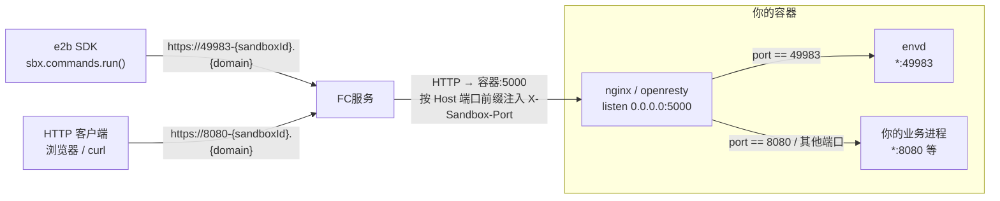
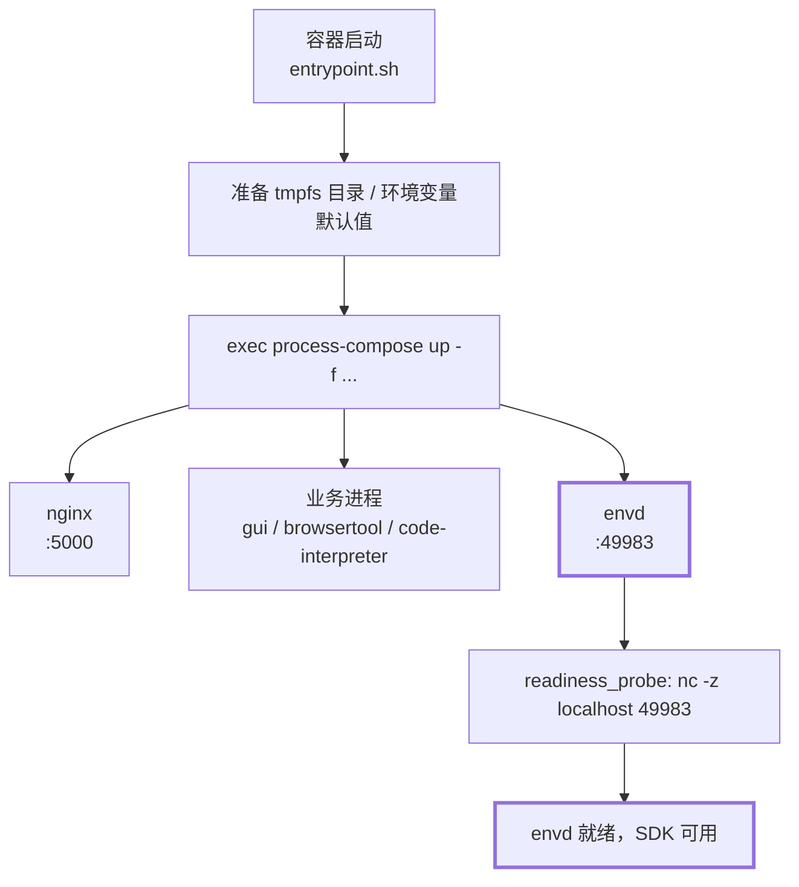
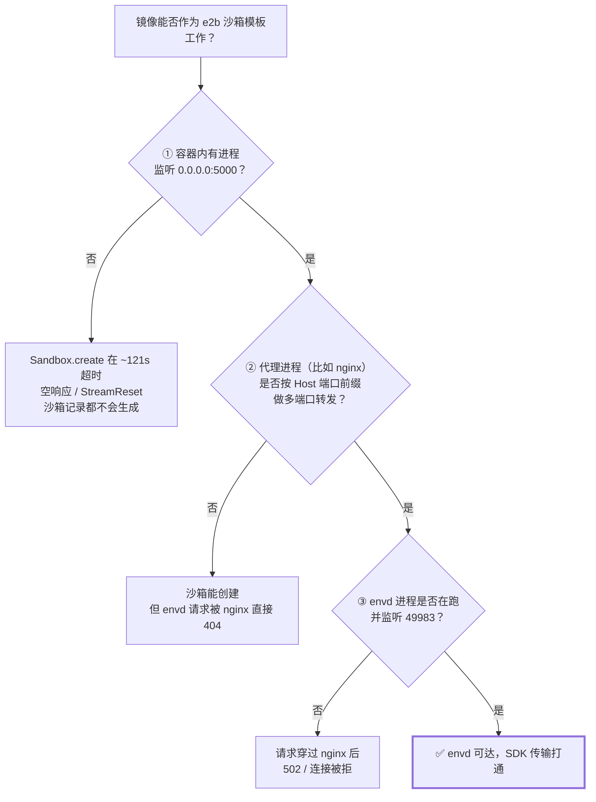
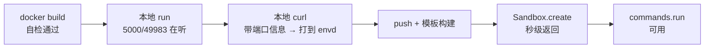
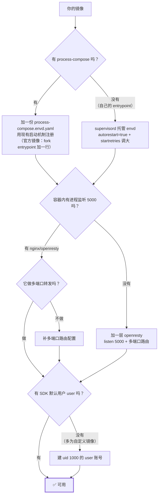

# envd 集成教程：完全自定义把你自己的镜像变成 e2b 沙箱模板

本文以 AgentRun 中 `sandbox-all-in-one` 的镜像为例，走通「一个普通容器镜像 → 可用的 e2b 沙箱模板」的全过程。
**例子只是载体，要理解的是原理**：只要满足文中三个必要条件，任何镜像都能这么改。

除了这三个 envd 相关条件外，镜像还必须满足平台的硬性要求，详见[构建自定义镜像模板](../04.功能说明/02.模板/03.构建自定义镜像模板.md)：架构为 `linux/amd64`、ACR EE 未开启镜像加速、`/etc/passwd` 和 `/etc/group` 可写，以及 `commands.run` 和 PTY 需要固定路径的 `/bin/bash`。

- 目标读者：手上有自己的容器镜像，想让 e2b SDK 的 `commands.run`、`files` 等能力在里面可用
- 前置：能 `docker build` / `docker push` 到 ACR EE，有 e2b 的 `API_KEY` / `API_URL` / `DOMAIN`

---

## 一、为什么需要 envd

e2b SDK 的部分能力不是直接对着你的业务进程说话的，而是对着沙箱里的一个**代理进程 `envd`** 说话：

| SDK 调用 | 实际发生了什么 |
|---|---|
| `sbx.commands.run("ls")` | 请求发给沙箱内的 envd，由 envd 在容器里 fork 进程并回传 stdout/stderr |
| `sbx.files.write(...)` | 请求发给 envd，由 envd 落盘 |
| `others` | ... |

所以：**镜像里没有 envd，或者 envd 起来了但网关的流量进不去，SDK 有些方法就是不可用的**——
即使 `Sandbox.create()` 成功返回、你的业务进程也一切正常。

envd 二进制的来源就是官方 runtime base 镜像：

```
fc-e2b-registry.cn-hangzhou.cr.aliyuncs.com/runtime/base:v0.0.48  →  /.fce2b/envd
```

它固定监听 `0.0.0.0:49983`，`GET /health` 返回 `204`。

> **这里的 envd 也可以完全是你自定义实现的**

---

## 二、原理

### 2.1 请求链路：所有流量都从 5000 进，靠端口前缀分流

这是整套机制里最反直觉、也最容易踩坑的一点：



要点：

1. 网关**只往容器的 5000 端口打流量**，不管目标服务实际监听在哪
2. 真正的目标端口藏在 **`X-Sandbox-Port` 头**
3. 由**容器内的 nginx** 解析出端口，再 `proxy_pass` 到 `127.0.0.1:{port}`
4. envd 的 49983 走的就是这条路——所以 **nginx 的多端口路由和 envd 本身同样重要**
5. HTTP 客户端访问 8080 时，请求地址是 `https://8080-{sandboxId}.{domain}`；FC 服务从 Host 的 `8080-` 前缀识别目标端口，自动在发往容器的请求里注入 `X-Sandbox-Port: 8080`，nginx 再据此把流量 `proxy_pass` 到 `127.0.0.1:8080` 的业务进程

### 2.2 启动链路：process-compose 拉起 envd

`sandbox-all-in-one` 的镜像元数据：

```
Entrypoint: ["/usr/local/bin/entrypoint.sh"]
Cmd:        ["process-compose","up","--tui=false","--no-server"]
```



集成 envd 要做的，就是**在图里加上 `D3` 这个分支**：给 process-compose 多喂一份配置文件。

### 2.3 三个必要条件 {#three-conditions}



三个条件里，**只有 ③ 是本教程新增的东西**，① ② 取决于你的镜像本来长什么样：

- 用 AgentRun 官方 `sandbox-all-in-one` 系列镜像做基础：① ② 通常已满足
- 用**你自己的镜像**：① ② 大概率都不满足，需要自己补一个 nginx/openresty 层，见 [第六节](#porting)

> 这三条只保证 envd **可达**，并不等于每条 `commands.run` 都能成功：调用时若不传 `user=`，SDK 会把命令降权到镜像里 uid 1000 的 `user` 账号执行——这是与上面三条正交的第 ④ 个条件，三条全绿时缺它照样会 `unknown user`。官方镜像自带，自定义镜像通常要自己建，详见 [6.1 ③](#porting)。

---

## 三、动手：以 all-in-one 为例

目录里放这几个文件即可：

```
case-all-in-one/
├── Dockerfile
├── process-compose.envd.yaml   # envd 进程定义
├── entrypoint.sh               # vendor 原文件的 fork，只多 envd 那两行
├── build.py                    # docker build → push → e2b 模板构建
└── run.py                      # 创建沙箱并验证 envd
```

### 步骤 1：写 envd 的 process-compose 配置

`process-compose.envd.yaml`：

```yaml
version: "0.5"

processes:
  envd:
    # [PC-START] 便于在日志里评估启动耗时
    command: "sh -c 'echo \"[PC-START] envd $(date +%Y-%m-%dT%H:%M:%S)\"; exec /usr/local/bin/envd'"
    availability:
      restart: "always"        # envd 挂了必须自动拉起，否则整个沙箱失能
      backoff_seconds: 2
    readiness_probe:
      exec:
        command: "sh -c 'nc -z localhost 49983'"
      initial_delay_seconds: 0
      period_seconds: 10
      timeout_seconds: 2
      success_threshold: 1
      failure_threshold: 3
    log_configuration:
      disable_json: true
      no_metadata: false
      add_timestamp: true
      timestamp_format: "2006-01-02 15:04:05.000"
      fields_to_append:
        - level=INFO
```

`command` 里用 `exec` 是关键：让 envd 取代 `sh` 成为该进程组的主进程，
process-compose 的重启/信号才能正确作用到 envd 本身。

### 步骤 2：把 vendor 的 entrypoint.sh fork 过来，加一行 {#fork-entrypoint}

配置列表由 entrypoint 组装，**同一个镜像换个版本就可能换写法**，所以第一件事是把那个脚本
原样取出来读一遍（**不要手抄**）：

```bash
IMG=serverless-registry.cn-hangzhou.cr.aliyuncs.com/functionai/sandbox-all-in-one:v0.10.1
cid=$(docker create $IMG)
docker cp "$cid":/usr/local/bin/entrypoint.sh ./entrypoint.sh && docker rm "$cid"

grep -n process-compose ./entrypoint.sh
```

读到的就是这一步要改的地方。all-in-one v0.10.1 的脚本末尾是：

```bash
# ── Process-compose config files (pre-generated at build time) ──
# 直接展开配置文件路径，避免 while 循环读取文件的开销
exec process-compose up \
    -f /etc/sandbox/config/process-compose.base.yaml \
    -f /etc/sandbox/config/process-compose.gui.yaml \
    -f /etc/sandbox/config/process-compose.browsertool.yaml \
    -f /etc/sandbox/config/process-compose.code-interpreter.yaml \
    --tui=false --no-server 2>&1
```

**别用 `sed` 去原地改它**——正则要贴合上游那一行的写法，上游一改格式就静默不命中。
整份 fork 过来、加一行、`COPY` 回去，启动逻辑在你仓库里就是一个能从头读到尾的文件。

在取出的副本里只加两行（注释不能写在 `\` 续行里面，所以放在 `exec` 上方）：

```diff
  # ── Process-compose config files (pre-generated at build time) ──
  # 直接展开配置文件路径，避免 while 循环读取文件的开销
+ # [envd] 以下 -f …process-compose.envd.yaml 是相对 vendor 原文件的唯一改动
  exec process-compose up \
+     -f /etc/sandbox/config/process-compose.envd.yaml \
      -f /etc/sandbox/config/process-compose.base.yaml \
      -f /etc/sandbox/config/process-compose.gui.yaml \
      -f /etc/sandbox/config/process-compose.browsertool.yaml \
      -f /etc/sandbox/config/process-compose.code-interpreter.yaml \
      --tui=false --no-server 2>&1
```

Dockerfile：

```dockerfile
# Stage 1: 从 runtime base 镜像中提取 envd 二进制
FROM fc-e2b-registry.cn-hangzhou.cr.aliyuncs.com/runtime/base:v0.0.48 AS envd-extract

# Stage 2: 目标镜像
FROM serverless-registry.cn-hangzhou.cr.aliyuncs.com/functionai/sandbox-all-in-one:v0.10.1

# 复制 envd 二进制
COPY --from=envd-extract /.fce2b/envd /usr/local/bin/envd

# 添加 envd 的 process-compose 配置
COPY process-compose.envd.yaml /etc/sandbox/config/process-compose.envd.yaml

# 覆盖前先留一份 vendor 原文件，供下一步精确 diff
RUN cp /usr/local/bin/entrypoint.sh /tmp/entrypoint.vendor.sh
COPY entrypoint.sh /usr/local/bin/entrypoint.sh

# 构建期护栏：断言本副本相对 vendor 原文件「只多了那两行、没删改任何一行」
RUN set -eu; \
    chmod 0755 /usr/local/bin/entrypoint.sh; \
    diff /tmp/entrypoint.vendor.sh /usr/local/bin/entrypoint.sh > /tmp/entrypoint.diff || true; \
    echo "--- diff vs vendor:"; cat /tmp/entrypoint.diff; \
    [ "$(grep -c '^<' /tmp/entrypoint.diff)" = "0" ] \
      || { echo "vendor 有、本副本没有的行（多为上游升版后未重新 fork），请重做"; exit 1; }; \
    [ "$(grep -c '^>' /tmp/entrypoint.diff)" = "2" ] \
      || { echo "相对 vendor 的新增行不是预期的 2 行，请重新 fork"; exit 1; }; \
    grep -q '^> # \[envd\]' /tmp/entrypoint.diff; \
    grep -qE '^> +-f /etc/sandbox/config/process-compose\.envd\.yaml \\$' /tmp/entrypoint.diff; \
    bash -n /usr/local/bin/entrypoint.sh; \
    rm -f /tmp/entrypoint.vendor.sh /tmp/entrypoint.diff
```

`ENTRYPOINT` / `CMD` 都用镜像自带的，不用改。

**那个 `RUN` 护栏不是装饰，是这套改法能用的前提。**
fork 的代价是"从此你own这份文件，上游升版你不知道"——护栏就是把这个代价变成一次 build 失败：

| 校验 | 挡住什么 |
|---|---|
| `^<` 计数为 0 | vendor 有、你没有的行 → 上游加了准备步骤/环境变量默认值/配置文件，你还带着旧脚本 |
| `^>` 计数为 2 | 你多加了别的东西，或上游删了行（比如删掉某个 `-f`） |
| 两条 `grep` | 那 2 行确实就是 envd 的注释和 `-f`，不是别的改动 |
| `bash -n` | fork 时手抄/编辑器改坏了语法（续行符、引号），容器一起就退 |

实测四种上游漂移场景，护栏全部拦住：

| 模拟的上游改动 | 护栏结果 |
|---------------|---------|
| 正常情况 | PASS |
| 上游新增一个 process-compose 配置文件 | FAIL：`^<` 不为 0 |
| 上游新增一个环境变量默认值 | FAIL：`^<` 不为 0 |
| 上游删掉两行 | FAIL：`^>` 不是 2 |

> **不想 fork？** 还有一条路：不动脚本，改 `CMD`。v0.10.1 的 entrypoint.sh 在全部准备工作
> （tmpfs 目录、20+ 个环境变量默认值、`trap`）**之后**留了个逃生口：
> ```bash
> if [ $# -gt 0 ] && [ "$1" != "process-compose" ]; then exec "$@"; fi
> [ "$1" = "process-compose" ] && shift
> ```
> 所以 `CMD ["bash","-c","exec process-compose up -f …envd.yaml -f …base.yaml … --tui=false --no-server"]`
> 就能白拿全部准备工作。**但第一个参数绝不能是 `process-compose`** ——
> 会命中下面那句 `shift`，你的参数被丢掉、仍执行 vendor 写死的列表，静默失效。
> 这条路也实测通过，代价是配置列表被复制了一份、且读者要先理解这个逃生口。
>
> 唯一**不该**做的是把 entrypoint.sh 换成一份自己从零写的脚本：那 100 行准备工作得全抄，
> 上游改了你也不会知道。

### 步骤 3：本地验证（最便宜的一轮） {#local-validation}

push 和模板构建都慢，**先在本地把能验的全验完**。注意用和模板一致的规格（示例统一 4C8G）：

`-p 15000:5000` 的左边是**宿主机**端口、右边是**容器内**端口：容器里 nginx 只听 5000
（网关也只认 5000），宿主机上映射到哪个端口随意，用 15000 只是避免和本机已占用的 5000 冲突。
所以下面在宿主机上 `curl 127.0.0.1:15000`，而 `docker exec` 进容器里则是 `localhost:5000`。

```bash
docker build --platform linux/amd64 -t my-envd-image:local .
docker run -d --name t --cpus 4 --memory 8g -p 15000:5000 my-envd-image:local

# ① envd 进程在不在、49983 和 5000 有没有在听
docker exec t ps -ef | grep -E 'process-compose|envd'
docker exec t ss -ltn

# ② 沙箱内直连 envd（期望 204）
docker exec t curl -s -o /dev/null -w '%{http_code}\n' http://localhost:49983/health

# ③ 模拟网关：把目标端口放在 X-Sandbox-Port 头里打到 5000，看能不能转到 envd
#    期望 envd 自己的纯文本 "404 page not found"，而不是 openresty 的 404 HTML
curl -s -H 'X-Sandbox-Port: 49983' http://127.0.0.1:15000/__nope

# ④ 不带端口信息时，你原有的业务路由不受影响
curl -s -o /dev/null -w '%{http_code}\n' http://127.0.0.1:15000/health
```

③ 是最有价值的一条：它在本地就把 [2.3](#three-conditions) 的条件 ① ② ③ 一次性验完了。

> **为什么 ③ 用 `/__nope` 而不是 `/health`？**
> all-in-one 自带的 nginx 有 `location = /health { return 200 … }`，而它**没有**开
> `rewrite_by_lua_no_postpone on`，所以带端口信息的 `/health` 会被这条精确 location 抢答，
> 实测返回 **200（vendor 的），不是 204（envd 的）** —— 拿它当判据会误判。
> 换一个 vendor 没定义的路径（`/__nope`），响应体是 envd 的纯文本 `404 page not found`

### 步骤 4：push 并构建模板

注意**推送地址和模板拉取地址不同**：push 走公网，模板构建服务在 VPC 内拉镜像。

```python
REGISTRY     = "<你的公网 ACR EE 域名>.cr.aliyuncs.com"      # push 用；需与模板构建服务同账号、同地域
REGISTRY_VPC = "<你的 VPC ACR EE 域名>.cr.aliyuncs.com"      # from_image 用；需与 REGISTRY 同账号、同地域
REPO, TAG = "runtime/envd-all-in-one", "v2"

IMAGE      = f"{REGISTRY}/{REPO}:{TAG}"
FROM_IMAGE = f"{REGISTRY_VPC}/{REPO}:{TAG}"

subprocess.run(["docker", "build", "--platform", "linux/amd64", "-t", IMAGE, "."], check=True)
subprocess.run(["docker", "push", IMAGE], check=True)

build = Template.build(
    Template().from_image(FROM_IMAGE),
    name="envd-all-in-one-4c8g-v2",
    cpu_count=4,
    memory_mb=8192,
    skip_cache=False,
    on_build_logs=default_build_logger(),
    headers={"X-E2B-Template-Build-Mode": "direct"},
    api_key=API_KEY, api_url=API_URL, domain=DOMAIN,
)
```

**两条平台侧限制，重跑脚本前必须换名字**：

| 限制 | 报错 | 应对 |
|---|---|---|
| ACR EE tag 如果设置了不可覆盖 | `tag[v1] is already existed` | 换 tag：v1 → v2 → v3 |
| 一个模板名只能构建一次 | `409 … only a single build` | 换模板名 |

### 步骤 5：创建沙箱验证

```python
sbx = Sandbox.create(template="envd-all-in-one-4c8g-v2", timeout=900, api_key=..., api_url=..., domain=...)
try:
    # create 返回后 envd 可能还没被网关路由到（镜像越大冷启越慢），首个命令要重试。
    # 探活用 `echo` 而不是 `true`：顺带验证 stdout 回传 ——
    # envd 能 fork 进程但输出流坏掉时，无输出的命令照样会过
    for i in range(12):
        try:
            assert sbx.commands.run("echo envd-ok").stdout.strip() == "envd-ok"
            break
        except Exception as exc:
            print(f"waiting for envd ({i + 1}/12): {type(exc).__name__}")
            time.sleep(15)

    print(sbx.commands.run("ps -ef | grep -E 'process-compose|envd'").stdout)
    print(sbx.commands.run("nc -z localhost 49983 && curl -s -o /dev/null -w '%{http_code}' localhost:49983/health").stdout)
finally:
    sbx.kill()
```

期望输出（实测）：

```
sandbox_id: sbx-4ef4c439-6cda-4f40-908b-293ad543ad68
OK   envd reachable, stdout 回传正常 (attempt 1)
root  1  0  process-compose up -f …process-compose.envd.yaml -f …base.yaml -f …gui.yaml …
root 21  1  /usr/local/bin/envd
OK   envd process running
OK   port 49983 listening
OK   envd /health -> 204
```

第一行 `process-compose up` 的参数里能看到 `envd.yaml`，第二行能看到 envd 进程 —— 这两行就是验收标准。

---

## 四、验收清单



- [ ] 精确 diff / `bash -n`（必要时 `nginx -t`）在 `RUN` 里，补丁或 fork 失效时 build 直接失败
- [ ] `docker exec … ss -ltn` 能看到 `0.0.0.0:5000` 和 `*:49983`
- [ ] 沙箱内 `curl localhost:49983/health` → 204
- [ ] 本地 `-H 'X-Sandbox-Port: 49983'` 打 5000 的未定义路径 → envd 的纯文本 404（**这条最关键**）
- [ ] 不带端口信息时原有业务路由行为不变
- [ ] `Sandbox.create` 秒级返回（**不是** 卡 ~121s 后报错）
- [ ] `commands.run` 首个命令带重试，最终成功
- [ ] `finally` 里 `sbx.kill()`，别漏沙箱

---

## 五、排错对照表

| 症状 | 根因 | 处置 |
|---|---|---|
| `Sandbox.create` 卡 ~120s 后 `StreamReset` / 空响应，`GET /sandboxes` 里查不到这个沙箱 | 容器内没有进程监听 **5000**，网关等不到就绪就断连 | 让 nginx（或任意反代）`listen 0.0.0.0:5000` |
| 沙箱创建成功，但 SDK 请求返回 **openresty 404 HTML** | nginx 缺**多端口路由**，49983 的请求没人转 | 补 [第六节](#porting) 的多端口配置 |
| 请求穿过 nginx 后 **502 / 连接被拒** | envd 没起来 | `ps -ef` 看 envd；再看 entrypoint 补丁是否生效 |
| entrypoint 的 `-f` 列表里**没有** `envd.yaml` | fork 的是旧版脚本，或改动没落到真正生效的那份配置列表上 | 按[步骤 2](#fork-entrypoint) 以 vendor 原文件为基准重新 fork，并把精确 diff 护栏加进 `RUN` |
| 容器起来就退，日志见 `syntax error near unexpected token` | entrypoint 语法被改坏（多为续行符被断开） | `bash -n` 定位；以 vendor 原文件为基准重新 fork |
| `docker push` 报 `tag is already existed` | ACR EE tag 不可覆盖 | 换 tag |
| 模板构建报 `409 … only a single build` | 一个模板名只能构建一次 | 换模板名 |

**排错顺序建议**：先在本地 `docker run` 复现。上面绝大多数症状本地都能复现——
本地复现不了才需要怀疑平台侧。

---

## 六、移植到你自己的镜像 {#porting}



**这一节的每条结论都在独立示例工程 [`e2b-custom-image`](https://github.com/aliyun-fc/fc-e2b-samples/tree/main/e2b-custom-image) 上实测过**（源码可直接 clone 跑）：从 `debian:bookworm-slim` 起步，
自己装 openresty、写多端口路由、用 supervisord 托管 envd，
完整跑通 build → 本地验证 → push → 模板构建 → 创建沙箱，`commands.run` / `files` 全部可用。
成品镜像 **235MB**（vendor 镜像方案则是 2.34GB–6.51GB）。

```
e2b-custom-image/
├── Dockerfile                    # debian-slim + openresty + supervisor + envd + user 账号
├── nginx.conf                    # ① listen 0.0.0.0:5000
├── nginx-multiport-http.conf     # ② http 级：map + rewrite_by_lua_no_postpone
├── nginx-multiport-routes.conf   # ② server 级：多端口路由
├── nginx-app-routes.conf         # 业务路由（含 location = /health，故意留的抢答陷阱）
├── supervisord.conf              # ③ 主配置：nodaemon + socket + include conf.d
├── supervisor-envd.conf          # ③ envd —— 可整份搬到你自己镜像的那一份
├── supervisor-openresty.conf     # 反代（daemon off + stopsignal=QUIT）
├── supervisor-app.conf           # 示例业务进程
├── entrypoint.sh                 # 只做目录准备 + exec supervisord
├── app.py                        # 示例业务进程（127.0.0.1:8000）
├── verify-local.sh               # 步骤 3 的本地验证，①–⑦ 七组断言
├── build.py                      # docker build → push → 模板构建
├── run.py                        # 创建沙箱并验证 envd / supervisord 状态 / user / files
├── requirements.txt              # e2b SDK + python-dotenv
└── env.example                   # E2B_API_KEY / _API_URL / _DOMAIN，复制成 .env
```

从零搭的镜像（示例用 `debian:bookworm-slim`）相比 AgentRun 官方 `sandbox-*` 镜像，要自己补齐下面四件事。
**每件的完整配置、构建期护栏、失败实测输出都在工程里**，逐文件的设计取舍见工程
[README](https://github.com/aliyun-fc/fc-e2b-samples/blob/main/e2b-custom-image/README_ZH-CN.md) §1–§4；
这里只留「必须记住的那一条」和对应文件。

### 6.1 四件要补的事

| 要补什么 | 必须记住的那一条 | 完整配置 |
|---|---|---|
| **① 让 envd 常驻**<br/>supervisord 托管，替代 process-compose | envd 一挂，沙箱 SDK 能力全失。`autorestart=true` **不够**：supervisord 默认 `startretries=3`，快速失败 3 次即进 **FATAL 永不再拉起** → 「前几分钟正常、之后所有 SDK 调用 502」。必须把 `startretries` 调到极大值 | [`supervisor-envd.conf`](https://github.com/aliyun-fc/fc-e2b-samples/blob/main/e2b-custom-image/supervisor-envd.conf) · [`supervisord.conf`](https://github.com/aliyun-fc/fc-e2b-samples/blob/main/e2b-custom-image/supervisord.conf) |
| **② 5000 上的多端口反代**<br/>自己装 openresty | 要 nginx **带 Lua 模块**——多端口路由靠 `rewrite_by_lua`。示例用 openresty；Debian 上也可给原生 nginx 装 [`libnginx-mod-http-lua`](https://packages.debian.org/bookworm/libnginx-mod-http-lua)。无论哪种都要 `rewrite_by_lua_no_postpone on;`，否则 envd 的 `/health` 会被业务的 `location = /health` 抢答 | [`nginx.conf`](https://github.com/aliyun-fc/fc-e2b-samples/blob/main/e2b-custom-image/nginx.conf) · [`nginx-multiport-http.conf`](https://github.com/aliyun-fc/fc-e2b-samples/blob/main/e2b-custom-image/nginx-multiport-http.conf) · [`nginx-multiport-routes.conf`](https://github.com/aliyun-fc/fc-e2b-samples/blob/main/e2b-custom-image/nginx-multiport-routes.conf) |
| **③ SDK 默认用户 `user`**<br/>[2.3](#three-conditions) 的第 ④ 个条件 | 不指定 `user=` 时每条 `commands.run` 都降权到 `user` 账号执行；缺它 → `AuthenticationException: unknown user`。而此时沙箱创建成功、envd 在跑、`/health` 也是 204，三个必要条件全绿，最易误判 | [`Dockerfile`](https://github.com/aliyun-fc/fc-e2b-samples/blob/main/e2b-custom-image/Dockerfile)（`useradd --uid 1000`） |
| **④ 国内构建 + 运行期护栏** | 四个「构建能过、运行期才炸」的坑：`deb.debian.org` 国内不可用、`python3-minimal` 缺标准库致业务端口一直 502、slim 无 `ss`、bookworm 换源要用 deb822。通解：凡此类都往 `RUN` 里塞一条断言 | [`Dockerfile`](https://github.com/aliyun-fc/fc-e2b-samples/blob/main/e2b-custom-image/Dockerfile) |

> **验收要验「崩了能起来」，不是「现在在跑」。** 工程 [`verify-local.sh`](https://github.com/aliyun-fc/fc-e2b-samples/blob/main/e2b-custom-image/verify-local.sh) 第 ⑦ 项：
> `pkill -9 envd` 后 6 秒内 49983 重新在听、且 `supervisorctl status envd` 回到 **RUNNING**
> （进 FATAL 前也会重启几次，只看端口会漏判；`STARTING`/`BACKOFF` 是过渡态，要轮询）。
> 另外 `files` 与 `commands` 走 envd 的不同接口，[`run.py`](https://github.com/aliyun-fc/fc-e2b-samples/blob/main/e2b-custom-image/run.py) 因此在 `whoami` 外还做一次 `files.write` / `files.read` 往返。

### 6.2 移植检查表

| 项 | AgentRun 官方 `sandbox-*` 镜像 | 你自己的镜像 |
|---|---|---|
| envd 二进制 | `COPY --from=base:v0.0.48 /.fce2b/envd` | 同左（静态链接，跨发行版可用） |
| envd 常驻 | 加 `process-compose.envd.yaml` + 注册 | supervisord 托管 + `startretries` 调大 |
| 5000 监听 | 通常已有（browser-tool 例外） | 自己装 openresty |
| 多端口路由 | 通常已有（browser-tool 例外） | 自己写 lua route |
| `user` 账号 | 自带 | **必须自己建** |
| 构建期自检 | 与 vendor 原文件精确 diff + `bash -n` + `nginx -t` | `openresty -t` + 语义 `grep` + `id user` + 依赖 `import` |

> 完整源码与逐条设计取舍见独立工程 [`e2b-custom-image`](https://github.com/aliyun-fc/fc-e2b-samples/tree/main/e2b-custom-image)，clone 下来即可复现全流程。

---

## 七、一句话总结

**envd 集成 = 放二进制 + 让它常驻 + 让 5000 上的反代能按 Host 端口前缀（或 `X-Sandbox-Port` 头）
把 49983 的流量转给它。**

前两件事所有镜像都一样；第三件事取决于你的镜像里那层反代长什么样，也是几乎所有疑难故障的来源。

本地起容器（`-p 15000:5000`）后一条命令就是这三件事的单点判据 —— 路径要选一个你的业务
**没有**定义的，否则会被业务自己的 `location` 抢答（见[步骤 3](#local-validation)）：

```bash
curl -s -H 'X-Sandbox-Port: 49983' http://127.0.0.1:15000/__nope   # 期望 envd 的纯文本 404 page not found
```
