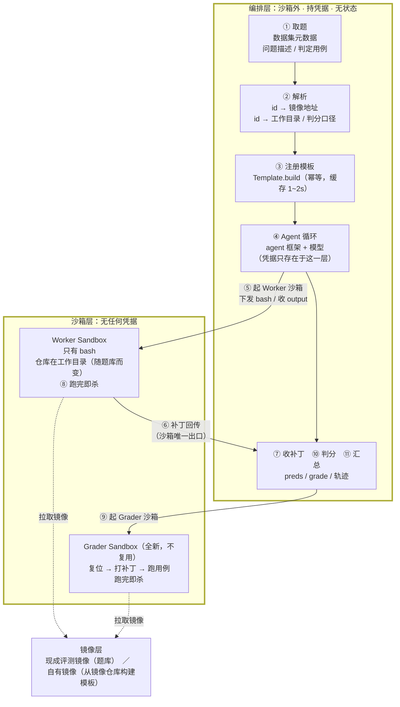

# 构建 SWE Agent

SWE Agent（软件工程 Agent）自动完成 Issue 修复、PR 生成这类开发任务：把一个真实仓库的缺陷描述交给它，它在沙箱里读代码、改文件、跑测试，最后产出一个补丁。评估它做得好不好，业界标准做法是跑 SWE-bench 这类基准 —— 每道题给定一个包含仓库现场的镜像，用测试用例判定补丁是否真的修好了问题。

本文以一道真实的 SWE-bench 形态题目为例，说明如何在云沙箱上跑通「Agent 修复 → 产出补丁 → 判定是否修好」的完整闭环，再扩展到批量评测，并说明如何接入自有仓库的镜像。文中代码可直接复制运行。

## 业务场景

- 团队需要一个可复现的评测底座，用统一口径比较不同模型、不同提示词在真实仓库缺陷上的修复能力。
- Agent 会执行仓库里的代码和测试，需要强隔离环境，避免影响本地或 CI 机器。
- 批量评测要同时跑几十上百个实例，需要按实例隔离、跑完即回收，成本可控。
- 自研仓库需要构造私有评测集，希望复用同一套 Agent 与判分链路。

## 前置条件

- 已开通云沙箱，并获取目标地域的 `E2B_API_KEY`。本文以华东1（上海）地域为例，对应接入点：
  - `api_url`：`https://api.cn-shanghai.e2b.fc.aliyuncs.com`
  - `domain`：`cn-shanghai.e2b.fc.aliyuncs.com`
- 一个可用的模型 API Key（本文用兼容 OpenAI 协议的端点）。
- Python 3.10 及以上。

> API Key 与地域绑定，跨地域使用会返回 401。

## 整体架构



**模型跑在编排层，沙箱只执行 bash。** 这样模型 Key 与代码仓库凭据都不进沙箱：Agent 读到的仓库内容即使包含恶意指令，最坏也只能提交一个无效补丁，拿不到任何凭据。

## 一道题由三部分组成

本文例题 `getmoto__moto-7365`：moto 的 DynamoDB `update_item` 用 `ADD` 表达式做加法时走了浮点运算，金额算出 `Decimal('11.700000000000003')`，应当用 `Decimal` 精确运算。

| 组成 | 内容 | 来源 |
| --- | --- | --- |
| 环境 | 镜像 `fc-e2b-registry.cn-shanghai.cr.aliyuncs.com/swebench/sweb.eval.x86_64:envd_v_0_0_41_getmoto_s_moto-7365-latest_202607231510`，仓库已停在缺陷提交上、依赖已装好 | 现成评测镜像 |
| 任务 | 问题描述 `problem_statement` | 上游数据集 |
| 判定 | `FAIL_TO_PASS`（修好后应通过）、`PASS_TO_PASS`（不能回归）、`test_patch` | 上游数据集 |

**镜像只是环境，题目与判定在元数据里。** 只有镜像、没有元数据，题是跑不了的。

## 装依赖与配置凭据

```bash
mkdir swe-demo && cd swe-demo
python -m venv .venv
.venv/bin/pip install e2b "mini-swe-agent>=2.4" pyyaml

export E2B_API_KEY="<your-e2b-api-key>"
export E2B_REGION="cn-shanghai"
export MODEL_API_KEY="<your-model-api-key>"
export MSWEA_CONFIGURED=true MSWEA_SILENT_STARTUP=1
```

Agent 循环直接用社区标准实现 [mini-SWE-agent](https://github.com/SWE-agent/mini-swe-agent)，提示词与提交协议全部沿用官方，只把执行底座替换成云沙箱。它的执行环境协议只有三个方法，实现即可，不需要修改上游代码。

## 实现执行环境：`fc_env.py`

以下是完整实现。注释标出的四处，是与本地 docker 执行环境不同、必须特殊处理的地方。

```python
# fc_env.py
from __future__ import annotations

import hashlib
import os
import platform
import shlex
from dataclasses import dataclass, field
from typing import Any

from e2b import CommandExitException, Sandbox, Template
from minisweagent.exceptions import Submitted

SUBMIT_SENTINEL = "COMPLETE_TASK_AND_SUBMIT_FINAL_OUTPUT"

REGIONS = {
    "cn-shanghai": "https://api.cn-shanghai.e2b.fc.aliyuncs.com",
    "cn-hangzhou": "https://api.cn-hangzhou.e2b.fc.aliyuncs.com",
    "cn-beijing": "https://api.cn-beijing.e2b.fc.aliyuncs.com",
    "cn-hongkong": "https://api.cn-hongkong.e2b.fc.aliyuncs.com",
    "us-west-1": "https://api.us-west-1.e2b.fc.aliyuncs.com",
}


@dataclass
class FCSandboxEnvironmentConfig:
    image: str = ""
    template: str = ""
    cwd: str = "/testbed"
    env: dict[str, str] = field(default_factory=dict)
    forward_env: list[str] = field(default_factory=list)  # 保持为空：宿主变量不进沙箱
    timeout: int = 60
    interpreter: list[str] = field(default_factory=lambda: ["bash", "-c"])
    sandbox_timeout: int = 1800
    region: str = field(default_factory=lambda: os.environ.get("E2B_REGION", "cn-shanghai"))
    run_as_user: str = "root"  # 评测镜像的仓库属主通常是 root，且镜像里往往没有 sudo


class FCSandboxEnvironment:
    def __init__(self, *, config_class=FCSandboxEnvironmentConfig, **kwargs):
        self.config = config_class(**kwargs)
        self._conn = {
            "api_key": os.environ["E2B_API_KEY"],
            "api_url": REGIONS[self.config.region],
            "domain": f"{self.config.region}.e2b.fc.aliyuncs.com",
        }
        template = self.config.template or self._ensure_template()
        self.sbx = Sandbox.create(template, timeout=self.config.sandbox_timeout, **self._conn)
        self.template = template

        # 差异 1：docker 的 -w 会自动创建目录，沙箱不会。目录不存在时报的是
        # `fork/exec /bin/bash: no such file or directory`，容易误判成 bash 有问题。
        self._run_raw(f"mkdir -p {shlex.quote(self.config.cwd)}")
        # 差异 2：跨用户的 git 操作会被拒绝（dubious ownership）
        self._run_raw(f"git config --global --add safe.directory {shlex.quote(self.config.cwd)}")

    def _ensure_template(self) -> str:
        """镜像 → 模板，幂等：先用模板名探活，失败才构建。

        模板名用镜像内容哈希、不要带版本号：同名模板只允许构建一次，
        构建失败后该名字会停留在 CREATE_FAILED，再次构建直接返回 409。
        """
        name = "swe-" + hashlib.sha1(self.config.image.encode()).hexdigest()[:16]
        try:
            probe = Sandbox.create(name, timeout=60, **self._conn)
            probe.kill()
            return name
        except Exception:
            pass
        Template.build(Template().from_image(self.config.image), name=name,
                       cpu_count=2, memory_mb=8192, **self._conn)
        return name

    def _run_raw(self, command: str) -> None:
        try:
            self.sbx.commands.run(command, user=self.config.run_as_user or None, timeout=30)
        except Exception:
            pass  # 探路性质的命令，失败不影响主流程

    def execute(self, action: dict, cwd: str = "", *, timeout: int | None = None) -> dict[str, Any]:
        command = action.get("command", "")
        limit = timeout or self.config.timeout
        envs = {k: os.environ[k] for k in self.config.forward_env if k in os.environ}
        envs.update(self.config.env)
        cmd = shlex.join([*self.config.interpreter, command])
        try:
            r = self.sbx.commands.run(
                cmd, cwd=cwd or self.config.cwd, envs=envs or None,
                user=self.config.run_as_user or None,
                timeout=limit, request_timeout=limit + 60,
            )
            out = {"output": (r.stdout or "") + (r.stderr or ""), "returncode": 0,
                   "exception_info": ""}
        except CommandExitException as e:
            # 差异 3：命令非零退出是正常信号（测试失败等），必须转成 returncode，不能外抛
            out = {"output": (e.stdout or "") + (e.stderr or ""), "returncode": e.exit_code,
                   "exception_info": ""}
        except Exception as e:
            out = {"output": "", "returncode": -1,
                   "exception_info": f"命令执行异常: {e}",
                   "extra": {"exception_type": type(e).__name__}}
        self._check_finished(out)
        return out

    def _check_finished(self, output: dict) -> None:
        """差异 4：提交协议必须原样复刻 —— 首行是哨兵且退出码为 0，其余行即补丁。"""
        lines = output.get("output", "").lstrip().splitlines(keepends=True)
        if lines and lines[0].strip() == SUBMIT_SENTINEL and output["returncode"] == 0:
            submission = "".join(lines[1:])
            raise Submitted({"role": "exit", "content": submission,
                             "extra": {"exit_status": "Submitted", "submission": submission}})

    def get_template_vars(self, **kwargs) -> dict[str, Any]:
        return {**self.config.__dict__, **platform.uname()._asdict(), **kwargs}

    def serialize(self) -> dict:
        # 每条轨迹都要能回溯到具体沙箱与源镜像
        return {"environment_class": "fc_env.FCSandboxEnvironment",
                "sandbox_id": self.sbx.sandbox_id, "template": self.template,
                "image": self.config.image, "cwd": self.config.cwd}

    def cleanup(self) -> None:
        try:
            self.sbx.kill()
        except Exception:
            pass
```

## 配置：镜像与工作目录成对指定

```yaml
# demo.yaml —— 与 mini-SWE-agent 官方 swebench.yaml 叠加，提示词与提交协议沿用官方
environment:
  environment_class: fc_env.FCSandboxEnvironment
  image: fc-e2b-registry.cn-shanghai.cr.aliyuncs.com/swebench/sweb.eval.x86_64:envd_v_0_0_41_getmoto_s_moto-7365-latest_202607231510
  cwd: /testbed          # 换题库必须同时更换，见「换题库要改什么」
  run_as_user: root
  timeout: 120
model:
  model_name: openai/<your-model>
  model_kwargs:
    api_base: <兼容 OpenAI 协议的端点>
    temperature: 0.0
  cost_tracking: ignore_errors   # 自建端点的模型不在价格表里，否则成本计算会抛错
agent:
  step_limit: 40
  cost_limit: 0
```

## 驱动 Agent：`run.py`

```python
# run.py
import argparse, json, os
from pathlib import Path

import yaml
from minisweagent.agents.default import DefaultAgent
from minisweagent.config import builtin_config_dir
from minisweagent.models.litellm_model import LitellmModel
from minisweagent.utils.serialize import recursive_merge

from fc_env import FCSandboxEnvironment

p = argparse.ArgumentParser()
p.add_argument("-c", "--config", type=Path, default=Path("demo.yaml"))
p.add_argument("-t", "--task", type=Path, default=Path("task.md"))
p.add_argument("-o", "--output", type=Path, default=Path("out.patch"))
p.add_argument("--traj", type=Path, default=Path("traj.json"))
a = p.parse_args()

# 官方 swebench.yaml 提供提示词与提交协议；本地 yaml 只覆盖镜像、模型与上限
official = yaml.safe_load((builtin_config_dir / "benchmarks" / "swebench.yaml").read_text())
cfg = recursive_merge(official, yaml.safe_load(a.config.read_text()))

env_cfg = dict(cfg["environment"])
env_cfg.pop("environment_class", None)          # 直接实例化，不走注册表
env = FCSandboxEnvironment(**env_cfg)

model_cfg = dict(cfg["model"])
model_cfg.setdefault("model_kwargs", {})
model_cfg["model_kwargs"]["api_key"] = os.environ["MODEL_API_KEY"]   # 只在编排层

agent = DefaultAgent(LitellmModel(**model_cfg), env,
                     **recursive_merge(cfg.get("agent", {}), {"output_path": a.traj}))
try:
    result = agent.run(a.task.read_text())
finally:
    env.cleanup()

patch = result.get("submission") or ""
a.output.write_text(patch)
print(json.dumps({"exit_status": result.get("exit_status"), "patch_bytes": len(patch),
                  "model_calls": agent.n_calls, "sandbox_id": env.sbx.sandbox_id},
                 ensure_ascii=False))
```

> **批量评测不要用交互式命令行驱动。** mini-SWE-agent 的 `mini` 命令在 Agent 收尾时有一次交互确认，`-y` 不跳过它；非交互环境下会以 `EOFError` 结束，补丁全部丢失（而 Agent 其实已经解出来了）。脚本化请像上面一样直接驱动 `DefaultAgent`。

## 判分：`grade.py`

判定口径与 SWE-bench 官方一致：`FAIL_TO_PASS` 全部通过，且 `PASS_TO_PASS` 没有回归。

**判分在全新沙箱里做，不复用 Agent 的工作沙箱。** Agent 跑完后那个沙箱已经不是原始现场了 —— 它可能装过额外的包（测试可能因此意外通过）、改过测试文件或 `conftest.py`、留下临时文件。云沙箱的镜像是不可变的，所以只要用同一镜像新建一个沙箱，仓库就自动回到原始状态，不需要清理 Agent 的痕迹。模板已缓存，第二个沙箱起来只要几秒。

```python
# grade.py
import argparse, json, re, shlex
from pathlib import Path

import yaml
from fc_env import FCSandboxEnvironment

# 评测镜像的 python/pytest 常装在 conda 环境里，靠 BASH_ENV 激活。
# 不带这套环境变量，`python -m pytest` 会用到 conda base，报 No module named pytest。
GRADE_ENV = {"PAGER": "cat", "MANPAGER": "cat", "PIP_PROGRESS_BAR": "off",
             "TQDM_DISABLE": "1", "BASH_ENV": "/root/.bashrc"}

def as_list(v):
    if isinstance(v, str):
        try:
            return json.loads(v)
        except json.JSONDecodeError:
            return [v] if v else []
    return list(v or [])

def files_of(names):        # 用例名 → 文件名
    return {n.strip().strip("'\"").split("::")[0] for n in names}

def patched_files(diff):    # 补丁触及的文件
    return sorted(set(re.findall(r"^\+\+\+ b/(\S+)", diff, flags=re.M)))

p = argparse.ArgumentParser()
p.add_argument("--instance", type=Path, default=Path("instance.json"))
p.add_argument("--patch", type=Path)
p.add_argument("--gold", action="store_true", help="用数据集自带补丁自检")
p.add_argument("--cwd", default="/testbed")
a = p.parse_args()

inst = json.loads(a.instance.read_text())[0]
patch = inst["patch"] if a.gold else a.patch.read_text()
if not patch.strip():
    raise SystemExit(json.dumps({"resolved": False, "reason": "补丁为空"}))

image = yaml.safe_load(Path("demo.yaml").read_text())["environment"]["image"]
f2p, p2p = as_list(inst["FAIL_TO_PASS"]), as_list(inst["PASS_TO_PASS"])

env = FCSandboxEnvironment(image=image, cwd=a.cwd, run_as_user="root",
                           timeout=900, env=GRADE_ENV)
try:
    # 1) 打被判定的补丁；打不上也是一种结果
    env.sbx.files.write("/tmp/model.patch", patch)
    out = env.execute({"command": "git apply -v /tmp/model.patch"}, timeout=300)
    if out["returncode"] != 0:
        out = env.execute({"command": "patch -p1 -i /tmp/model.patch"}, timeout=300)
        assert out["returncode"] == 0, f"补丁打不上: {out['output'][-200:]}"

    # 2) 先把测试文件恢复到基线，再打 test_patch —— 测试内容不可被 Agent 篡改
    tf = patched_files(inst["test_patch"])
    if tf:
        env.execute({"command": f"git checkout -- {' '.join(map(shlex.quote, tf))} || true"})
    env.sbx.files.write("/tmp/test.patch", inst["test_patch"])
    out = env.execute({"command": "git apply -v /tmp/test.patch"}, timeout=300)
    assert out["returncode"] == 0, f"test_patch 打不上: {out['output'][-200:]}"

    # 3) 跑整个测试文件，再从 -rA 报告里按名字匹配。
    # 不要把用例名当命令行参数传给 pytest：参数化用例名里可能有空格和括号，会 not found。
    # 也不要对报告做 tail 截断：大仓库有几千行，截断会漏判已通过的用例。
    files = sorted(set(tf) | files_of(f2p + p2p))
    cmd = ("python -m pytest -rA --no-header -q " + " ".join(map(shlex.quote, files))
           + " > /tmp/res.log 2>&1; grep -E '^(PASSED|FAILED|ERROR) ' /tmp/res.log;"
             " echo '===TAIL==='; tail -3 /tmp/res.log")
    report = env.execute({"command": cmd}, timeout=1800)["output"]
    passed = set(re.findall(r"^PASSED (\S+)", report, flags=re.M))

    def ok(name):
        n = name.strip().strip("'\"")
        head = n.split()[0] if n.split() else n
        return n in passed or any(x.startswith(head) for x in passed)

    f2p_ok, p2p_ok = [t for t in f2p if ok(t)], [t for t in p2p if ok(t)]
    print(json.dumps({
        "resolved": len(f2p_ok) == len(f2p) and len(p2p_ok) == len(p2p) and bool(f2p),
        "FAIL_TO_PASS": f"{len(f2p_ok)}/{len(f2p)}",
        "PASS_TO_PASS": f"{len(p2p_ok)}/{len(p2p)}",
        "summary": report.strip().splitlines()[-1][:120],
    }, ensure_ascii=False))
finally:
    env.cleanup()
```

## 运行

`task.md` 是问题描述正文；`instance.json` 是单元素数组，字段取自上游数据集：

```json
[{"instance_id": "getmoto__moto-7365",
  "problem_statement": "DynamoDB's `update_item` performs floating-point arithmetic …",
  "FAIL_TO_PASS": ["tests/test_dynamodb/test_dynamodb_update_expressions.py::test_update_item_add_float"],
  "PASS_TO_PASS": ["tests/test_dynamodb/test_dynamodb_update_expressions.py::test_update_different_map_elements_in_single_request"],
  "test_patch": "diff --git a/tests/... （上游数据集原文）",
  "patch": "diff --git a/moto/... （数据集自带的正确补丁，仅用于判分器自检）"}]
```

**先让判分器自检，再跑 Agent。** 用数据集自带的正确补丁走一遍判分，必须 `resolved: true`：

```bash
PYTHONPATH=. .venv/bin/python grade.py --gold
# {"resolved": true, "FAIL_TO_PASS": "1/1", "PASS_TO_PASS": "1/1", "summary": "2 passed in 0.58s"}
```

自检不通过，说明判分链路本身有问题（镜像、测试引入方式、用例名匹配），此时 Agent 的得分没有意义。自检通过后跑 Agent 并判分：

```bash
PYTHONPATH=. .venv/bin/python run.py
# {"exit_status": "Submitted", "patch_bytes": 1839, "model_calls": 31, "sandbox_id": "sbx-…"}

PYTHONPATH=. .venv/bin/python grade.py --patch out.patch
# {"resolved": true, "FAIL_TO_PASS": "1/1", "PASS_TO_PASS": "1/1", "summary": "2 passed in 0.76s"}
```

首次运行会把镜像注册成模板（幂等，之后命中缓存 1~2 秒）。模型有随机性，`model_calls` 与 `patch_bytes` 会浮动。

## 扩展到批量评测

从一道题到 N 道题，`fc_env.py` 不用改，增加的是解析层与并发编排。

### 解析层：把写死的两行变成查表

单题时镜像地址与工作目录写在配置里；批量时每道题都不同，必须查表。三件事需要按实例解析：镜像地址（评测镜像的 tag 通常带构建批次信息，**不能由 instance_id 推导**）、工作目录、判分口径。

```python
# resolve.py
import json

IMAGES = dict(l.split("\t") for l in open("images.tsv").read().splitlines())
REGISTRY = json.load(open("registry.json"))     # family → cwd / run_as_user / grading
FAMILY = json.load(open("family-index.json"))   # instance_id → family

def resolve(instance: dict) -> dict:
    spec = REGISTRY[FAMILY[instance["instance_id"]]]
    cwd = spec["cwd"]
    if cwd.startswith("$dataset."):             # 某些题库的工作目录每实例不同
        cwd = instance[cwd.split(".", 1)[1]]    # 取数据集里对应字段
    return {"image": IMAGES[instance["instance_id"]], "cwd": cwd,
            "run_as_user": spec["run_as_user"], "grading": spec["grading"]}
```

解析是纯查表，没有网络与沙箱开销，可以在开跑前一次性完成。解析失败的实例（缺镜像映射、缺元数据）应当在开跑前剔除，而不是跑到一半才失败。

### 并发编排

```python
# batch.py（骨架）
import concurrent.futures as cf, json
from pathlib import Path

from fc_env import FCSandboxEnvironment
from resolve import resolve

def run_one(inst: dict) -> tuple[str, dict]:
    spec = resolve(inst)
    env = FCSandboxEnvironment(image=spec["image"], cwd=spec["cwd"],
                               run_as_user=spec["run_as_user"], timeout=120)
    try:
        agent = build_agent(env)                       # 同前文 run.py
        result = agent.run(inst["problem_statement"])
        return inst["instance_id"], {
            "model_patch": result.get("submission") or "",
            "exit_status": result.get("exit_status"),
            "sandbox_id": env.sbx.sandbox_id,          # 保证可回溯
        }
    except Exception as e:                             # 单实例失败不拖垮整批
        return inst["instance_id"], {"model_patch": "", "error": f"{type(e).__name__}: {e}"}
    finally:
        env.cleanup()                                  # 跑完即杀，不要等 TTL

instances = json.loads(Path("instances.json").read_text())
preds = {}
with cf.ThreadPoolExecutor(max_workers=6) as ex:
    for iid, pred in ex.map(run_one, instances):
        preds[iid] = pred
Path("preds.json").write_text(json.dumps(preds, ensure_ascii=False, indent=1))
```

四个必须做到的编排约束：

| 约束 | 做法 |
| --- | --- |
| 单实例失败不拖垮整批 | 每个实例独立捕获异常，记录错误后继续 |
| 沙箱一定要回收 | `finally` 里调用 `kill()`。靠 TTL 兜底会额外计费并占用并发 |
| Agent 侧设上限 | `step_limit`、`cost_limit`、`wall_time_limit`，超限即停，否则一道难题可能耗掉整批预算 |
| 输出截断分档 | 终端 15k、单文件 20k、批量 50k 字符，防止上下文被占满 |

**并发建议压在 6 左右。** 大镜像在 10 并发下创建沙箱可能超时，串行重试即可成功；因此创建沙箱失败时应先串行重试一次，再判定实例不可用，否则会把并发压力误记成镜像问题。

### 判分与 Agent 解耦

Agent 阶段只产出 `preds.json`，判分阶段读它，每条另起全新沙箱并发判定。这样调整判分逻辑后重判不需要重跑 Agent，省掉整轮模型开销。

**接入任何新题库的第一件事，是把数据集自带的正确补丁全部判一遍，通过率必须接近 100%。** 以下四类问题都会静默压低分数且不报错，只有这一步能暴露：

| 问题 | 现象 | 处置 |
| --- | --- | --- |
| 数据集字段里是字面量 `\n`（反斜杠加 n，不是换行） | bash 视为转义符，命令被拼坏，整条复位失败 | 仅对该字段还原换行，不要全局处理 |
| 判定依据被 `tail -N` 截断 | 大仓库测试报告数千行，通过的用例被漏判，分数偏低 | 先过滤出判定行，再单独取统计尾部 |
| 参数化用例名含空格或换行 | pytest 报告在第一个空白处截断用例名，精确匹配全部落空 | 按截断后的前缀匹配，并按数量满足判定 |
| 用例名当命令行参数传给 pytest | 名字含空格括号，报 not found，最终 no tests ran | 跑整个测试文件，再从报告按名字匹配 |

## 上海地域现成的评测镜像

华东1（上海）地域已预置一批开源评测集的镜像，仓库现场与依赖都已就绪，拿到镜像地址构建模板即可使用，无需自行搬运。镜像前缀统一为 `fc-e2b-registry.cn-shanghai.cr.aliyuncs.com/swebench/`。

**镜像只解决「环境」，题目与判定用例来自上游数据集，需要按 `instance_id` 与镜像关联。** 按元数据是否公开可得，分两类。

### 一、可直接使用：元数据公开，关联字段已验证

下表每个题库的元数据都公开可取，且已逐条验证「镜像 ↔ 数据集」的关联字段能对上（关联率均为 100%，`SWE-smith` 为 99.7%）。拿到数据集与镜像清单即可开跑。

| 题库 | 镜像数 | 题目类型 | 元数据数据集 | 关联字段 | 工作目录 |
| --- | --- | --- | --- | --- | --- |
| SWE-rebench V2 | **32,074**<br/>（3,614 个仓库） | 真实 PR 修复，仓库覆盖面最广 | [nebius/SWE-rebench-V2](https://huggingface.co/datasets/nebius/SWE-rebench-V2) | `image_name` 字段即镜像的原始地址，逐字相等 | 仓库在根目录、以仓库原名命名（如 `/OpenTripPlanner`），需运行时探测 |
| Scale-SWE | **19,473**<br/>（1,180 个仓库） | 真实 PR 修复：仓库复位到 PR 的父提交，要求实现该 PR | [AweAI-Team/Scale-SWE](https://huggingface.co/datasets/AweAI-Team/Scale-SWE) | `instance_id` 即镜像 tag 中的实例名 | `/workspace/<repo>`，取数据集 `workdir` 字段 |
| SWE-Gym | **2,401**<br/>（11 个仓库） | 真实 issue 修复，SWE-bench 标准形态 | [SWE-Gym/SWE-Gym](https://huggingface.co/datasets/SWE-Gym/SWE-Gym) | `instance_id`（**镜像 tag 强制小写**，比对时需统一大小写） | `/testbed` |
| SWE-bench Pro | **731** | 企业级仓库 issue 修复，上下文更长，含 Go/Node 等多语言 | [ScaleAI/SWE-bench_Pro](https://huggingface.co/datasets/ScaleAI/SWE-bench_Pro) | `dockerhub_tag` | `/app` |
| SWE-smith | **363**<br/>（环境级镜像） | 合成缺陷修复，一个镜像承载同一仓库的多道题（上游共 88,130 道） | [SWE-bench/SWE-smith-py](https://huggingface.co/datasets/SWE-bench/SWE-smith-py) 等 8 个语言子集（py / java / js / ts / rs / cpp / php / go） | `image_name` | `/testbed`，用 `git checkout <instance_id>` 选题 |
| SEC-bench | **300** | 安全漏洞复现与修复（CVE） | [SEC-bench/SEC-bench](https://huggingface.co/datasets/SEC-bench/SEC-bench) | `instance_id` | 取数据集 `work_dir` 字段 |
| Terminal-Bench 2.x | **89** | 终端任务（非代码修复）：给一段指令在 shell 中完成，无 git 仓库、不产补丁 | [harborframework/terminal-bench-2.0](https://huggingface.co/datasets/harborframework/terminal-bench-2.0) | 任务目录名即镜像 tag | `/app` |
| SWE-Atlas QnA | **11** | 仓库问答，按 rubric 评分，不产补丁 | [ScaleAI/SWE-Atlas-QnA](https://huggingface.co/datasets/ScaleAI/SWE-Atlas-QnA) | `docker_image` | `/app` |

判定方式并非只有一种，接入前先确认：SWE-rebench V2 / Scale-SWE / SWE-Gym / SWE-bench Pro 用 `FAIL_TO_PASS` + `PASS_TO_PASS`；SEC-bench 用 sanitizer 报告与退出码；Terminal-Bench 跑任务自带的 `tests/test.sh`；SWE-Atlas QnA 需按 rubric 打分。Scale-SWE 的用例引入方式也与 SWE-bench 不同，详见「换题库要改什么」。

### 二、仅提供镜像：元数据需自行匹配

下表的镜像同样可用（构建模板、创建沙箱、进容器操作都正常），但**平台不提供题目与判定用例的关联关系**，原因见「说明」列。使用前需要自己找到元数据来源并建立与镜像的对应关系，否则只能把它们当作「预置好依赖的真实仓库环境」使用，无法做自动判分。

| 题库 | 镜像数 | 镜像内容 | 说明：为什么需要自行匹配 |
| --- | --- | --- | --- |
| TMax | 14,490 | 通用终端任务环境（领域各异，含音视频、数据处理等） | 上游数据集的任务标识与镜像 tag（12 位十六进制）不同源，实测无交集，无法建立对应关系 |
| TerminalTraj | 5,646 | 终端任务容器，仅预装 `tmux` / `asciinema`，任务描述不在镜像内 | 上游以任务包（tar）形式分发，需自行解包后从每个任务的 Dockerfile 反查镜像标识 |
| ProgramBench | 200 | 净室实现任务：仓库代码已清空，只保留目标产物与说明 | 未找到公开的元数据数据集。另注意此类任务是「从零实现」而非「修复缺陷」，Agent 提示词需相应调整 |
| SEC-bench Pro | 183 | 安全类任务环境 | 镜像 tag 是纯数字标识，在已知的公开数据集中无对应记录 |
| DeepSWE | 114 | SWE-bench 形态仓库环境 | 镜像 tag 是不可逆的随机串，无法反查上游实例 |
| NL2RepoBench | 104 | 按自然语言描述实现仓库功能 | 未找到公开的元数据数据集 |
| Frontier | 17 | 性能优化任务：镜像内是训练脚本与计时脚本，无 git 仓库 | 未找到公开的元数据数据集。判定方式是跑分而非跑测试 |
| Toolathlon | 1 | 工具调用任务环境 | 上游仅公开轨迹数据，未公开题目集 |

### 镜像清单获取

无论哪一类，都需要一份 `instance_id`（或镜像 tag）到镜像地址的映射表：**镜像 tag 带构建批次信息，无法由 `instance_id` 推导**。映射表按题库拆分成制表符分隔的文本文件提供（每行 `instance_id<TAB>镜像地址`），便于直接检索与脚本消费：

| 题库 | 映射表下载 |
| --- | --- |
| SWE-rebench V2 | <!-- TODO: 补充下载地址 --> |
| Scale-SWE | <!-- TODO: 补充下载地址 --> |
| SWE-Gym | <!-- TODO: 补充下载地址 --> |
| SWE-bench Pro | <!-- TODO: 补充下载地址 --> |
| SWE-smith | <!-- TODO: 补充下载地址 --> |
| SEC-bench | <!-- TODO: 补充下载地址 --> |
| Terminal-Bench 2.x | <!-- TODO: 补充下载地址 --> |
| 其余题库 | <!-- TODO: 补充下载地址 --> |

```bash
# 查某一道题的镜像地址
grep '^getmoto__moto-7365' swegym-images.tsv | cut -f2

# 挑出某个仓库的全部题目
grep '^pandas-dev__' scaleswe-images.tsv | cut -f1 > my-instances.txt
```

## 换题库要改什么

不同来源的评测镜像**不是同构的**，工作目录就不一样：

| 镜像来源形态 | 工作目录 | 怎么拿到 |
| --- | --- | --- |
| SWE-bench 标准形态 | `/testbed` | 固定值；python 环境常在 conda 的 `testbed` 里，需 `BASH_ENV` 激活 |
| 按仓库名分目录 | `/workspace/<repo>` | 取数据集的 `workdir` 字段，每实例不同 |
| 单一应用目录 | `/app` | 固定值 |
| 根目录下以仓库原名命名 | 如 `/OpenTripPlanner`、`/ApplicationInsights-node.js` | **无法从镜像 tag 推导**（tag 是小写、目录保留原始大小写），需运行时探测 |

最后一种要在容器里探测，例如：

```bash
for d in /*/; do [ -d "$d/.git" ] && echo "${d%/}" && break; done
```

把它做成解析层的一个 `auto` 选项，比在配置里逐条枚举更可靠。

镜像地址与工作目录必须**成对**更换。只改一个会报 `fork/exec /bin/bash: no such file or directory` —— 那是工作目录不存在，与 bash 无关。

两个要避免的做法：

- **把工作目录写死在评测配置里**。它只对部分题库成立，换库必挂，应当按前文查表。
- **依据镜像元数据里的语言标记选判分执行器**。同一批镜像里常混有 Go、Node、Java、Python 多种仓库，应按数据集的 `repo_language` 字段分流。

## 接入自有镜像

自研仓库、内部框架、私有评测集走这条路，接入后前文的 Agent 与判分链路可直接复用，只替换镜像层。

把自有镜像变成可用模板的完整流程见[构建自定义镜像模板](../04.功能说明/02.模板/03.构建自定义镜像模板.md)，
其中包含镜像的平台硬性要求（`linux/amd64` 架构、`/etc/passwd` 与 `/etc/group` 可写、
`commands.run` 与 PTY 依赖固定路径的 `/bin/bash` 等）。两种常见场景另有专文：

- 镜像在需要鉴权的仓库里：[使用 GHCR 自定义镜像构建 Sandbox 模板](./07.使用%20GHCR%20自定义镜像构建%20Sandbox%20模板.md)，
  通过 `X-E2B-Template-Source-Username` / `X-E2B-Template-Source-Password` 两个 header 传入仓库凭据
- 把模板构建接入流水线：[使用 GitHub Actions 发布 Sandbox 模板](./09.使用%20GitHub%20Actions%20发布%20Sandbox%20模板.md)

在此基础上，评测场景还有四点需要注意：

| 约束 | 现象 | 应对 |
| --- | --- | --- |
| 一个模板名只允许构建一次 | 构建失败后重试返回 `409: template build is not allowed in current status CREATE_FAILED`，该名字永久失效 | 重试必须换名。模板名用镜像内容哈希，不要带版本号 |
| 构建阶段不支持执行步骤 | 声明 `run_cmd` / `set_user` / `set_workdir` 会返回 `400: steps are not supported` | 依赖与环境必须在源镜像里就绪；权限与工作目录只能在运行时用 `user="root"` 解决 |
| 匿名拉取公共镜像可能失败 | 未传凭据 header 时，构建流程会走完并打出 `Build finished`，但模板最终状态为 `CREATE_FAILED`，SDK 不报错而是一直等待就绪 | 按上文引用的文档传入仓库凭据；并在 `Template.build` 外层自行加超时 |
| 大镜像创建沙箱会超时 | 高并发下报 `TimeoutException` | 并发压到 6 左右，失败先串行重试一次 |

镜像接入后，验收不要停在「沙箱起来了」。抽样跑完以下四步，任何一步不过都不算可用：

1. 构建模板、创建沙箱成功。
2. 仓库目录存在、是 git 仓库、`HEAD` 能解析。
3. 该语言的测试执行器可用。
4. 能真正收集到用例（如 `pytest --collect-only -q`）。

**验收必须在与判分器完全相同的环境变量下进行。** 三类常见误判会让正常镜像被判为不可用：

| 误判原因 | 后果 |
| --- | --- |
| 验收时漏掉 `BASH_ENV` | conda 环境未激活，`python -m pytest` 报 No module named pytest |
| Go 装在 `/usr/local/go/bin`，不在默认 PATH | 正常的 Go 仓库镜像被判「没有测试执行器」 |
| Java 项目不装全局 mvn/gradle，而是带 `./gradlew` | 正常镜像被误判 |

## 上线建议

- **凭据管理**：`E2B_API_KEY` 与模型 API Key 通过环境变量或密钥管理服务注入，不要硬编码或提交进代码仓库。模型调用放在编排层，沙箱内不放任何凭据。
- **出网收敛**：沙箱按 `deny_out: ["0.0.0.0/0"]` 加白名单，只放代码托管、镜像源与模型端点。注意域名过滤只对 80 端口的 Host 头与 443 的 SNI 生效，其他端口只能用 CIDR；`allow` 优先于 `deny`；被拒绝的 TCP 从沙箱内部看像是连接成功，需用应用层响应判定。
- **两层超时**：区分沙箱级 TTL 与命令级超时。不要使用 `timeout=0`，卡住的进程不会自愈；长任务用 `on_timeout="pause"` 配合 `auto_resume`，暂停期间不计费、不占并发。
- **补丁是唯一出口**：沙箱只需要仓库读权限。编排层拿到补丁后重建干净仓库校验并跑测试，通过再创建 PR。不要在沙箱内 push 或建 PR。
- **及时销毁**：`finally` 里调用 `sandbox.kill()`，按秒计费仅统计运行中的时间。
- **可回溯**：每条轨迹记录 `sandbox_id` 与源镜像地址（前文 `serialize()` 已包含），便于复现与排障。
- **成本核算**：编排层自行记录起止时间，配合 `get_info()` 读取规格自算成本。

## 相关功能

- [构建自定义镜像模板](../04.功能说明/02.模板/03.构建自定义镜像模板.md)
- [使用 GHCR 自定义镜像构建 Sandbox 模板](./07.使用%20GHCR%20自定义镜像构建%20Sandbox%20模板.md)
- [使用 GitHub Actions 发布 Sandbox 模板](./09.使用%20GitHub%20Actions%20发布%20Sandbox%20模板.md)
- [使用 Claude Code Sandbox](./05.使用%20Claude%20Code%20Sandbox.md)
- [运行命令](../04.功能说明/03.命令/02.运行命令.md)
- [读写文件](../04.功能说明/04.文件系统/02.读写文件.md)
