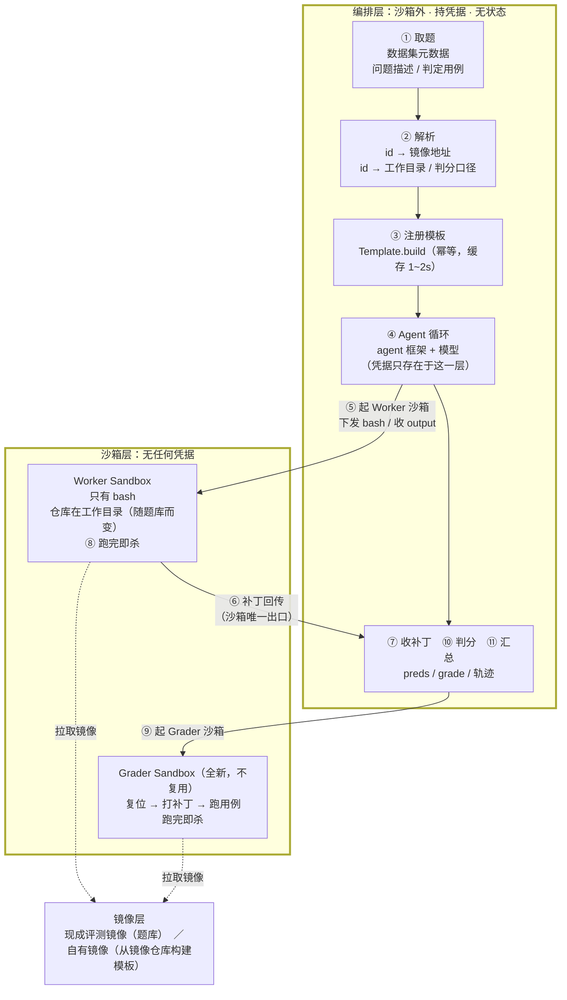

# 构建 SWE Agent

SWE Agent（软件工程 Agent）自动完成 Issue 修复、PR 生成这类开发任务：把一个真实仓库的缺陷描述交给它，它在沙箱里读代码、改文件、跑测试，最后产出一个补丁。评估它做得好不好，业界标准做法是跑 SWE-bench 这类基准 —— 每道题给定一个包含仓库现场的镜像，用测试用例判定补丁是否真的修好了问题。

本文以一道真实的 SWE-bench 形态题目为例，说明如何在云沙箱上跑通「Agent 修复 → 产出补丁 → 判定是否修好」的完整闭环，再扩展到批量评测，并说明如何接入自有仓库的镜像。文中代码可直接复制运行。

## 业务场景

- 团队需要一个可复现的评测底座，用统一口径比较不同模型、不同提示词在真实仓库缺陷上的修复能力。
- Agent 会执行仓库里的代码和测试，需要强隔离环境，避免影响本地或 CI 机器。
- 批量评测要同时跑几十上百个实例，需要按实例隔离、跑完即回收，成本可控。
- 自研仓库需要构造私有评测集，希望复用同一套 Agent 与判分链路。

## 前置条件

- 已开通云沙箱，并获取目标地域的 `E2B_API_KEY`。本文以华东1（上海）地域为例，接入域名为 `cn-shanghai.e2b.fc.aliyuncs.com`（SDK 会据此推导出 API 地址 `https://api.cn-shanghai.e2b.fc.aliyuncs.com`）。
- 一个可用的模型 API Key（本文用兼容 OpenAI 协议的端点）。
- Python 3.10 及以上。

> API Key 与地域绑定，跨地域使用会返回 401。

## 整体架构



**模型跑在编排层，沙箱只执行 bash。** 这样模型 Key 与代码仓库凭据都不进沙箱：Agent 读到的仓库内容即使包含恶意指令，最坏也只能提交一个无效补丁，拿不到任何凭据。

## 一道题由三部分组成

本文例题 `getmoto__moto-7365`：moto 的 DynamoDB `update_item` 用 `ADD` 表达式做加法时走了浮点运算，金额算出 `Decimal('11.700000000000003')`，应当用 `Decimal` 精确运算。

| 组成 | 内容 | 来源 |
| --- | --- | --- |
| 环境 | 镜像 `fc-e2b-registry.cn-shanghai.cr.aliyuncs.com/swebench/sweb.eval.x86_64:envd_v_0_0_41_getmoto_s_moto-7365-latest_202607231510`，仓库已停在缺陷提交上、依赖已装好 | 现成评测镜像 |
| 任务 | 问题描述 `problem_statement` | 上游数据集 |
| 判定 | `FAIL_TO_PASS`（修好后应通过）、`PASS_TO_PASS`（不能回归）、`test_patch` | 上游数据集 |

**镜像只是环境，题目与判定在元数据里。** 只有镜像、没有元数据，题是跑不了的。

## 装依赖与配置凭据

```bash
mkdir swe-demo && cd swe-demo
python -m venv .venv
.venv/bin/pip install pyyaml \
  "mini-swe-agent[e2b] @ git+https://github.com/aliyun-fc/mini-swe-agent@571ea037897d8eb332a83c48319926505b4a05a5"

# 云沙箱：SDK 由 domain 推导出接入点（https://api.<domain>），不需要单独配 api_url
export E2B_API_KEY="<your-e2b-api-key>"
export E2B_DOMAIN="cn-shanghai.e2b.fc.aliyuncs.com"
# 模型凭据只在编排层使用，不进沙箱。变量名由后面 model_name 的 `openai/` 前缀决定，
# 值填你那个兼容端点的 key。用 litellm 认的标准变量，单题脚本与批量入口才能共用同一份凭据
export OPENAI_API_KEY="<your-model-api-key>"
export MSWEA_CONFIGURED=true MSWEA_SILENT_STARTUP=1
```

**pin 到完整 commit SHA，不要 pin 分支。** 分支会随后续提交移动，今天装到的和下周装到的
不是同一份代码，评测结果就不可复现。装完确认一下：

```bash
.venv/bin/python -c "import minisweagent; print(minisweagent.__version__)"
# 2.4.6+fc.1
```

> 网络受限时可以先 `git clone https://github.com/aliyun-fc/mini-swe-agent`，再 `pip install -e ".[e2b]"`。

## 执行环境：用内置的 `e2b`

Agent 循环用社区标准实现 [mini-SWE-agent](https://github.com/SWE-agent/mini-swe-agent)，提示词与提交协议沿用官方，只把执行底座换成云沙箱。上一步装的版本内置了 `e2b`，配置写一行即可：

```yaml
environment:
  environment_class: e2b
```

它第一次用到某个镜像时注册成持久模板（`Template.build`），之后命中缓存；每个实例起一个沙箱，命令走 `commands.run`，补丁按官方协议回传。

**云沙箱与本地 docker 有五处差异，内置类都处理了。** 自行实现执行底座、或排查异常时会撞上：

| 差异 | 不处理的后果 | 处理方式 |
| --- | --- | --- |
| 沙箱不自动创建工作目录（`docker run -w` 会） | 失败在进程创建阶段、**不带退出码**，每条命令都被记成基础设施异常 | 启动时 `mkdir -p <cwd>`。但要先探测一次并告警 —— 否则配错的工作目录会被静默建成空目录，Agent 交出空补丁、判 0 分；`require_existing_cwd: true` 可升级为启动即失败 |
| 属主与运行用户不一致时 git 拒绝操作 | `dubious ownership`，`git diff` 出不来，等于交不出补丁 | 启动时 `git config --global --add safe.directory <cwd>` |
| 非零退出被 SDK 抛成异常 | 测试失败、`grep` 无匹配这类**正常信号**被当成执行故障 | 转成 `returncode`，输出原样交还 |
| 超时异常不带 stdout/stderr | 超时前的几千行全丢，而最容易超时的正是大仓库的慢测试 | 流式收集，超时后交还已产生的部分并标注超时 |
| 仓库属 root，镜像通常没有 `sudo` | 非 root 用户连文件都写不了 | `run_as_user: root`（与官方 docker harness 一致） |

模板构建还有三点，接自有镜像或自行实现时尤其重要：

- **模板名由镜像地址与规格共同决定。** 内置实现哈希「镜像地址 + `cpu_count`/`memory_mb`」；名字里不含规格，改了内存也只会拿到旧规格的模板。
- **同一张镜像的并发首建必须互斥。** 否则都发现模板不存在、都去建同一个名字，实测 4 并发 3 个失败（`409 ... resource conflict`），每个失败者还留一条孤儿模板记录。
- **构建失败的名字不会自愈。** 别名端点不返回状态，于是存在性检查一直说「存在」，而起沙箱被拒、再建报「只允许构建一次」。恢复要按真实状态分流：别人在建就等，`error` 或不存在才删了重建（删除是异步的，要等别名消失）。名字由内容决定，不要带版本号手工递增。

## 配置：镜像与工作目录成对指定

```yaml
# demo.yaml —— 与 mini-SWE-agent 官方 swebench.yaml 叠加，提示词与提交协议沿用官方
environment:
  environment_class: e2b
  image: fc-e2b-registry.cn-shanghai.cr.aliyuncs.com/swebench/sweb.eval.x86_64:envd_v_0_0_41_getmoto_s_moto-7365-latest_202607231510
  cwd: /testbed          # 换题库必须同时更换，见「换题库要改什么」
  require_existing_cwd: true   # 工作目录不在镜像里就启动即失败，而不是建成空目录静默判 0 分
  run_as_user: root
  timeout: 120
  memory_mb: 8192        # 评测镜像大，默认的 2048 起不来
model:
  model_name: openai/<your-model>
  model_kwargs:
    api_base: <兼容 OpenAI 协议的端点>
    temperature: 0.0
  cost_tracking: ignore_errors   # 自建端点的模型不在价格表里，否则成本计算会抛错
agent:
  # 沿用官方 swebench.yaml 的 250。实测压到 40 时 4 个实例 3 个撞上限，其中一个已改好、
  # 只差一步交卷却记 0 分 —— 上限压低会系统性低估分数
  step_limit: 250
  # 步数管不了时间：实测有实例跑到 35 分钟仍未收尾，一直占着并发位与计费沙箱。
  # 注意字段名是 wall_time_limit_seconds，写错不会报错、会被静默忽略
  wall_time_limit_seconds: 1800
  cost_limit: 0     # 自建端点的模型不在价格表里，按成本卡上限没有意义
```

`require_existing_cwd` 默认关闭（与上游一致），**基于仓库的题库都应打开** —— 它是这类静默失败唯一的拦网。

## 驱动 Agent：`run.py`

```python
# run.py
import argparse, json
from pathlib import Path

import yaml
from minisweagent.agents.default import DefaultAgent
from minisweagent.config import builtin_config_dir
from minisweagent.environments import get_environment
from minisweagent.models.litellm_model import LitellmModel
from minisweagent.utils.serialize import recursive_merge

p = argparse.ArgumentParser()
p.add_argument("-c", "--config", type=Path, default=Path("demo.yaml"))
p.add_argument("-t", "--task", type=Path, default=Path("task.md"))
p.add_argument("-o", "--output", type=Path, default=Path("out.patch"))
p.add_argument("--traj", type=Path, default=Path("traj.json"))
a = p.parse_args()

# 官方 swebench.yaml 提供提示词与提交协议；本地 yaml 只覆盖镜像、模型与上限
official = yaml.safe_load((builtin_config_dir / "benchmarks" / "swebench.yaml").read_text())
cfg = recursive_merge(official, yaml.safe_load(a.config.read_text()))

env = get_environment(cfg["environment"])      # environment_class: e2b

# 不在这里注入 api_key：交给 litellm 从标准环境变量解析（`openai/` 前缀 → OPENAI_API_KEY）。
# 这样本脚本与官方批量入口用的是同一份凭据；自定义一个只有本脚本认的变量，会让照着配的
# 批量跑以 Missing credentials 收场。
agent = DefaultAgent(LitellmModel(**cfg["model"]), env,
                     **recursive_merge(cfg.get("agent", {}), {"output_path": a.traj}))
try:
    result = agent.run(a.task.read_text())
finally:
    env.cleanup()

patch = result.get("submission") or ""
a.output.write_text(patch)
print(json.dumps({"exit_status": result.get("exit_status"), "patch_bytes": len(patch),
                  "model_calls": agent.n_calls, "template": env.template,
                  "sandbox_id": env.sandbox.sandbox_id},
                 ensure_ascii=False))
```

> **批量评测不要用交互式命令行驱动。** mini-SWE-agent 的 `mini` 命令在 Agent 收尾时有一次交互确认，`-y` 不跳过它；非交互环境下会以 `EOFError` 结束，补丁全部丢失（而 Agent 其实已经解出来了）。脚本化请像上面一样直接驱动 `DefaultAgent`。

## 判分：`grade.py`

判定口径与 SWE-bench 官方一致：`FAIL_TO_PASS` 全部通过，且 `PASS_TO_PASS` 没有回归。

**判分在全新沙箱里做，不复用 Agent 的工作沙箱。** Agent 跑完后那个沙箱已经不是原始现场了 —— 它可能装过额外的包（测试可能因此意外通过）、改过测试文件或 `conftest.py`、留下临时文件。云沙箱的镜像是不可变的，所以只要用同一镜像新建一个沙箱，仓库就自动回到原始状态，不需要清理 Agent 的痕迹。模板已缓存，第二个沙箱起来只要几秒。

```python
# grade.py
import argparse, json, re, shlex
from collections import Counter
from pathlib import Path

import yaml
from minisweagent.config import builtin_config_dir
from minisweagent.environments import get_environment
from minisweagent.utils.serialize import recursive_merge

def as_list(v):
    if isinstance(v, str):
        try:
            return json.loads(v)
        except json.JSONDecodeError:
            return [v] if v else []
    return list(v or [])

def files_of(names):        # 用例名 → 文件名
    # 只取带文件前缀的（pytest node id）。多语言题库的用例名可能是纯用例描述或
    # 测试类名，没有文件前缀，整串当文件名传给 pytest 会报 file not found。
    return {n.strip().strip("'\"").split("::")[0] for n in names
            if "::" in n or n.strip().strip("'\"").endswith(".py")}

def patched_files(diff):    # 补丁触及的文件
    return sorted(set(re.findall(r"^\+\+\+ b/(\S+)", diff, flags=re.M)))

p = argparse.ArgumentParser()
p.add_argument("--instance", type=Path, default=Path("instance.json"))
p.add_argument("--config", type=Path, default=Path("demo.yaml"))
p.add_argument("--patch", type=Path)
p.add_argument("--gold", action="store_true", help="用数据集自带补丁自检")
a = p.parse_args()

inst = json.loads(a.instance.read_text())[0]
patch = inst["patch"] if a.gold else a.patch.read_text()
if not patch.strip():
    raise SystemExit(json.dumps({"resolved": False, "reason": "补丁为空"}))

# 与 run.py 做同一次叠加：镜像、工作目录、环境变量都取自同一处（后文的验收脚本也读它）。
# 判分器自己拼一份环境就会与 Agent 现场漂移 —— 改了 cwd 而判分器还用旧值是最典型的一种；
# 漏掉官方配置里的 BASH_ENV 则会报 No module named pytest，被误读成镜像不可用。
cfg = recursive_merge(
    yaml.safe_load((builtin_config_dir / "benchmarks" / "swebench.yaml").read_text()),
    yaml.safe_load(a.config.read_text()),
)
f2p, p2p = as_list(inst["FAIL_TO_PASS"]), as_list(inst["PASS_TO_PASS"])

env = get_environment(dict(cfg["environment"], timeout=1800))
try:
    # 1) 打被判定的补丁；打不上也是一种结果
    env.sandbox.files.write("/tmp/model.patch", patch)
    out = env.execute({"command": "git apply -v /tmp/model.patch"}, timeout=300)
    if out["returncode"] != 0:
        out = env.execute({"command": "patch -p1 -i /tmp/model.patch"}, timeout=300)
        assert out["returncode"] == 0, f"补丁打不上: {out['output'][-200:]}"

    # 2) 先把测试文件恢复到基线，再打 test_patch —— 测试内容不可被 Agent 篡改
    tf = patched_files(inst["test_patch"])
    if tf:
        env.execute({"command": f"git checkout -- {' '.join(map(shlex.quote, tf))} || true"})
    env.sandbox.files.write("/tmp/test.patch", inst["test_patch"])
    out = env.execute({"command": "git apply -v /tmp/test.patch"}, timeout=300)
    assert out["returncode"] == 0, f"test_patch 打不上: {out['output'][-200:]}"

    # 3) 跑整个测试文件，再从 -rA 报告里按名字匹配。
    # 不要把用例名当命令行参数传给 pytest：参数化用例名里可能有空格和括号，会 not found。
    # 也不要对报告做 tail 截断：大仓库有几千行，截断会漏判已通过的用例。
    files = sorted(set(tf) | files_of(f2p + p2p))
    cmd = ("python -m pytest -rA --no-header -q " + " ".join(map(shlex.quote, files))
           + " > /tmp/res.log 2>&1; grep -E '^(PASSED|FAILED|ERROR) ' /tmp/res.log;"
             " echo '===TAIL==='; tail -3 /tmp/res.log")
    res = env.execute({"command": cmd}, timeout=1800)
    report = res["output"]

    # 判分命令跑不出东西时，不能判成「测试没过」—— 那是把基础设施故障算进模型分数。
    # 高并发下命令超时是真实场景，必须与「测试失败」区分开。超时前已产生的输出会被
    # 保留下来，据此能看出是卡在收集阶段还是某个用例上。
    if not report.strip() or res["returncode"] == -1:
        raise SystemExit(json.dumps({"resolved": False, "graded": False,
                                     "reason": "判分未完成（疑似超时），请降低并发后重跑",
                                     "exception_info": res.get("exception_info", ""),
                                     "partial_output": report.strip()[-300:]},
                                    ensure_ascii=False))

    passed = Counter(re.findall(r"^PASSED (\S+)", report, flags=re.M))

    def score(names):
        """精确命中的直接计入；其余按截断头分组，再按**数量**满足判定。

        不能用「头出现在通过列表里就算过」：一个参数化的头下可能有 4 个用例、
        只通过 2 个，而判定只要求其中 2 个 —— 一律算过会把失败的也算成通过。
        反过来「头下有失败就全判失败」又会误杀通过的那些。数量满足是这两者之间
        唯一不系统性偏向任一边的做法（截断后的输出无法区分具体是哪个参数）。
        """
        groups, ok = {}, []
        for name in names:
            n = name.strip().strip("'\"")
            if passed.get(n):
                ok.append(name)
            else:
                groups.setdefault(n.split()[0] if n.split() else n, []).append(name)
        for head, members in groups.items():
            avail = sum(c for p, c in passed.items() if p.startswith(head))
            ok += members[:avail]
        return ok

    f2p_ok, p2p_ok = score(f2p), score(p2p)
    print(json.dumps({
        "resolved": len(f2p_ok) == len(f2p) and len(p2p_ok) == len(p2p) and bool(f2p),
        "FAIL_TO_PASS": f"{len(f2p_ok)}/{len(f2p)}",
        "PASS_TO_PASS": f"{len(p2p_ok)}/{len(p2p)}",
        "summary": report.strip().splitlines()[-1][:120],
    }, ensure_ascii=False))
finally:
    env.cleanup()
```

## 运行

`task.md` 是问题描述正文；`instance.json` 是单元素数组，字段取自上游数据集：

```json
[{"instance_id": "getmoto__moto-7365",
  "problem_statement": "DynamoDB's `update_item` performs floating-point arithmetic …",
  "FAIL_TO_PASS": ["tests/test_dynamodb/test_dynamodb_update_expressions.py::test_update_item_add_float"],
  "PASS_TO_PASS": ["tests/test_dynamodb/test_dynamodb_update_expressions.py::test_update_different_map_elements_in_single_request"],
  "test_patch": "diff --git a/tests/... （上游数据集原文）",
  "patch": "diff --git a/moto/... （数据集自带的正确补丁，仅用于判分器自检）"}]
```

**先让判分器自检，再跑 Agent。** 用数据集自带的正确补丁走一遍判分，必须 `resolved: true`，这一步不花模型 token：

```bash
.venv/bin/python grade.py --gold
# {"resolved": true, "FAIL_TO_PASS": "1/1", "PASS_TO_PASS": "1/1", "summary": "2 passed in 0.64s"}
```

自检不通过，说明这条链路本身有问题（镜像、工作目录、测试引入方式、用例名匹配），此时 Agent 的得分没有意义。自检通过后跑 Agent 并判分：

```bash
.venv/bin/python run.py
# {"exit_status": "Submitted", "patch_bytes": 1843, "model_calls": 32,
#  "template": "fc-e2b-registry-…-46a01131", "sandbox_id": "sbx-…"}

.venv/bin/python grade.py --patch out.patch
# {"resolved": true, "FAIL_TO_PASS": "1/1", "PASS_TO_PASS": "1/1", "summary": "2 passed in 0.75s"}
```

首次运行会把镜像注册成模板（幂等，之后命中缓存 1~2 秒）。模型有随机性，`model_calls` 与 `patch_bytes` 会浮动。

## 扩展到批量评测

从一道题到 N 道题，不用自己写并发编排 —— mini-SWE-agent 自带批量评测入口 `mini-extra swebench`，按实例隔离、并发、写 `preds.json`、跑完回收沙箱都由它负责。你要做的只有一件事：**把每道题的镜像地址喂给它**。

### 解析层：镜像地址必须查表得到

评测镜像的 tag 通常带构建批次信息（如 `..._202607231510`），**不能由 instance_id 推导**，所以必须查表。`mini-extra swebench` 会优先读取实例上的 `image_name` 字段，把解析结果写进这个字段即可：

```python
# prepare.py —— 产出带 image_name 的本地数据集
import json
from pathlib import Path

# 清单是制表符分隔的文本，前两列是 instance_id 与镜像地址（见「镜像清单获取」）
IMAGES = dict(l.rstrip("\n").split("\t")[:2] for l in open("swegym-images.tsv"))
instances = json.loads(Path("instances.json").read_text())

out = Path("dataset"); out.mkdir(exist_ok=True)
with (out / "train.jsonl").open("w") as f:
    for inst in instances:
        if inst["instance_id"] not in IMAGES:     # 缺镜像映射的实例开跑前就剔除
            continue
        inst["image_name"] = IMAGES[inst["instance_id"]]
        f.write(json.dumps(inst, ensure_ascii=False) + "\n")
```

> `--subset` 认的是**目录**（目录里放 `train.jsonl` 或 parquet），直接给单个文件路径会报 `Couldn't find any data file`。

解析是纯查表，没有网络与沙箱开销，可以在开跑前一次性完成。解析失败的实例应当在开跑前剔除，而不是跑到一半才失败。

### 跑批

```bash
.venv/bin/mini-extra swebench \
    --subset ./dataset --split train \
    -c swebench.yaml -c demo.yaml \
    --workers 6 -o ./results
```

`-c` 是**列表**，给了自定义配置就会顶掉默认值，所以官方 `swebench.yaml` 要显式放在第一个 —— 只写 `-c demo.yaml` 会因为缺提示词报 `ValidationError: system_template Field required`。`demo.yaml` 里的 `image` 这时不用填，按实例注入。

两处容易踩到：

- **凭据必须用 litellm 认的标准变量名。** 批量入口不注入 api_key，由 litellm 按 provider 解析
  （`openai/...` → `OPENAI_API_KEY`）。名字不对会**先重试 3 次、每次等 60 秒**才报 `Missing credentials`。
- **整批的退出码恒为 0**，即使每个实例都失败 —— 异常记进各实例的 `exit_status`、整批照常走完（见下方约束表）。
  所以外层要查 `preds.json` 里 `model_patch` 是否为空，别看退出码。实测三个实例全因凭据错误失败时，
  退出码仍是 0、`preds.json` 条目齐全但补丁全空。

结果落在 `results/preds.json`（`instance_id → model_patch`），每个实例另有一份轨迹，里面记着 `sandbox_id` 与 `template`，便于回溯到具体那次执行。

**同一批只能放同族镜像。** `cwd` 与 `run_as_user` 在配置里是全批共用的，而不同题库的工作目录不同（见「换题库要改什么」），所以要按镜像族分批跑，每族一份 `demo.yaml`。

四个编排约束，前两个内置入口已经做到，后两个仍需你自己设：

| 约束 | 状态 |
| --- | --- |
| 单实例失败不拖垮整批 | 内置：异常记进该实例的 `exit_status`，其余继续 |
| 沙箱一定要回收 | 内置：正常结束、Agent 抛异常、启动命令失败、环境对象被丢弃、进程被 `SIGTERM` 终止五条路径都会 `kill`。最后一条是**立即释放、不等在途实例** —— 调度器会在自己的窗口之后补 SIGKILL（Kubernetes 默认 30 秒，还不够大仓库跑完一步），先等就可能来不及发出 kill 请求。在途实例的工作会丢，但 `preds.json` 是逐实例写的，重跑同一条命令只补没跑完的那些。靠 TTL 兜底会额外计费并占用并发 |
| Agent 侧设上限 | 需自己配 `step_limit`、`cost_limit`、`wall_time_limit_seconds`，否则一道难题可能耗掉整批预算。**字段名写错不会报错、会被静默忽略** |
| 输出截断分档 | 需自己配：终端 15k、单文件 20k、批量 50k 字符，防止上下文被占满 |

**并发建议压在 6 左右。** 同一张镜像的并发首次构建已由内置环境类按模板名互斥（见前文「模板构建」），
不需要你处理；压并发的理由只剩一个 —— 大镜像在 10 并发下创建沙箱可能超时，串行重试即可成功。
因此创建沙箱失败时应先串行重试一次，再判定实例不可用，否则会把并发压力误记成镜像问题。

### 判分与 Agent 解耦

Agent 阶段只产出 `preds.json`，判分阶段读它，每条另起全新沙箱并发判定。这样调整判分逻辑后重判不需要重跑 Agent，省掉整轮模型开销。

**接入任何新题库的第一件事，是把数据集自带的正确补丁全部判一遍，通过率必须接近 100%。** 以下五类问题都会静默压低分数且不报错，只有这一步能暴露：

| 问题 | 现象 | 处置 |
| --- | --- | --- |
| 数据集字段里是字面量 `\n`（反斜杠加 n，不是换行） | bash 视为转义符，命令被拼坏，整条复位失败 | 仅对该字段还原换行，不要全局处理 |
| 判定依据被 `tail -N` 截断 | 大仓库测试报告数千行，通过的用例被漏判，分数偏低 | 先过滤出判定行，再单独取统计尾部 |
| 参数化用例名含空格或换行 | pytest 报告在第一个空白处截断用例名，精确匹配全部落空 | 按截断后的前缀匹配，并按数量满足判定 |
| 用例名当命令行参数传给 pytest | 名字含空格括号，报 not found，最终 no tests ran | 跑整个测试文件，再从报告按名字匹配 |
| 判分命令超时、输出为空被当成「测试未通过」 | 大测试集在高并发下超时，实例被记为 0 通过；串行重跑则全过 | 输出为空或退出码异常时标记为**判分未完成**，不计入分母，降并发重跑 |

最后一类最容易被忽略，也最有害：它把基础设施故障读成模型能力差，而且越是测试用例多的大仓库越容易触发 —— 结果是评测结论被系统性压低，却看不出任何报错。

## 上海地域现成的评测镜像

华东1（上海）地域已预置一批开源评测集的镜像，仓库现场与依赖都已就绪，拿到镜像地址构建模板即可使用，无需自行搬运。镜像前缀统一为 `fc-e2b-registry.cn-shanghai.cr.aliyuncs.com/swebench/`。

**镜像只解决「环境」。** 一道题能进评测，要三件套齐全：镜像能起、拿得到题目元信息（问题描述与判定用例）、判定方式已实现。按这三件套，这批镜像分三类：

| 分类 | 镜像数 | 状态 | 你需要做什么 |
| --- | --- | --- | --- |
| 一、判定口径已验证 | **29,112** | 三件套齐全，且用数据集自带的正确补丁自检通过 | 换镜像地址与工作目录即可开跑（Scale-SWE 另需换用例引入方式，见下） |
| 二、元数据齐备，判定需自行实现 | **27,837** | 能起沙箱、能取到题面、关联关系已核对，但判定方式与本文示例不同 | 按该题库的判定方式实现判分 |
| 三、仅提供镜像 | **20,755** | 镜像能起，但题目与镜像的对应关系无法建立 | 只能当预置好依赖的仓库环境用；要做判分需自行找元数据 |
| 合计 | **77,704** | | |

**只想先跑通，取第一类。** 第二类给出来是因为镜像与题面都是完备的，缺的只是判分实现；第三类给出来是为了完整披露，但它无法自动判分。

> 元数据数据集托管在 HuggingFace 上，**沙箱内不一定能直接访问**。建议在能出网的环境先把需要的字段（`problem_statement` / `FAIL_TO_PASS` / `PASS_TO_PASS` / `test_patch`）导出成本地文件，再随评测任务下发；不要在批量评测过程中现拉，一旦拉取失败会把整批拖住。

### 一、判定口径已验证：29,112 张

下表三个题库的元数据公开可取，「镜像 ↔ 数据集」的关联字段已**逐条**核对（非抽样），并且用数据集自带的正确补丁走完判分全部通过。

| 题库 | 镜像数 | 仓库数 | 题目类型 | 元数据数据集 | 关联字段 | 工作目录 |
| --- | --- | --- | --- | --- | --- | --- |
| Scale-SWE | **19,473** | 1,180 | 真实 PR 修复：仓库复位到 PR 的父提交，要求实现该 PR | [AweAI-Team/Scale-SWE](https://huggingface.co/datasets/AweAI-Team/Scale-SWE) | `instance_id` 即镜像 tag 中的实例名 | `/workspace/<repo>`，取数据集 `workdir` 字段 |
| SWE-rebench V2（python 子集） | **7,238** | 689 | 真实 PR 修复 | [nebius/SWE-rebench-V2](https://huggingface.co/datasets/nebius/SWE-rebench-V2)，筛 `language=python` | `image_name` 字段即镜像的原始地址，逐字相等 | 仓库在根目录、以仓库原名命名（如 `/OpenTripPlanner`），需运行时探测 |
| SWE-Gym | **2,401** | 11 | 真实 issue 修复，SWE-bench 标准形态 | [SWE-Gym/SWE-Gym](https://huggingface.co/datasets/SWE-Gym/SWE-Gym) | `instance_id`（**镜像 tag 强制小写**，比对时需统一大小写） | `/testbed` |

三者的判定依据都是 `FAIL_TO_PASS` + `PASS_TO_PASS`，但**用例引入方式有别**：

- **SWE-Gym、SWE-rebench V2（python）**：与本文 `grade.py` 完全一致 —— 打 `test_patch` 引入用例，再跑 pytest。SWE-rebench V2 的 python 子集测试命令统一是 `pytest --no-header`，所以口径能直接对上；换库只需换镜像地址，工作目录改为运行时探测。
- **Scale-SWE**：**没有 `test_patch`**。`FAIL_TO_PASS` 指向一个注入的新测试文件，内容在 `f2p_script` 字段（或打在已有测试文件上的 `f2p_patch`）；复位靠 `pre_commands`。要改 `grade.py` 里引入用例的那一段，顺序也不能反 —— `pre_commands` 里的 `git clean -fd` 会删掉未跟踪文件，先写测试再复位等于白写。

**仓库多样性差别很大**：Scale-SWE 覆盖 1,180 个仓库，SWE-rebench V2 的 python 子集 689 个，而 SWE-Gym 只有 11 个（pandas、moto 等占大头）。做跨仓库泛化的基线要看「仓库数」这一列 —— 只用 SWE-Gym 会有天花板，题目再多也集中在同几个仓库上。

### 二、元数据齐备，判定需自行实现：27,837 张

下表的镜像能起、题面能取、关联字段也已核对到 100%（`SWE-smith` 为 99.7%），差的只是判定实现 —— 它们的判定方式与本文示例不同。

| 题库 | 数量 | 题目类型 | 元数据数据集 | 关联字段 | 判定方式与待补内容 |
| --- | --- | --- | --- | --- | --- |
| SWE-rebench V2（python 以外的 19 种语言） | **24,836** | 真实 PR 修复，仓库覆盖面最广（整族 3,614 个仓库） | [nebius/SWE-rebench-V2](https://huggingface.co/datasets/nebius/SWE-rebench-V2) | `image_name` 字段即镜像的原始地址 | 同为 `FAIL_TO_PASS` + `PASS_TO_PASS`，但用例名形态随测试框架而变，**必须按语言分流**。数据集的 `install_config.test_cmd` 与 `log_parser` 逐实例给出了运行命令与解析方式 |
| CyberGym | **1,507** | 漏洞挖掘：在真实 OSS 项目中触发并修复已知漏洞（来自 OSS-Fuzz / ARVO） | [sunblaze-ucb/cybergym](https://huggingface.co/datasets/sunblaze-ucb/cybergym) | `task_id`，去掉镜像 tag 末尾的 `-vul` 后缀即相等 | 不用 `FAIL_TO_PASS`，判定漏洞能否被触发、修复后是否不再触发，需接 fuzz 复现链路 |
| SWE-bench Pro | **731** | 企业级仓库 issue 修复，上下文更长，含 Go / Node 等多语言 | [ScaleAI/SWE-bench_Pro](https://huggingface.co/datasets/ScaleAI/SWE-bench_Pro)，或 [AweAI-Team/AweAgent-Meta-SWE-Bench-Pro](https://huggingface.co/datasets/AweAI-Team/AweAgent-Meta-SWE-Bench-Pro) | `dockerhub_tag` | 同为 `FAIL_TO_PASS` + `PASS_TO_PASS`，需按 `repo_language` 分流。**优先用 AweAI 那份**：行数相同但额外带 `run_script_sh` / `parser_py`，运行与解析脚本都给了 |
| SWE-smith | **363 张环境镜像**（对应上游 **79,418 道题**） | 合成缺陷修复，一个镜像承载同一仓库的多道题 | [SWE-bench/SWE-smith-py](https://huggingface.co/datasets/SWE-bench/SWE-smith-py) 等 7 个语言子集（py / java / js / ts / rs / cpp / php）。上游另有 go 子集，**无对应镜像** | `image_name` | 判定依据同 SWE-bench，但**选题机制要自己接**：在镜像内 `/testbed` 执行 `git checkout <instance_id>` 切到对应缺陷状态 |
| SEC-bench | **300** | 安全漏洞复现与修复（CVE） | [SEC-bench/SEC-bench](https://huggingface.co/datasets/SEC-bench/SEC-bench) | `instance_id` | 不用 `FAIL_TO_PASS`，看 sanitizer 报告与退出码。数据集自带 `work_dir` / `build_sh` / `secb_sh`，运行与判定脚本都给了 |
| Terminal-Bench 2.x | **89** | 终端任务（非代码修复）：给一段指令在 shell 中完成，无 git 仓库、不产补丁 | [harborframework/terminal-bench-2.0](https://huggingface.co/datasets/harborframework/terminal-bench-2.0) | 任务目录名即镜像 tag | 跑任务自带的 `tests/test.sh`，**判分不用自己写**；但 Agent 循环要换 —— 它不产出补丁 |
| SWE-Atlas QnA | **11** | 仓库问答，不产补丁 | [ScaleAI/SWE-Atlas-QnA](https://huggingface.co/datasets/ScaleAI/SWE-Atlas-QnA) | `docker_image` | 按 rubric 打分，需要模型评判而非跑测试 |

其中 SWE-smith 值得单独一提：**它的「镜像数」和「题量」不是一回事**。363 张是环境镜像（一个仓库一张），背后挂着上游 79,418 道题，靠切分支选题 —— 接好选题机制后，它是这批资产里题量最大的一个来源。

**多语言题库要按语言分流判定。** 以 SWE-rebench V2 为例，用例名的形态随测试框架而变：python 是 pytest 的 node id（`tests/test_x.py::TestA::test_b`），TS / JS 是 jest、mocha 的用例描述，Java 是测试类名。用一套 pytest 的解析逻辑套所有语言，非 python 的实例会**全部判为失败**。清单里的 `swerebenchv2-languages.tsv`（id → 语言）可用于筛选。测试命令的形态比语言集中：Go 全是 `go test`、Rust 全是 `cargo test`、Java 是 Maven 与 Gradle 两种、JS / TS 是 npm 系的 jest / mocha / vitest 等 —— 按四到五组实现解析器即可覆盖大部分。SWE-bench Pro 同理，按 `repo_language` 分流。

### 三、仅提供镜像：元数据需自行匹配，20,755 张

下表的镜像同样能用（构建模板、创建沙箱、进容器操作都正常），但**平台不提供题目与判定用例的关联关系**。使用前需要自己找到元数据来源并建立与镜像的对应关系，否则只能把它们当作「预置好依赖的真实仓库环境」使用，无法做自动判分。

| 题库 | 镜像数 | 镜像内容 | 说明：为什么需要自行匹配 |
| --- | --- | --- | --- |
| TMax | 14,490 | 通用终端任务环境（领域各异，含音视频、数据处理等） | 上游数据集的任务标识与镜像 tag（12 位十六进制）不同源，实测无交集，无法建立对应关系 |
| TerminalTraj | 5,646 | 终端任务容器，仅预装 `tmux` / `asciinema`，任务描述不在镜像内 | 上游以任务包（tar）形式分发，需自行解包后从每个任务的 Dockerfile 反查镜像标识 |
| ProgramBench | 200 | 净室实现任务：仓库代码已清空，只保留目标产物与说明 | 未找到公开的元数据数据集。另注意此类任务是「从零实现」而非「修复缺陷」，Agent 提示词需相应调整 |
| SEC-bench Pro | 183 | 安全类任务环境 | 镜像 tag 是纯数字标识，在已知的公开数据集中无对应记录 |
| DeepSWE | 114 | SWE-bench 形态仓库环境 | 镜像 tag 是不可逆的随机串，无法反查上游实例 |
| NL2RepoBench | 104 | 按自然语言描述实现仓库功能 | 未找到公开的元数据数据集 |
| Frontier | 17 | 性能优化任务：镜像内是训练脚本与计时脚本，无 git 仓库 | 未找到公开的元数据数据集。判定方式是跑分而非跑测试 |
| Toolathlon | 1 | 工具调用任务环境 | 上游仅公开轨迹数据，未公开题目集 |

### 镜像清单获取

无论哪一类，都需要一份 `instance_id`（或镜像 tag）到镜像地址的映射表：**镜像 tag 带构建批次信息，无法由 `instance_id` 推导**。清单是制表符分隔的文本文件，每行 `instance_id<TAB>镜像地址`，可直接 `grep` 或 `cut -f2` 喂给脚本。

**按上面三类取用**（这三个文件与前文的三个小节一一对应）：

| 分类 | 清单文件 | 行数 | 下载地址 |
| --- | --- | --- | --- |
| 一、判定口径已验证 | `tier-A-images.tsv` | 29,112 | [下载](https://images.devsapp.cn/e2b/swe-bench/swe-images-20260821/tier-A-images.tsv)（[gz](https://images.devsapp.cn/e2b/swe-bench/swe-images-20260821/tier-A-images.tsv.gz)） |
| 二、元数据齐备，判定需自行实现 | `tier-B-images.tsv` | 27,837 | [下载](https://images.devsapp.cn/e2b/swe-bench/swe-images-20260821/tier-B-images.tsv)（[gz](https://images.devsapp.cn/e2b/swe-bench/swe-images-20260821/tier-B-images.tsv.gz)） |
| 三、仅提供镜像 | `tier-C-images.tsv` | 20,755 | [下载](https://images.devsapp.cn/e2b/swe-bench/swe-images-20260821/tier-C-images.tsv)（[gz](https://images.devsapp.cn/e2b/swe-bench/swe-images-20260821/tier-C-images.tsv.gz)） |

这三个文件都是三列：`instance_id` / 镜像地址 / 题库名，用第三列即可切到单个题库。

**按题库单独取用**：

| 题库 | 清单文件 | 行数 | 下载地址 |
| --- | --- | --- | --- |
| SWE-rebench V2（整族） | `swerebenchv2-images.tsv` | 32,074 | [下载](https://images.devsapp.cn/e2b/swe-bench/swe-images-20260821/swerebenchv2-images.tsv)（[gz](https://images.devsapp.cn/e2b/swe-bench/swe-images-20260821/swerebenchv2-images.tsv.gz)） |
| SWE-rebench V2（python 子集） | `swerebenchv2-python-images.tsv` | 7,238 | [下载](https://images.devsapp.cn/e2b/swe-bench/swe-images-20260821/swerebenchv2-python-images.tsv)（[gz](https://images.devsapp.cn/e2b/swe-bench/swe-images-20260821/swerebenchv2-python-images.tsv.gz)） |
| SWE-rebench V2（id → 语言对照） | `swerebenchv2-languages.tsv` | 32,074 | [下载](https://images.devsapp.cn/e2b/swe-bench/swe-images-20260821/swerebenchv2-languages.tsv)（[gz](https://images.devsapp.cn/e2b/swe-bench/swe-images-20260821/swerebenchv2-languages.tsv.gz)） |
| Scale-SWE | `scaleswe-images.tsv` | 19,473 | [下载](https://images.devsapp.cn/e2b/swe-bench/swe-images-20260821/scaleswe-images.tsv)（[gz](https://images.devsapp.cn/e2b/swe-bench/swe-images-20260821/scaleswe-images.tsv.gz)） |
| SWE-Gym | `swegym-images.tsv` | 2,401 | [下载](https://images.devsapp.cn/e2b/swe-bench/swe-images-20260821/swegym-images.tsv)（[gz](https://images.devsapp.cn/e2b/swe-bench/swe-images-20260821/swegym-images.tsv.gz)） |
| CyberGym | `cybergym-images.tsv` | 1,507 | [下载](https://images.devsapp.cn/e2b/swe-bench/swe-images-20260821/cybergym-images.tsv) |
| SWE-bench Pro | `swebpro-images.tsv` | 731 | [下载](https://images.devsapp.cn/e2b/swe-bench/swe-images-20260821/swebpro-images.tsv)（[gz](https://images.devsapp.cn/e2b/swe-bench/swe-images-20260821/swebpro-images.tsv.gz)） |
| SWE-smith | `swesmith-images.tsv` | 363 | [下载](https://images.devsapp.cn/e2b/swe-bench/swe-images-20260821/swesmith-images.tsv) |
| SEC-bench | `secbench-images.tsv` | 300 | [下载](https://images.devsapp.cn/e2b/swe-bench/swe-images-20260821/secbench-images.tsv) |
| Terminal-Bench 2.x | `tb21-images.tsv` | 89 | [下载](https://images.devsapp.cn/e2b/swe-bench/swe-images-20260821/tb21-images.tsv) |
| SWE-Atlas QnA | `sweatlas-images.tsv` | 11 | [下载](https://images.devsapp.cn/e2b/swe-bench/swe-images-20260821/sweatlas-images.tsv) |

配套文件：

| 文件 | 内容 | 下载地址 |
| --- | --- | --- |
| `all-images.tsv` | 全部 77,704 张，四列：`instance_id` / 镜像地址 / 题库 / 所属分类 | [下载](https://images.devsapp.cn/e2b/swe-bench/swe-images-20260821/all-images.tsv)（[gz](https://images.devsapp.cn/e2b/swe-bench/swe-images-20260821/all-images.tsv.gz)） |
| `image-registry.json` | 每个题库的工作目录、运行用户、判定方式、元数据来源，供 runner 读取 | [下载](https://images.devsapp.cn/e2b/swe-bench/swe-images-20260821/image-registry.json) |
| `MANIFEST.tsv` | 各文件的行数、字节数与 **sha256**，下载后建议校验完整性 | [下载](https://images.devsapp.cn/e2b/swe-bench/swe-images-20260821/MANIFEST.tsv) |

超过 200 KB 的清单另有 `.gz` 版本，内容一致。清单不做原地更新：新一批镜像会发布到新的目录，已发布文件的内容保持不变。

**`instance_id` 的形态各题库不同**，写筛选脚本前先看一眼实际内容，不要跨题库套用同一个正则：

| 题库 | `instance_id` 形态 | 示例 |
| --- | --- | --- |
| SWE-Gym | `owner__repo-编号` | `getmoto__moto-7365` |
| Scale-SWE | `user_repo_pr编号` | `geopandas_geopandas_pr2027` |
| SWE-rebench V2 | `owner-repo:PR-提交前缀` | `keras-team-keras:19955-ca9519b` |

```bash
# 查某一道题的镜像地址
grep '^getmoto__moto-7365' swegym-images.tsv | cut -f2

# 挑出某个仓库的全部题目（注意用该题库自己的 id 形态）
grep '^pandas-dev__' swegym-images.tsv | cut -f1 > my-instances.txt
grep '^geopandas_geopandas_' scaleswe-images.tsv | cut -f1 >> my-instances.txt

# 从第一类清单里只取某个题库（第三列是题库名）
awk -F'\t' '$3=="scaleswe"{print $2}' tier-A-images.tsv | head

# 校验下载完整性（macOS 用 shasum -a 256 -c）
awk -F'\t' 'NR>1{print $4"  "$1}' MANIFEST.tsv > sums && sha256sum -c sums
```

## 换题库要改什么

不同来源的评测镜像**不是同构的**，工作目录就不一样：

| 镜像来源形态 | 工作目录 | 怎么拿到 |
| --- | --- | --- |
| SWE-bench 标准形态 | `/testbed` | 固定值；python 环境常在 conda 的 `testbed` 里，需 `BASH_ENV` 激活 |
| 按仓库名分目录 | `/workspace/<repo>` | 取数据集的 `workdir` 字段，每实例不同 |
| 单一应用目录 | `/app` | 固定值 |
| 根目录下以仓库原名命名 | 如 `/OpenTripPlanner`、`/ApplicationInsights-node.js` | **无法从镜像 tag 推导**（tag 是小写、目录保留原始大小写），需运行时探测 |

最后一种要在沙箱内探测：

```bash
for d in /*/; do [ -d "$d/.git" ] && echo "${d%/}" && break; done   # 例如探出 /cfn-lint
```

**把探到的值填回 `demo.yaml`。** 解析只做一次，`run.py` 与 `grade.py` 只认具体值 —— 批量评测时这一步属于解析层，开跑前一次性完成，不要每个实例现探。后文的验收脚本支持把 `cwd` 写成 `auto`，由它探测并打印。

镜像地址与工作目录必须**成对**更换。配了 `require_existing_cwd: true` 时改错会启动即失败：

```text
RuntimeError: Working directory /testbed was not in the image and has been created empty.
For a repository-based task this means it is misconfigured: …
```

**没配这个开关，这类错误完全不报**：工作目录不存在时会被自动创建成一个空目录，Agent 在里面跑完一整轮、交出一个空补丁，判分记 0 分。所以换题库后第一件事是用数据集自带补丁跑一遍 `grade.py --gold`，它会连带确认工作目录下确实是目标仓库。

两个要避免的做法：

- **把工作目录写死在评测配置里**。它只对部分题库成立，换库必挂，应当按前文查表。
- **依据镜像元数据里的语言标记选判分执行器**。同一批镜像里常混有 Go、Node、Java、Python 多种仓库，应按数据集的 `repo_language` 字段分流。

## 接入自有镜像

自研仓库、内部框架、私有评测集走这条路，接入后前文的 Agent 与判分链路可直接复用，只替换镜像层。

把自有镜像变成可用模板的完整流程见[构建自定义镜像模板](../04.功能说明/02.模板/03.构建自定义镜像模板.md)，
其中包含镜像的平台硬性要求（`linux/amd64` 架构、`/etc/passwd` 与 `/etc/group` 可写、
`commands.run` 与 PTY 依赖固定路径的 `/bin/bash` 等）。两种常见场景另有专文：

- 镜像在需要鉴权的仓库里：[使用 GHCR 自定义镜像构建 Sandbox 模板](./07.使用%20GHCR%20自定义镜像构建%20Sandbox%20模板.md)，
  通过 `X-E2B-Template-Source-Username` / `X-E2B-Template-Source-Password` 两个 header 传入仓库凭据
- 把模板构建接入流水线：[使用 GitHub Actions 发布 Sandbox 模板](./09.使用%20GitHub%20Actions%20发布%20Sandbox%20模板.md)

在此基础上，评测场景还有五点需要注意：

| 约束 | 现象 | 应对 |
| --- | --- | --- |
| 一个模板名只允许构建一次 | 构建失败后重试返回 `409: template build is not allowed in current status CREATE_FAILED`，该名字永久失效 | 重试必须换名。模板名用镜像内容哈希，不要带版本号 |
| 构建阶段不支持执行步骤 | 声明 `run_cmd` / `set_user` / `set_workdir` 会返回 `400: steps are not supported` | 依赖与环境必须在源镜像里就绪；权限与工作目录只能在运行时用 `user="root"` 解决 |
| 源镜像不满足 envd 注入条件会构建失败 | 构建阶段平台会向镜像注入 envd。若镜像不满足前置条件，日志里会打出 `template build failed: envd inject failed`，且仍会输出 `Build finished`（实测用 `python:3.11-slim` 直接构建即触发） | 按[构建自定义镜像模板](../04.功能说明/02.模板/03.构建自定义镜像模板.md)核对镜像要求（`linux/amd64`、`/etc/passwd` 与 `/etc/group` 可写、固定路径的 `/bin/bash` 等）。**注意 `Build finished` 不代表成功，要看有没有 `envd inject failed`** |
| 构建失败时 SDK 可能长时间不返回 | 失败后客户端会持续轮询构建状态，日志量大时可能拖很久才抛 `ReadTimeout` | 必须在 `Template.build` 外层加超时，不要依赖它自己返回。内置 `e2b` 环境类已经这么做（`build_timeout`，默认 30 分钟）|
| 大镜像创建沙箱会超时 | 高并发下报 `TimeoutException` | 并发压到 6 左右，失败先串行重试一次 |

镜像接入后，验收不要停在「沙箱起来了」。抽样跑完以下四步，任何一步不过都不算可用：

1. 构建模板、创建沙箱成功。
2. 仓库目录存在、是 git 仓库、`HEAD` 能解析。
3. 该语言的测试执行器可用。
4. 能真正收集到用例（如 `pytest --collect-only -q`）。

下面这份脚本是这四步的实现：一个沙箱跑完，不花模型 token。抽样几十上百张镜像时它比 `grade.py --gold` 便宜一个数量级 —— 后者要打补丁、跑完整测试文件。`cwd` 写 `auto` 时它会在沙箱内探测仓库目录（见「换题库要改什么」）。

**它只适用于 Python 题库** —— 测试执行器写死 `python -m pytest`、用例名按 pytest node id 解析。换 Go / Java / JS 题库要同时改这两处，判分器同理（见前文「多语言题库要按语言分流判定」）。

```python
# preflight.py
import argparse, json, re, shlex, sys
from pathlib import Path

import yaml
from minisweagent.config import builtin_config_dir
from minisweagent.environments import get_environment
from minisweagent.utils.serialize import recursive_merge

PROBE = 'for d in /*/; do [ -d "$d/.git" ] && echo "${d%/}" && break; done'

def as_list(v):
    """与 grade.py 同一条规则：字段可能是 JSON 字符串，也可能就是一条普通字符串。"""
    if isinstance(v, str):
        try:
            return json.loads(v)
        except json.JSONDecodeError:
            return [v] if v else []
    return list(v or [])

def test_files(instance):
    """判定用例所在的文件。只取带文件前缀的名字，规则与 grade.py 一致。"""
    names = as_list(instance.get("FAIL_TO_PASS")) + as_list(instance.get("PASS_TO_PASS"))
    return sorted({n.strip().strip("'\"").split("::")[0] for n in names
                   if "::" in n or n.strip().strip("'\"").endswith(".py")})

p = argparse.ArgumentParser("preflight")
p.add_argument("-c", "--config", type=Path, default=Path("demo.yaml"))
p.add_argument("--instance", type=Path, default=Path("instance.json"))
a = p.parse_args()

# 与 run.py、grade.py 做同一次叠加，环境变量因此天然一致
cfg = recursive_merge(
    yaml.safe_load((builtin_config_dir / "benchmarks" / "swebench.yaml").read_text()),
    yaml.safe_load(a.config.read_text()),
)
instance = json.loads(a.instance.read_text())[0]
env_cfg = cfg["environment"]
report = {}

# cwd 写 auto 时沙箱先落在 /（必然存在），探到仓库目录后每条命令再带 cwd 覆盖，只花一个沙箱。
# 写具体值时则交给 require_existing_cwd 在构造阶段就把配错拦下来。
auto = env_cfg.get("cwd") == "auto"
env = get_environment(dict(env_cfg, cwd="/" if auto else env_cfg["cwd"], timeout=600))
report |= {"template": env.template, "sandbox_id": env.sandbox.sandbox_id}
try:
    cwd = env_cfg["cwd"]
    if auto:
        found = env.execute({"command": PROBE})["output"].strip().splitlines()
        cwd = found[-1].strip() if found else ""
        report["probed_cwd"] = cwd or "(根目录下没有 git 仓库)"
        if not cwd:
            raise SystemExit(json.dumps(report | {"ok": False}, ensure_ascii=False))
    report["cwd"] = cwd

    head = env.execute({"command": "git rev-parse HEAD"}, cwd)
    report["is_git_repo"] = head["returncode"] == 0
    report["head"] = head["output"].strip()[:40]

    # 字段缺失要显式说出来。静默跳过会让读者以为这一项通过了，而镜像与元数据配不配对
    # 恰恰是「判分全 0 却不报错」的常见原因。
    expected = instance.get("base_commit") or ""
    report["base_commit_match"] = report["head"] == expected if expected else "(元数据里没有基线 commit，未校验)"

    ver = env.execute({"command": "python -m pytest --version"}, cwd)
    report["pytest"] = ver["output"].strip().splitlines()[0][:60] if ver["returncode"] == 0 else ""

    # 镜像里可能留着 HEAD 之后的历史，那意味着答案能从 git 里翻出来。只报告不判失败。
    future = env.execute({"command": "git rev-list --all --not HEAD --count"}, cwd)
    report["future_commits"] = future["output"].strip()[:12] if future["returncode"] == 0 else "?"

    # 判定文件可能在基线上还不存在 —— test_patch 会新建它。而 pytest 一旦收到不存在的
    # 路径就整个中止收集，所以必须先分开，否则「新增测试文件」的题目会被误判成环境坏了。
    wanted = test_files(instance)
    present = []
    if wanted:
        probe = env.execute({"command": "for f in " + " ".join(map(shlex.quote, wanted))
                                        + '; do [ -f "$f" ] && echo "$f"; done'}, cwd)
        present = [ln.strip() for ln in probe["output"].strip().splitlines() if ln.strip() in wanted]
    report["test_files"] = f"{len(present)}/{len(wanted)} 在基线存在"

    if present:
        out = env.execute({"command": "python -m pytest --collect-only -q "
                                      + " ".join(map(shlex.quote, present))}, cwd, timeout=600)
        found = re.search(r"(\d+) tests? collected", out["output"])
        report["collected"] = int(found.group(1)) if found else 0
    else:
        report["collected"] = None   # 判定文件全由 test_patch 新建，基线上无从收集
finally:
    env.cleanup()

report["ok"] = bool(report["is_git_repo"] and report["base_commit_match"] is not False
                    and report["pytest"] and report["collected"] != 0 and wanted)
print(json.dumps(report, ensure_ascii=False))
sys.exit(0 if report["ok"] else 1)
```

```bash
.venv/bin/python preflight.py
# {"cwd": "/testbed", "is_git_repo": true, "head": "7f6c9cb1…", "base_commit_match": true,
#  "pytest": "pytest 8.3.2", "future_commits": "486", "test_files": "1/1 在基线存在",
#  "collected": 1, "ok": true}
```

读这份输出有三处要留意：

- **判定文件在基线上不存在是正常的**，`test_patch` 会新建它 —— 所以不能拿「收集到 0 个」当不可用。
- **`base_commit_match` 为 false** 说明镜像与这条元数据不是一对，判定用例不属于这个仓库现场。
- **`future_commits` 非 0 意味着答案可能就在镜像里**：部分题库保留了 `HEAD` 之后的历史（挂在 tag 或其他分支上），
  Agent 直接从 git 里翻就能拿到修复。实测 SWE-Gym 的一张 moto 镜像有 237 个 tag、未来提交比 `HEAD` 晚一年半，
  gold 补丁新增的类名可以直接 `git grep` 到；SWE-rebench V2 的镜像是 0。**这让分数偏高且完全不可见** ——
  与「工作目录配错」同类，只是方向相反。Scale-SWE 的 `pre_commands` 已在复位时剥掉 refs 与 reflog；
  其他题库要么自己在 `env_startup_command` 里剥，要么至少知道分数含这个成分。

**验收必须在与判分器完全相同的环境变量下进行。** 三类常见误判会让正常镜像被判为不可用：

| 误判原因 | 后果 |
| --- | --- |
| 验收时漏掉 `BASH_ENV` | conda 环境未激活，`python -m pytest` 报 No module named pytest |
| Go 装在 `/usr/local/go/bin`，不在默认 PATH | 正常的 Go 仓库镜像被判「没有测试执行器」 |
| Java 项目不装全局 mvn/gradle，而是带 `./gradlew` | 正常镜像被误判 |

上面的脚本与 `grade.py` 读同一份配置，所以第一类误判从结构上就不会发生 —— 这也是不要让验收脚本自己拼一份环境变量的原因。

## 上线建议

- **凭据管理**：`E2B_API_KEY` 与模型 API Key 通过环境变量或密钥管理服务注入，不要硬编码或提交进代码仓库。模型调用放在编排层，沙箱内不放任何凭据。
- **出网收敛**：沙箱按 `deny_out: ["0.0.0.0/0"]` 加白名单，只放代码托管、镜像源与模型端点。注意域名过滤只对 80 端口的 Host 头与 443 的 SNI 生效，其他端口只能用 CIDR；`allow` 优先于 `deny`；被拒绝的 TCP 从沙箱内部看像是连接成功，需用应用层响应判定。
- **两层超时**：区分沙箱级 TTL 与命令级超时。不要使用 `timeout=0`，卡住的进程不会自愈；长任务用 `on_timeout="pause"` 配合 `auto_resume`，暂停期间不计费、不占并发。
- **补丁是唯一出口**：沙箱只需要仓库读权限。编排层拿到补丁后重建干净仓库校验并跑测试，通过再创建 PR。不要在沙箱内 push 或建 PR。
- **及时销毁**：`finally` 里调用 `sandbox.kill()`，按秒计费仅统计运行中的时间。但 `finally` 与 `atexit` 都盖不住进程被信号打断的情况 —— 批量入口要在 `SIGTERM` 上立即释放沙箱（内置的 `mini-extra swebench` 已经这么做），并且无论如何都要把沙箱 TTL 设成你能接受的最大浪费：进程无论怎么死，平台都会在 TTL 到点回收，那是最后一道兜底。
- **可回溯**：每条轨迹记录 `sandbox_id`、模板名与源镜像地址（内置 `e2b` 环境类的 `serialize()` 已包含），便于复现与排障。
- **成本核算**：编排层自行记录起止时间，配合 `get_info()` 读取规格自算成本。

## 相关功能

- [构建自定义镜像模板](../04.功能说明/02.模板/03.构建自定义镜像模板.md)
- [使用 GHCR 自定义镜像构建 Sandbox 模板](./07.使用%20GHCR%20自定义镜像构建%20Sandbox%20模板.md)
- [使用 GitHub Actions 发布 Sandbox 模板](./09.使用%20GitHub%20Actions%20发布%20Sandbox%20模板.md)
- [使用 Claude Code Sandbox](./05.使用%20Claude%20Code%20Sandbox.md)
- [运行命令](../04.功能说明/03.命令/02.运行命令.md)
- [读写文件](../04.功能说明/04.文件系统/02.读写文件.md)
