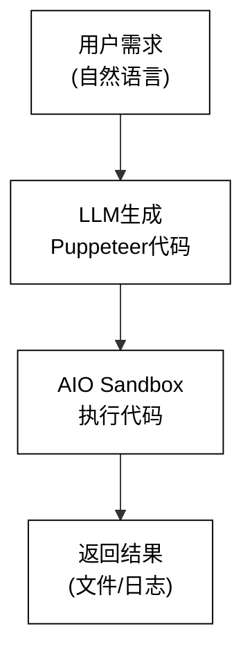
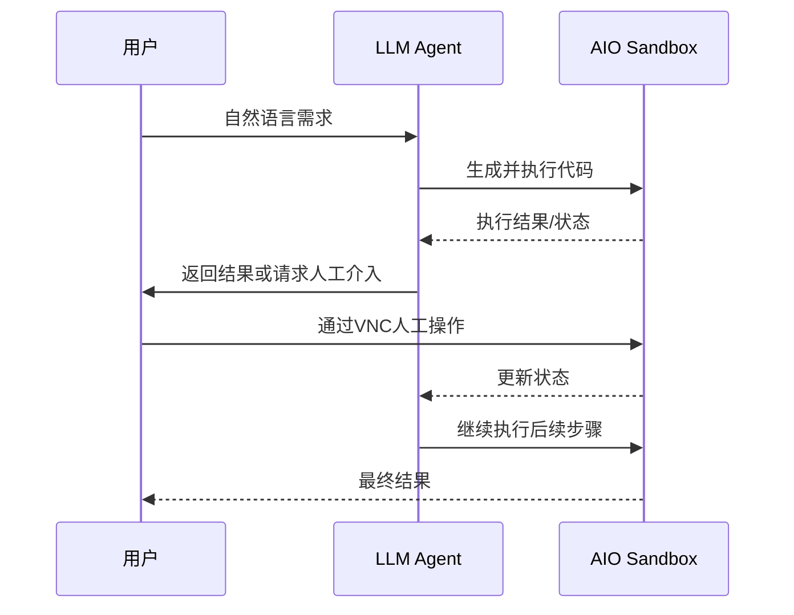

# All-In-One Sandbox 使用最佳实践


## 零、概述
在开发 E2B 云沙箱 的过程中，我们发现了一个让人头疼的问题：现有的沙箱方案太零散了。浏览器、代码执行、Shell 环境各自为政，导致开发效率大打折扣。于是我们决定自己动手，打造一个真正一体化的解决方案——All-In-One Sandbox（AIO）。

AIO 是 E2B 云沙箱 提供的云上浏览器自动化沙箱环境，它把浏览器、终端和代码执行能力全部集成在一个容器里。通过简单的 SDK 调用，你就能让 LLM 驱动复杂的 Web 自动化任务，再也不用在多个沙箱之间疲于奔命。

### 为什么选择 AIO？
说实话，传统的沙箱方案让我们吃尽了苦头。大多数沙箱都是**单一用途**的（要么只能跑浏览器，要么只能执行代码），这带来了几个实实在在的痛点：

#### **1. 文件共享简直是个噩梦**
+ 浏览器沙箱下载的文件得先上传到 NAS/OSS，代码沙箱才能用
+ 代码生成的文件又要重新上传，其他沙箱再下载
+ 多个沙箱之间的文件传递慢得像蜗牛爬

#### **2. 工具协调复杂到想哭**
+ 一个完整的 Agent 任务通常需要同时调用浏览器 + 代码 + Shell
+ 得手动编排多个沙箱的启动、通信和数据传递
+ 调试时要在好几个地方来回切换看日志，效率低得让人抓狂

#### **3. 环境配置繁琐到崩溃**
+ 本地方案：Node.js、浏览器、各种系统依赖，装得手都酸了
+ 多沙箱方案：每个环境都要单独配置和管理
+ 最要命的是环境污染问题——任务之间互相干扰，资源清理成了日常难题

#### **4. 成本和效率双重打击**
+ 多个沙箱同时运行，内存占用翻倍
+ 文件传输走网络 I/O，延迟高得离谱
+ 还得额外付费买 OSS/NAS 存储服务

## AIO 沙箱的核心优势
**架构一览**


**统一文件系统**

我们的解决方案很简单粗暴：把所有组件（浏览器、Shell、代码执行、文件系统）都塞进**同一个沙箱实例**里。


**性能对比一目了然：**

| 对比项 | 传统多沙箱方案 | All-In-One 沙箱 |
| --- | --- | --- |
| 启动时间 | 2 个沙箱启动 = 4-15秒(串/并行创建) | 1 个沙箱启动 = 5秒 |
| 文件传递 | 通过 OSS，耗时 2-3秒 | 直接访问，<100ms |
| 内存占用 | 2×独立运行 = 2c2g+2c2g | 1×共享运行 = 2c2g |


**底层技术栈很扎实：**

+ 浏览器：Chromium 120+ (固定版本，稳定可靠)
+ 协议：WebSocket CDP (:5000/ws/automation 端口)
+ 隔离：函数计算资源隔离及严格的资源限制
+ 文件系统：函数计算基于 microvm 的 FS 持久化层

**五大核心能力，开箱即用：**

1. **代码执行**：内置 Node.js + 原生 Puppeteer 自动化脚本支持
2. **文件处理**：提供 FileSystem API，可通过 MCP 方式调用
3. **会话保持**：结合 OSS/NAS 动态挂载，完美支持多步骤任务和状态传递
4. **实时日志**：流式输出执行日志，监控起来毫不费力
5. **多工具集成**：VNC、Terminal、代码执行无缝配合，想怎么用就怎么用

**云上沙箱，真的零配置**

基于函数计算架构，我们做到了：

+ **零配置**：不用装任何环境，API 调用就能直接上手
+ **环境隔离**：每次执行都是全新的沙箱，完全互不干扰
+ **自动清理**：执行完自动释放资源，绝不留垃圾
+ **安全可控**：代码在隔离环境中运行，Agent 宿主系统稳如泰山
+ **按需扩展**：根据负载自动创建/销毁沙箱实例，省钱又省心

**多种访问方式，灵活到飞起**

不管你是开发者还是运维，都能找到适合自己的使用方式：

| 接口 | 用途 | 访问方式 |
| --- | --- | --- |
| **代码执行 API** | 执行 Node.js/Python 脚本 | SDK 方法 |
| **VNC** | 可视化浏览器交互、人工介入 | Web 集成 |
| **Terminal WebSocket** | 实时 Shell 交互 | WebSocket |
| **文件 API** | 读写持久化文件 | SDK 方法 |


**这些场景特别适合用 AIO：**

+ 数据采集（电商、社交媒体、新闻网站）
+ 自动化测试（Web 应用功能测试）
+ RPA 任务（表单填写、批量操作）
+ LLM Agent（让 AI 自动生成和执行浏览器自动化脚本）
+ 云开发环境（团队标准化工具和远程开发）
+ 多步骤工作流（带有视觉反馈的自动化流程）

---

## 一、AIO 沙箱集成指南
### 1.1 核心概念
#### 沙箱实例到底是什么？
每个沙箱实例本质上就是一个基于函数计算环境的会话容器，里面已经预装好了你需要的一切：

+ Chromium 浏览器（已启动，监听在 CDP 端口 5000）
+ Node.js 运行时（预装 puppeteer-core）
+ 共享文件系统（`/home/user/` 目录）
+ VNC 服务（可选，调试和人工介入时超有用）

### 1.2 快速开始
> 注意：本文假设你已经看过前面的实践系列文章，了解 template 和 sandbox 的关系，并且正确创建了 template。如果你还没做过这些，建议先回去补课。
>

#### 安装SDK（很简单）
> 推荐用 python 3.11 环境，兼容性最好
>

```bash
pip install "e2b>=2.20.0"
```

#### 第一个任务：验证沙箱基本功能
```python
from e2b import Sandbox
import os

def quick_start():
    """验证沙箱基本功能"""
    sandbox = Sandbox.create(
        template="your-aio-template",
        timeout=600,
        api_key=os.getenv("E2B_API_KEY")
    )

    print(f"沙箱已创建: {sandbox.sandbox_id}")

    # 核心：连接已运行的浏览器，提取页面信息
    code = """
const puppeteer = require('puppeteer-core');
const browser = await puppeteer.connect({
  browserWSEndpoint: 'ws://localhost:5000/ws/automation'
});
const page = (await browser.pages())[0];
await page.goto('https://example.com');
console.log(await page.title());
await browser.disconnect();
"""

    sandbox.commands.run(f"node -e \"{code}\"")
    sandbox.kill()

quick_start()
```

#### 多步骤任务实战
**关键技巧：** 用 `disconnect()` 保持浏览器运行，通过文件系统传递状态。

**第一步：打开登录页**

```javascript
const puppeteer = require('puppeteer-core');
const browser = await puppeteer.connect({
  browserWSEndpoint: 'ws://localhost:5000/ws/automation'
});
const page = (await browser.pages())[0];
await page.goto('https://example.com/login');
console.log('请在 VNC 中完成登录');
await browser.disconnect();
```

**第二步：保存 Cookie**

```javascript
const fs = require('fs');
const puppeteer = require('puppeteer-core');
const browser = await puppeteer.connect({
  browserWSEndpoint: 'ws://localhost:5000/ws/automation'
});
const page = (await browser.pages())[0];
const cookies = await page.cookies();
fs.writeFileSync('/home/user/data/cookies.json', JSON.stringify(cookies));
console.log('Cookie 已保存');
await browser.disconnect();
```

**第三步：用 Cookie 爬数据**

```javascript
const fs = require('fs');
const puppeteer = require('puppeteer-core');
const browser = await puppeteer.connect({
  browserWSEndpoint: 'ws://localhost:5000/ws/automation'
});
const page = (await browser.pages())[0];
const cookies = JSON.parse(fs.readFileSync('/home/user/data/cookies.json'));
await page.setCookie(...cookies);
await page.goto('https://example.com/data');
// 执行数据采集
await browser.disconnect();
```

**为什么要用多步骤模式？**

+ **绕过验证码**：人工登录搞定验证码，后续任务全自动
+ **状态持久化**：Cookie 保存到文件，支持断点续传
+ **资源优化**：浏览器一直运行着，不用重复启动浪费时间

**完整代码参考：** [Github 示例仓库](https://github.com/devsapp/agentrun-sandbox-demos)

### 1.3 关键概念说明
#### 代码执行方式
通过 `sandbox.commands.run()` 执行 Shell 命令，或 `sandbox.run_code()` 执行代码片段：

```python
# 执行 Shell 命令
result = sandbox.commands.run("node -e \"console.log('Hello')\"")
print(result.stdout)  # Hello

# 执行 Python 代码
result = sandbox.run_code("print('Hello')")
print(result.stdout)  # Hello
```

返回格式很清晰：

```python
# result 对象包含：
result.stdout   # 标准输出
result.stderr   # 标准错误
result.exit_code  # 退出码
```

#### 文件操作（超简单）
```python
# 写入文件
sandbox.files.write(
    "/home/user/data/result.json",
    '{"key": "value"}'
)

# 读取文件
content = sandbox.files.read("/home/user/data/result.json")

# 上传本地文件
with open("./local_file.txt", "rb") as f:
    sandbox.files.write("/home/user/data/file.txt", f)

# 下载文件
content = sandbox.files.read("/home/user/data/result.json")
with open("./result.json", "w") as f:
    f.write(content)
```

---

## 二、最佳实践
### 2.1 多步骤任务模式
**什么时候用？** 需要登录、人工介入、或者数据量很大的时候。

**标准流程：**

```plain
步骤 1：打开登录页 → 通过 VNC 人工登录
步骤 2：保存 Cookie 到文件系统
步骤 3：使用 Cookie 执行数据采集
```

**实操要点：**

1. 设置 `timeout >= 1800` 避免超时断连
2. 一定要用 `disconnect()` 保持浏览器运行，`close()` 会关掉浏览器
3. 通过 `/home/user/data/` 目录传递 Cookie 和进度
4. VNC URL 用 `sandbox.sandbox_id` 和 base URL 拼起来就行
5. 文件操作就用 `sandbox.files.read()` 和 `sandbox.files.write()`

### 2.2 LLM Agent 集成模式
**适用场景：** 让 AI 自动生成和执行浏览器自动化代码，非技术用户也能用。

**整体架构：**



**三条铁律（必须遵守）：**

+ 禁止：`puppeteer.launch()` → 必须：`puppeteer.connect()`
+ 禁止：`browser.close()` → 必须：`browser.disconnect()`
+ 禁止：随便存文件 → 必须：`/home/user/data/xxx.json`

**为什么这么严格？**

+ 违反约束会导致浏览器重启，之前的状态全没了
+ AI 生成代码需要明确指导，不能指望它有"常识"
+ 详细内容见第 4 章系统提示词设计

### 2.3 Cookie 持久化模式
**什么时候需要？** 要保持登录状态，跨会话复用的时候。

**完整流程：**

```plain
首次登录：
1. 人工登录 → 2. 保存 Cookie → 3. 持久化存储

后续使用：
1. 上传Cookie -> 2. 读取 Cookie → 3. 恢复会话 → 4. 执行任务
```

**Cookie 保存示例：**

```javascript
const puppeteer = require('puppeteer-core');
const fs = require('fs');

const browser = await puppeteer.connect({
  browserWSEndpoint: 'ws://localhost:5000/ws/automation'
});

const page = (await browser.pages())[0];
const cookies = await page.cookies();

// 保存到文件系统
fs.writeFileSync('/home/user/data/cookies.json', JSON.stringify(cookies, null, 2));
console.log('Cookie 已保存');

await browser.disconnect();
```

**Cookie 恢复示例：**

```javascript
const puppeteer = require('puppeteer-core');
const fs = require('fs');

const browser = await puppeteer.connect({
  browserWSEndpoint: 'ws://localhost:5000/ws/automation'
});

const page = (await browser.pages())[0];

// 读取 Cookie
const cookies = JSON.parse(fs.readFileSync('/home/user/data/cookies.json'));

// 恢复会话
await page.setCookie(...cookies);
await page.goto('https://example.com/protected');

console.log('登录状态已恢复');
await browser.disconnect();
```

**关键提醒：**

+ Cookie 一定要保存到 `/home/user/data/` 目录，这样才有权限
+ 用 `page.cookies()` 获取所有 Cookie，一个都不能少
+ 用 `page.setCookie(...cookies)` 恢复，顺序很重要
+ 别忘了检查 Cookie 过期时间和安全性

### 2.4 批量任务模式
**适用场景：** 需要并发处理大量任务的时候。

**两种策略：**

```plain
策略 1：单沙箱顺序执行（简单任务，有依赖关系）
策略 2：多沙箱并发执行（复杂任务，无依赖关系）
```

**选择建议：**

| 策略 | 适用场景 | 优势 |
| --- | --- | --- |
| 单沙箱顺序执行 | 简单任务，依赖前序结果 | 资源占用低，状态连续 |
| 多沙箱并发执行 | 复杂任务，无依赖关系 | 执行速度快，并行处理 |


**并发控制示例：**

```python
# 使用 asyncio.gather() 实现并发
tasks = [
    process_item(item)
    for item in items
]
results = await asyncio.gather(*tasks, return_exceptions=True)
```

---

## 三、实战案例：豆瓣电影 Top250 爬取


> 完整的 demo 代码可以在示例仓库里找到
>

### 3.1 需求分析
**目标很明确：** 抓取豆瓣电影 Top250 的电影信息（标题、评分、导演、年份等）

**实际挑战：**

1. 豆瓣必须登录才能看完整信息
2. 数据分页展示，需要多步骤采集
3. 反爬虫机制相当严格

**我们的解法：** AIO Sandbox 的 Cookie 持久化 + 多步骤任务模式

### 3.2 核心实现流程
#### 步骤 1：首次登录并保存 Cookie


```javascript
// 1. 打开登录页
const puppeteer = require('puppeteer-core');
const browser = await puppeteer.connect({
  browserWSEndpoint: 'ws://localhost:5000/ws/automation'
});

const page = (await browser.pages())[0];
await page.goto('https://accounts.douban.com/passport/login');

console.log('请在 VNC 中完成登录');
console.log('登录完成后，程序将自动保存 Cookie');

await browser.disconnect();
```

**操作说明：**

+ 用户在 VNC 中手动完成登录（包括验证码）
+ 登录成功后进入下一步

#### 步骤 2：保存 Cookie
```javascript
const puppeteer = require('puppeteer-core');
const fs = require('fs');

const browser = await puppeteer.connect({
  browserWSEndpoint: 'ws://localhost:5000/ws/automation'
});

const page = (await browser.pages())[0];
const cookies = await page.cookies();

fs.writeFileSync('/home/user/data/douban_cookies.json', JSON.stringify(cookies, null, 2));
console.log(`Cookie 已保存，共 ${cookies.length} 条`);

await browser.disconnect();
```

#### 步骤 3：用 Cookie 爬取数据


```javascript
const puppeteer = require('puppeteer-core');
const fs = require('fs');

const browser = await puppeteer.connect({
  browserWSEndpoint: 'ws://localhost:5000/ws/automation'
});

const page = (await browser.pages())[0];

// 恢复 Cookie
const cookies = JSON.parse(fs.readFileSync('/home/user/data/douban_cookies.json'));
await page.setCookie(...cookies);

// 访问 Top250
await page.goto('https://movie.douban.com/top250', { waitUntil: 'networkidle2' });

// 提取数据
const movies = await page.evaluate(() => {
  return Array.from(document.querySelectorAll('.item')).map(item => ({
    title: item.querySelector('.title')?.textContent,
    rating: item.querySelector('.rating_num')?.textContent,
    quote: item.querySelector('.inq')?.textContent
  }));
});

// 保存结果
fs.writeFileSync('/home/user/data/movies.json', JSON.stringify(movies, null, 2));
console.log(`爬取完成，共 ${movies.length} 部电影`);

await browser.disconnect();
```

### 3.3 完整 Python 代码
具体实现可以参考项目的 `src/ai_code_generator.py` 和 `src/sandbox_executor.py`。

**核心逻辑：**

```python
from e2b import Sandbox
import os

def scrape_douban():
    # 1. 创建沙箱
    sandbox = Sandbox.create(
        template="your-aio-template",
        timeout=1800,
        api_key=os.getenv("E2B_API_KEY")
    )

    # 2. 执行登录步骤（代码略，参考上面）
    # 3. 保存 Cookie（代码略，参考上面）
    # 4. 爬取数据（代码略，参考上面）

    # 5. 读取结果
    result = sandbox.files.read('/home/user/data/movies.json')
    print(result)

scrape_douban()
```

### 3.4 核心技术点总结
1. **Cookie 持久化**：避免重复登录，通过文件系统保存和恢复登录状态
2. **connect() + disconnect()**：保持浏览器运行，完美支持多步骤任务
3. **文件系统状态传递**：跨步骤共享数据，无需网络 I/O 开销

### 3.5 扩展功能
#### 分页爬取（完整 Top250）
```javascript
const movies = [];
for (let page_num = 0; page_num < 250; page_num += 25) {
  await page.goto(`https://movie.douban.com/top250?start=${page_num}`);
  const items = await page.evaluate(() => {
    // 提取逻辑
  });
  movies.push(...items);

  // 延迟防止反爬
  await page.waitForTimeout(2000);
}

fs.writeFileSync('/home/user/data/all_movies.json', JSON.stringify(movies));
```

#### 错误处理和重试（生产必备）
```javascript
async function scrapeWithRetry(url, maxRetries = 3) {
  for (let i = 0; i < maxRetries; i++) {
    try {
      await page.goto(url, { waitUntil: 'networkidle2', timeout: 30000 });
      return true;
    } catch (error) {
      console.log(`重试 ${i + 1}/${maxRetries}: ${error.message}`);
      await page.waitForTimeout(5000);
    }
  }
  return false;
}
```

---

## 四、系统提示词设计
### 4.1 为什么提示词这么重要？
系统提示词（System Prompt）是 LLM Agent 的大脑，直接决定了 AI 如何理解和执行你的需求。对于 AIO Sandbox 集成来说，提示词必须明确告诉 AI 如何生成符合沙箱规范的代码。


### 4.2 我们的设计哲学
在设计提示词之前，你得先理解 All-In-One Sandbox 的核心理念，这直接影响提示词的结构。

#### 人机协作，不是完全自动化
我们承认有些事情 AI 就是搞不定，比如验证码、滑块验证、短信验证。所以 AIO 采用"人机协作"的设计理念：

**可观测性优先**

+ 通过 VNC 让执行过程完全透明，你能亲眼看到浏览器在做什么
+ 不用再通过日志猜来猜去，直接看页面状态快速定位问题

**人机协作而非完全自动**

+ 遇到验证码？没问题，人工介入搞定
+ 人工操作完，自动化任务接着跑，无缝衔接

**状态持久化**

+ 浏览器会话和数据可以跨步骤保存和恢复
+ 用 `disconnect()` 保持浏览器运行，状态不会丢

### 4.3 核心约束与最佳实践
提示词必须明确告诉 AI 这些关键约束：

#### 1. 必须用 connect()，别用 launch()
**为什么？看看对比就知道了：**

```plain
传统方式 (错误):
const browser = await puppeteer.launch();  // 启动新浏览器 (1-3 秒)
// 执行任务
await browser.close();  // 状态全部丢失

All-In-One 方式 (正确):
const browser = await puppeteer.connect({  // 连接已运行的浏览器 (<100ms)
  browserWSEndpoint: 'ws://localhost:5000/ws/automation'
});
// 执行任务
await browser.disconnect();  // 保持浏览器运行
```

**技术原因很简单：**

+ 浏览器在容器启动时就已经跑起来了
+ 用 `launch()` 会启动第二个浏览器，纯属浪费资源
+ `connect()` 几乎瞬间连接，特别适合多步骤任务

#### 2. 必须用 disconnect()，别用 close()
**关键区别在这：**

```plain
browser.close():
- 关闭所有页面
- 终止浏览器进程
- 清理所有状态
- 无法支持多步骤任务
- VNC 显示中断

browser.disconnect():
- 只断开 Puppeteer 连接
- 浏览器继续运行
- 所有状态保留
- 支持多步骤任务
- VNC 显示连续
```

#### 3. Cookie 持久化是王道
**登录状态的本质就是 Cookie：**

```plain
用户登录 → 服务器设置 Cookie → 后续请求携带 Cookie → 服务器识别用户
```

**没有持久化会怎样？**

+ Sandbox 重建后状态全丢
+ 长时间后 Cookie 过期
+ 频繁重新登录，烦死了

**标准做法：**

**保存 Cookie:**

```javascript
const cookies = await page.cookies();
fs.writeFileSync(
  '/home/user/data/cookies.json',
  JSON.stringify(cookies, null, 2)
);
```

**加载 Cookie:**

```javascript
const cookies = JSON.parse(
  fs.readFileSync('/home/user/data/cookies.json')
);
// 先访问对应域名
await page.goto('https://example.com');
// 再设置 Cookie
await page.setCookie(...cookies);
```

### 4.5 实用提示词模板
#### 基础模板（直接复制就能用）
```plain
你是 E2B 云沙箱 AIO Sandbox 的代码生成助手。你的任务是将用户需求转换为可在沙箱中执行的 Puppeteer 代码。

【环境信息】
- 浏览器：Chromium (已预启动)
- 连接端点：ws://localhost:5000/ws/automation
- 文件系统：/home/user/data/ (持久化目录)
- 超时限制：单次执行 300 秒

【代码规范】
1. 连接浏览器：
   const puppeteer = require('puppeteer-core');
   const browser = await puppeteer.connect({
     browserWSEndpoint: 'ws://localhost:5000/ws/automation'
   });

2. 结束会话：
   await browser.disconnect();

3. 文件读写：
   const fs = require('fs');
   // 读取
   const data = fs.readFileSync('/home/user/data/file.json');
   // 写入
   fs.writeFileSync('/home/user/data/file.json', JSON.stringify(data));

4. 错误处理：
   try {
     // 代码逻辑
   } catch (error) {
     console.error(`错误: ${error.message}`);
     throw error;
   }

【输出要求】
- 生成完整的 JavaScript 代码
- 包含必要的错误处理
- 关键步骤用 console.log() 记录
- 重要结果保存到文件系统
```

### 4.6 AI 对话模式的工作原理


AI 对话模式让非技术用户也能用浏览器自动化，系统提示词在里面起着关键的"翻译"作用。

#### 智能任务拆分
好的提示词要能指导 AI 自动判断何时拆分任务：

**简单任务（不拆分）**

```plain
用户: 访问 example.com，获取页面标题

AI 直接生成单个代码块，执行后返回结果
```

**需要登录（自动拆分）**

```plain
用户: 登录豆瓣，然后获取我的收藏

AI 自动拆分为 3 个步骤：
步骤 1: 打开登录页 → [生成代码1] → "请在 VNC 中完成登录"
步骤 2: 保存 Cookie → [生成代码2] → "已保存 15 个 Cookie"
步骤 3: 获取收藏 → [生成代码3] → "找到 25 部收藏电影"
```

#### 引导人工操作
遇到需要人工介入的步骤，AI 要明确告诉用户该怎么做：

```plain
AI: 我已经打开了登录页面，请在 VNC 窗口中：

1. 输入用户名和密码
2. 输入验证码
3. 点击登录按钮

完成后告诉我"登录完成"，我将继续后续步骤。
```

---

## 五、高级技巧与注意事项
### 5.1 错误处理（生产环境必备）
永远用 try-catch 包裹核心操作：

```javascript
try {
  // 核心操作
  await page.goto(url, { waitUntil: 'networkidle2', timeout: 30000 });

} catch (error) {
  // 明确的错误信息
  console.error(`操作失败: ${error.message}`);

  // 可选：重试逻辑
  if (error.name === 'TimeoutError' && retryCount < maxRetries) {
    console.log(`超时，重试第 ${retryCount + 1} 次`);
    await new Promise(resolve => setTimeout(resolve, 5000));
    return executeWithRetry(url, retryCount + 1);
  }

  throw error;
}
```

### 5.2 性能优化（速度提升明显）
**禁用不必要的资源加载**

```javascript
await page.setRequestInterception(true);
page.on('request', (req) => {
  const resourceType = req.resourceType();

  // 丢弃图片、样式、字体等非关键资源
  if (['image', 'stylesheet', 'font', 'media'].includes(resourceType)) {
    req.abort();
  } else {
    req.continue();
  }
});
```

**性能提升效果惊人：**

| 优化项 | 优化前 | 优化后 | 提升幅度 |
| --- | --- | --- | --- |
| 资源加载数量 | ~100个请求 | ~20个请求 | ↓80% |
| 页面加载时间 | 3-5秒 | 1-2秒 | ↑60% |
| 网络流量 | 5-10MB | 0.5-1MB | ↓90% |


### 5.3 安全注意事项
**Cookie 安全（重中之重）**

```bash
# .gitignore 中必须包含
*_cookies.json
cookies.json
*.env
```

**代码注入防护**

```javascript
// 危险：直接拼接用户输入
const userInput = req.query.selector;
await page.click(userInput);

// 安全：白名单验证
const allowedSelectors = ['.button-primary', '.submit-btn'];
if (!allowedSelectors.includes(userInput)) {
  throw new Error('非法选择器');
}
await page.click(userInput);
```

### 5.4 调试技巧（省时省力）
**VNC 实时观察（最有效）**

```python
# 创建沙箱后立即获取 VNC URL
BROWSERTOOL_PORT = 3000
host = sandbox.get_host(BROWSERTOOL_PORT)
vnc_url = f"wss://{host}/ws/livestream"
print(f"打开 VNC: {vnc_url}")
```

**截图调试（关键时刻救命）**

```javascript
// 登录前后都截图
await page.screenshot({ path: '/home/user/data/before_login.png', fullPage: true });
await page.screenshot({ path: '/home/user/data/after_login.png', fullPage: true });
```

---

## 六、核心总结
### 技术收益一目了然
使用 AIO sandbox 能够将状态传递和文件共享复杂度进行有效地降低，并且能够有如下收益：

1. 启动延迟低，从原有的多个 sandbox 优化为了一个 sandbox, 降低了至少 50%的启动时间；
2. 状态保持轻量，在代码执行和浏览器操作的过程中，能够尽量使用本地文件系统实现状态保持，符合最佳实践；
3. VNC 的透出提供了人工介入的手段，有效帮助用户解决了自动化的卡点，如验证等。

### 7 条黄金法则
1. **必须用** `puppeteer.connect()`，禁止 `launch()`
2. **必须用** `browser.disconnect()`，禁止 `close()`
3. **必须保存**数据到 `/home/user/data/` 目录
4. **登录流程拆分**：打开登录页 → 人工登录 → 保存 Cookie → 执行任务
5. **Cookie 先访问域名**再设置，避免跨域问题
6. **多步骤任务**用文件系统传递状态，别用全局变量
7. **重要操作**必须加错误处理，别让错误静默失败

### 常见陷阱避坑指南
| 陷阱 | 症状 | 解决方案 |
| --- | --- | --- |
| 用 `launch()` | 浏览器重复启动，内存爆了 | 改用 `connect()` |
| 用 `close()` | 后续步骤失败，状态丢了 | 改用 `disconnect()` |
| Cookie 没持久化 | 每次都要重新登录 | 保存到 `/home/user/data/cookies.json` |
| 等待时间不足 | 元素找不到报错 | 用 `waitForSelector` + `networkidle2` |
| 路径不规范 | 文件丢失或权限错误 | 统一用 `/home/user/data/` 目录 |


### 进阶学习路径
1. **源码分析**：[github.com/devsapp/agentrun-sandbox-demos/src/](https://github.com/devsapp/agentrun-sandbox-demos)
2. **性能调优**：
    - 禁用图片/字体资源
    - 用 `networkidle2` 等待策略
    - 批量处理数据，减少 I/O
3. **错误处理**：
    - 指数退避重试策略
    - 最大重试次数控制
    - 超时和网络错误处理