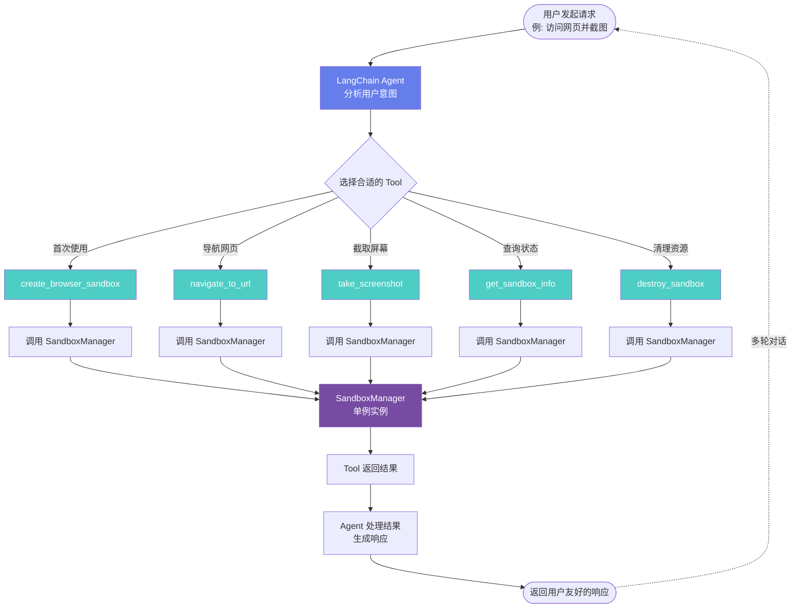

# LangChain + 云沙箱极简集成指南

作者：辰泉

## 前言
在 Agentic AI 时代,智能体需要与真实世界交互,而浏览器是连接虚拟世界与现实世界的重要桥梁。云沙箱 Browser Sandbox 为智能体提供了安全、高性能、免运维的浏览器执行环境,让 AI Agent 真正具备"上网"的能力——从网页抓取、信息提取到表单填写、自动化操作,一切皆可实现。

## 云沙箱 Browser Sandbox 介绍
### 什么是 Browser Sandbox?
Browser Sandbox 是云沙箱平台提供的云原生无头浏览器沙箱服务,基于阿里云函数计算（FC）构建。它为智能体提供了一个安全隔离的浏览器执行环境,支持通过标准的 Chrome DevTools Protocol (CDP) 远程控制浏览器实例。

### 核心特性
**无头浏览器能力**

+ 内置 Chromium/Chrome 浏览器,支持完整的 Web 标准
+ 原生兼容 Puppeteer、Playwright 等主流自动化框架
+ 支持通过 CDP 协议进行精细化控制

**实时可视化**

+ 内置 VNC 服务,支持实时查看浏览器界面
+ 提供操作录制功能,方便调试和回放
+ 支持通过 noVNC 客户端在网页中直接观看

**安全与隔离**

+ 每个沙箱实例运行在独立的容器环境中
+ 文件系统和进程空间完全隔离
+ 支持 WSS 加密传输,确保数据安全

**Serverless 架构**

+ 按需创建,按量付费,无需提前预置资源
+ 快速弹性伸缩,支持高并发场景
+ 零运维,无需管理服务器和浏览器依赖

### 主要应用场景
+ **AI Agent 赋能**: 为大模型提供"眼睛"和"手",执行网页浏览、信息提取、在线操作等任务
+ **自动化测试**: 在云端运行端到端（E2E）测试和视觉回归测试
+ **数据采集**: 稳定、高效地进行网页抓取,应对动态加载和反爬虫挑战
+ **内容生成**: 自动化生成网页截图或 PDF 文档

## 上手使用云沙箱 Browser Tool
### E2B SDK 快速介绍
> 后续的内容将基于 E2B SDK 进行，因此我们先对 SDK 进行简要介绍
>

E2B SDK 是一个开源的 Python 工具包,旨在简化智能体与云沙箱平台各种服务（包括 Browser Sandbox）的集成。它提供了统一的接口,让您可以用几行代码就将沙箱能力集成到现有的 Agent 框架中。SDK 的核心功能如下：

**统一集成接口**

+ 提供对 LangChain、AgentScope 等主流框架的开箱即用支持
+ 统一的模型代理接口,简化多模型管理
+ 标准化的工具注册机制

**Sandbox 生命周期管理**

+ 自动创建和销毁沙箱实例
+ 支持会话级别的状态保持
+ 灵活的资源配置和超时控制

#### 安装 E2B SDK
```bash
pip install e2b>=2.20.0
```

> **注意**: 确保您的 Python 环境版本在 3.10 及以上。
>

#### 基本使用示例
以下是使用 E2B SDK 创建和管理 Browser Sandbox 的核心代码：

```python

from e2b import Sandbox
from playwright.sync_api import sync_playwright
import os

BROWSERTOOL_PORT = 3000

api_key = os.getenv("E2B_API_KEY")

# 创建 Browser Sandbox
sandbox = Sandbox.create(
    template="your-template-name",
    timeout=300,
    api_key=api_key,
)

# 获取端点
host = sandbox.get_host(BROWSERTOOL_PORT)
cdp_url = f"wss://{host}/ws/automation"

# 使用 Playwright 连接并操作
with sync_playwright() as p:
    headers = {"X-Access-Token": sandbox._envd_access_token}
    browser = p.chromium.connect_over_cdp(cdp_url, headers=headers)
    page = browser.contexts[0].pages[0]

    page.goto("https://www.example.com")
    page.screenshot(path="screenshot.png")

    browser.close()

# 销毁 Sandbox
sandbox.kill()
```

**关键概念：**

+ **template**: 控制台创建的浏览器环境模板名称
+ **cdp_url**: 通过 `sandbox.get_host(port)` 获取主机地址，拼接 `/ws/automation` 路径，用于 Playwright/Puppeteer 连接
+ **vnc_url**: 用于实时查看浏览器画面（通过 `sandbox.get_host(port)` 获取主机地址，拼接 `/ws/livestream` 路径）
+ **headers**: Playwright 连接时需要传递 `X-Access-Token` 请求头进行鉴权

> **注意**: 由于所有浏览器操作都在云端进行，您无需在本地安装浏览器。Playwright 仅用于通过 CDP 协议连接到云端的浏览器实例。
>

---

### 如何创建 sandbox 模板
使用 Browser Sandbox 需要新建 Sandbox 模板，您需要访问  [云沙箱控制台网站](https://functionai.console.aliyun.com/cn-hangzhou/agent/runtime/sandbox)，并按照如下步骤创建模板:

1. 在顶部菜单栏选择“运行时与沙箱”；
2. 在左侧边栏选择“Sandbox沙箱”；
3. 点击右上角“创建沙箱模板”；


4. 选择“浏览器”；

5. 在弹出的抽屉对话框中填写和选择您的模板的规格、网络等配置，并复制模板名称；

6. 点击“创建浏览器” 等待其就绪即可。

### <font style="color:rgb(38, 38, 38);">从零开始用 LangChain 创建 Browser Sandbox 智能体</font>
<font style="color:rgb(38, 38, 38);">本教程将指导您从零开始创建一个完整的 Browser Sandbox 智能体项目。</font>

#### <font style="color:rgb(38, 38, 38);">基于 LangChain 集成 Browser Sandbox</font>
<font style="color:rgb(38, 38, 38);">本教程将详细讲解如何使用 LangChain 创建 Browser Sandbox 相关的 tools 并集成到 Agent 中。</font>

##### <font style="color:rgb(38, 38, 38);">项目结构</font>
<font style="color:rgb(38, 38, 38);">为了保持代码的内聚性和可维护性，我们将代码拆分为以下模块：</font>

**<font style="color:rgb(38, 38, 38);">模块职责划分：</font>**

<font style="color:rgb(38, 38, 38);background-color:rgba(0, 0, 0, 0.06);">sandbox_manager.py</font><font style="color:rgb(38, 38, 38);">: 负责 Sandbox 的创建、管理和销毁，提供统一的接口</font><font style="color:rgb(38, 38, 38);background-color:rgba(0, 0, 0, 0.06);">langchain_agent.py</font><font style="color:rgb(38, 38, 38);">: 负责创建 LangChain tools 和 Agent，集成 VNC 信息</font>

<font style="color:rgb(38, 38, 38);background-color:rgba(0, 0, 0, 0.06);">main.py</font><font style="color:rgb(38, 38, 38);">: 作为入口文件，演示如何使用上述模块</font>

##### <font style="color:rgb(38, 38, 38);">步骤 1: 创建项目并安装依赖</font>
<font style="color:rgb(38, 38, 38);">首先创建项目目录（如果还没有）：</font>

```typescript
mkdir -p langchain-demo
cd langchain-demo
```

<font style="color:rgb(38, 38, 38);">创建 </font><font style="color:rgb(38, 38, 38);background-color:rgba(0, 0, 0, 0.06);">requirements.txt</font><font style="color:rgb(38, 38, 38);"> 文件，内容如下：</font>

```typescript
# LangChain 核心库
langchain>=0.1.0
langchain-openai>=0.0.5
langchain-community>=0.0.20

# E2B SDK
e2b>=2.20.0

# 浏览器自动化
playwright>=1.40.0

# 环境变量管理
python-dotenv>=1.0.0
```

<font style="color:rgb(38, 38, 38);">然后安装依赖：</font>

```typescript
pip install -r requirements.txt
```

<font style="color:rgb(38, 38, 38);">主要依赖说明：</font>

+ <font style="color:rgb(38, 38, 38);background-color:rgba(0, 0, 0, 0.06);">langchain</font><font style="color:rgb(38, 38, 38);"> 和 </font><font style="color:rgb(38, 38, 38);background-color:rgba(0, 0, 0, 0.06);">langchain-openai</font><font style="color:rgb(38, 38, 38);">: LangChain 核心库</font>
+ <font style="color:rgb(38, 38, 38);background-color:rgba(0, 0, 0, 0.06);">e2b</font><font style="color:rgb(38, 38, 38);">: E2B SDK，用于 Sandbox 管理</font>
+ <font style="color:rgb(38, 38, 38);background-color:rgba(0, 0, 0, 0.06);">playwright</font><font style="color:rgb(38, 38, 38);">: 浏览器自动化库</font>
+ <font style="color:rgb(38, 38, 38);background-color:rgba(0, 0, 0, 0.06);">python-dotenv</font><font style="color:rgb(38, 38, 38);">: 环境变量管理</font>

##### <font style="color:rgb(38, 38, 38);">步骤 2: 配置环境变量</font>
<font style="color:rgb(38, 38, 38);">在项目根目录创建 </font><font style="color:rgb(38, 38, 38);background-color:rgba(0, 0, 0, 0.06);">.env</font><font style="color:rgb(38, 38, 38);"> 文件，配置以下环境变量：</font>

```typescript
# 阿里云百炼平台的 API Key，用于调用大模型能力
DASHSCOPE_API_KEY=sk-your-bailian-api-key

# E2B API Key，用于 E2B SDK 鉴权
E2B_API_KEY=your-e2b-api-key

# E2B 连接配置（可选，默认使用cn-hangzhou）
E2B_API_URL=https://e2b.cn-hangzhou.aliyuncs.com

# browser sandbox 模板名称
BROWSER_TEMPLATE_NAME=sandbox-your-template-name
```

##### <font style="color:rgb(38, 38, 38);">步骤 3: 创建 Sandbox 生命周期管理模块</font>
<font style="color:rgb(38, 38, 38);">创建 </font><font style="color:rgb(38, 38, 38);background-color:rgba(0, 0, 0, 0.06);">sandbox_manager.py</font><font style="color:rgb(38, 38, 38);"> 文件，负责 Sandbox 的创建、管理和销毁。核心代码如下：</font>

```typescript
"""
Sandbox 生命周期管理模块

负责 E2B Browser Sandbox 的创建、管理和销毁。
提供统一的接口供 LangChain Agent 使用。
"""

import os
from typing import Optional, Dict, Any
from dotenv import load_dotenv

# 加载环境变量
load_dotenv()

BROWSERTOOL_PORT = 3000


class SandboxManager:
    """Sandbox 生命周期管理器"""

    def __init__(self):
        self._sandbox: Optional[Any] = None
        self._sandbox_id: Optional[str] = None
        self._cdp_url: Optional[str] = None
        self._vnc_url: Optional[str] = None
        self._token: Optional[str] = None

    def create(
        self,
        template_name: Optional[str] = None,
        idle_timeout: int = 3000
    ) -> Dict[str, Any]:
        """
        创建或获取一个浏览器 sandbox 实例

        Args:
            template_name: Sandbox 模板名称，如果为 None 则从环境变量读取
            idle_timeout: 空闲超时时间（秒），默认 3000 秒

        Returns:
            dict: 包含 sandbox_id, cdp_url, vnc_url 的字典

        Raises:
            RuntimeError: 创建失败时抛出异常
        """
        try:
            from e2b import Sandbox

            # 如果已有 sandbox，直接返回
            if self._sandbox is not None:
                return self.get_info()

            # 从环境变量获取模板名称
            if template_name is None:
                template_name = os.getenv(
                    "BROWSER_TEMPLATE_NAME",
                    "sandbox-browser-demo"
                )

            # 获取 API Key
            api_key = os.getenv("E2B_API_KEY")

            # 创建 sandbox
            self._sandbox = Sandbox.create(
                template=template_name,
                timeout=idle_timeout,
                api_key=api_key,
            )

            self._sandbox_id = self._sandbox.sandbox_id
            self._token = self._sandbox._envd_access_token

            # 通过 get_host() 获取 CDP URL 和 VNC URL
            host = self._sandbox.get_host(BROWSERTOOL_PORT)
            self._cdp_url = f"wss://{host}/ws/automation"
            self._vnc_url = f"wss://{host}/ws/livestream"

            return self.get_info()

        except ImportError as e:
            print(e)
            raise RuntimeError(
                "e2b 未安装，请运行: pip install e2b>=2.20.0"
            )
        except Exception as e:
            raise RuntimeError(f"创建 Sandbox 失败: {str(e)}")

    def get_info(self) -> Dict[str, Any]:
        """
        获取当前 sandbox 的信息

        Returns:
            dict: 包含 sandbox_id, cdp_url, vnc_url, token 的字典

        Raises:
            RuntimeError: 如果没有活动的 sandbox
        """
        if self._sandbox is None:
            raise RuntimeError("没有活动的 sandbox，请先创建")

        return {
            "sandbox_id": self._sandbox_id,
            "cdp_url": self._cdp_url,
            "vnc_url": self._vnc_url,
            "token": self._token,
        }

    def get_cdp_url(self) -> Optional[str]:
        """获取 CDP URL"""
        return self._cdp_url

    def get_vnc_url(self) -> Optional[str]:
        """获取 VNC URL"""
        return self._vnc_url

    def get_sandbox_id(self) -> Optional[str]:
        """获取 Sandbox ID"""
        return self._sandbox_id

    def destroy(self) -> str:
        """
        销毁当前的 sandbox 实例

        Returns:
            str: 操作结果描述
        """
        if self._sandbox is None:
            return "没有活动的 sandbox"

        try:
            sandbox_id = self._sandbox_id

            # 销毁 sandbox
            self._sandbox.kill()

            # 清理状态
            self._sandbox = None
            self._sandbox_id = None
            self._cdp_url = None
            self._vnc_url = None
            self._token = None

            return f"Sandbox 已销毁: {sandbox_id}"

        except Exception as e:
            # 即使销毁失败，也清理本地状态
            self._sandbox = None
            self._sandbox_id = None
            self._cdp_url = None
            self._vnc_url = None
            self._token = None
            return f"销毁 Sandbox 时出错: {str(e)}"

    def is_active(self) -> bool:
        """检查 sandbox 是否活跃"""
        return self._sandbox is not None

    def __enter__(self):
        """上下文管理器入口"""
        return self

    def __exit__(self, exc_type, exc_val, exc_tb):
        """上下文管理器退出，自动销毁"""
        self.destroy()
        return False


# 全局单例（可选，用于简单场景）
_global_manager: Optional[SandboxManager] = None


def get_global_manager() -> SandboxManager:
    """获取全局 SandboxManager 单例"""
    global _global_manager
    if _global_manager is None:
        _global_manager = SandboxManager()
    return _global_manager


def reset_global_manager():
    """重置全局 SandboxManager"""
    global _global_manager
    if _global_manager:
        _global_manager.destroy()
    _global_manager = None

```

**关键功能：**

1. **创建 Sandbox**: 使用 E2B SDK 创建浏览器 Sandbox
2. **获取连接信息**: 通过 `sandbox.get_host(port)` 获取 CDP URL 和 VNC URL
3. **生命周期管理**: 提供销毁方法，确保资源正确释放

##### 步骤 4: 创建 LangChain Tools 和 Agent
创建 `langchain_agent.py` 文件，定义 LangChain tools 并创建 Agent。核心代码如下：

```typescript
"""
LangChain Agent 和 Tools 注册模块

负责创建 LangChain Agent，注册 Sandbox 相关的 tools，并集成 VNC 可视化。

本模块使用 sandbox_manager.py 中封装的 SandboxManager 来管理 sandbox 生命周期。
"""

import os
from dotenv import load_dotenv
from langchain.tools import tool
from langchain_openai import ChatOpenAI
from langchain.agents import create_agent
from pydantic import BaseModel, Field

# 导入 sandbox 管理器
from sandbox_manager import SandboxManager

# 加载环境变量
load_dotenv()

# 全局 sandbox 管理器实例（单例模式）
_sandbox_manager: SandboxManager | None = None


def get_sandbox_manager() -> SandboxManager:
    """获取 sandbox 管理器实例（单例模式）"""
    global _sandbox_manager
    if _sandbox_manager is None:
        _sandbox_manager = SandboxManager()
    return _sandbox_manager


# ============ LangChain Tools 定义 ============

@tool
def create_browser_sandbox(
    template_name: str = None,
    idle_timeout: int = 3000
) -> str:
    """创建或获取一个浏览器 sandbox 实例。

    当需要访问网页、执行浏览器操作时，首先需要创建 sandbox。
    创建成功后，会返回 sandbox 信息，包括 VNC URL 用于可视化。

    Args:
        template_name: Sandbox 模板名称，如果不提供则从环境变量 BROWSER_TEMPLATE_NAME 读取
        idle_timeout: 空闲超时时间（秒），默认 3000 秒

    Returns:
        Sandbox 信息字符串，包括 ID、CDP URL、VNC URL
    """
    try:
        manager = get_sandbox_manager()
        # 如果 template_name 为空字符串，转换为 None 以便从环境变量读取
        if template_name == "":
            template_name = None
        info = manager.create(template_name=template_name, idle_timeout=idle_timeout)

        result = f"""✅ Sandbox 创建成功！

📋 Sandbox 信息:
- ID: {info['sandbox_id']}
- CDP URL: {info['cdp_url']}
"""

        vnc_url = info.get('vnc_url')
        if vnc_url:
            result += f"- VNC URL: {vnc_url}\n\n"
            result += "提示: VNC 查看器应该已自动打开，您可以在浏览器中实时查看浏览器操作。"
        else:
            result += "\n警告: 未获取到 VNC URL，可能无法使用可视化功能。"

        return result

    except Exception as e:
        return f" 创建 Sandbox 失败: {str(e)}"


@tool
def get_sandbox_info() -> str:
    """获取当前 sandbox 的详细信息，包括 ID、CDP URL、VNC URL 等。

    当需要查看当前 sandbox 状态或获取 VNC 连接信息时使用此工具。

    Returns:
        Sandbox 信息字符串
    """
    try:
        manager = get_sandbox_manager()
        info = manager.get_info()

        result = f"""📋 当前 Sandbox 信息:

- Sandbox ID: {info['sandbox_id']}
- CDP URL: {info['cdp_url']}
"""

        if info.get('vnc_url'):
            result += f"- VNC URL: {info['vnc_url']}\n\n"
            result += "您可以使用 VNC URL 在浏览器中实时查看操作过程。\n"
            result += "   推荐使用 vnc.html 文件或 noVNC 客户端。"

        return result

    except RuntimeError as e:
        return f" {str(e)}"
    except Exception as e:
        return f" 获取 Sandbox 信息失败: {str(e)}"


class NavigateInput(BaseModel):
    """浏览器导航输入参数"""
    url: str = Field(description="要访问的网页 URL，必须以 http:// 或 https:// 开头")
    wait_until: str = Field(
        default="load",
        description="等待页面加载的状态: load, domcontentloaded, networkidle"
    )
    timeout: int = Field(
        default=30000,
        description="超时时间（毫秒），默认 30000"
    )


@tool(args_schema=NavigateInput)
def navigate_to_url(url: str, wait_until: str = "load", timeout: int = 30000) -> str:
    """使用 sandbox 中的浏览器导航到指定 URL。

    当用户需要访问网页时使用此工具。导航后可以在 VNC 中实时查看页面。

    Args:
        url: 要访问的网页 URL
        wait_until: 等待页面加载的状态（load/domcontentloaded/networkidle）
        timeout: 超时时间（毫秒）

    Returns:
        导航结果描述
    """
    try:
        manager = get_sandbox_manager()

        if not manager.is_active():
            return " 错误: 请先创建 sandbox"

        # 验证 URL
        if not url.startswith(("http://", "https://")):
            return f" 错误: 无效的 URL 格式: {url}"

        cdp_url = manager.get_cdp_url()
        if not cdp_url:
            return " 错误: 无法获取 CDP URL"

        # 使用 Playwright 连接浏览器并导航
        try:
            from playwright.sync_api import sync_playwright

            with sync_playwright() as p:
                info = manager.get_info()
                headers = {"X-Access-Token": info["token"]}
                browser = p.chromium.connect_over_cdp(cdp_url, headers=headers)
                pages = browser.contexts[0].pages if browser.contexts else []

                if pages:
                    page = pages[0]
                else:
                    page = browser.new_page()

                page.goto(url, wait_until=wait_until, timeout=timeout)
                title = page.title()

                return f"已成功导航到: {url}\n📄 页面标题: {title}\n💡 您可以在 VNC 中查看页面内容。"

        except ImportError:
            return f"导航指令已发送: {url}\n💡 提示: 安装 playwright 以启用实际导航功能 (pip install playwright)"
        except Exception as e:
            return f" 导航失败: {str(e)}"

    except Exception as e:
        return f" 操作失败: {str(e)}"


@tool("browser_screenshot", description="在浏览器 sandbox 中截取当前页面截图")
def take_screenshot(filename: str = "screenshot.png") -> str:
    """截取浏览器当前页面的截图。

    Args:
        filename: 截图文件名，默认 "screenshot.png"

    Returns:
        操作结果
    """
    try:
        manager = get_sandbox_manager()

        if not manager.is_active():
            return " 错误: 请先创建 sandbox"

        cdp_url = manager.get_cdp_url()
        if not cdp_url:
            return " 错误: 无法获取 CDP URL"

        try:
            from playwright.sync_api import sync_playwright

            with sync_playwright() as p:
                info = manager.get_info()
                headers = {"X-Access-Token": info["token"]}
                browser = p.chromium.connect_over_cdp(cdp_url, headers=headers)
                pages = browser.contexts[0].pages if browser.contexts else []

                if pages:
                    page = pages[0]
                else:
                    return " 错误: 没有打开的页面"

                page.screenshot(path=filename)
                return f"截图已保存: {filename}"

        except ImportError:
            return " 错误: 需要安装 playwright (pip install playwright)"
        except Exception as e:
            return f" 截图失败: {str(e)}"

    except Exception as e:
        return f" 操作失败: {str(e)}"


@tool("destroy_sandbox", description="销毁当前的 sandbox 实例，释放资源。注意：仅在程序退出或明确需要释放资源时使用，不要在一轮对话后销毁。")
def destroy_sandbox() -> str:
    """销毁当前的 sandbox 实例。

    重要提示：此工具应该仅在以下情况使用：
    - 程序即将退出
    - 明确需要释放资源
    - 用户明确要求销毁

    不要在一轮对话完成后就销毁 sandbox，因为 sandbox 可以在多轮对话中复用。

    Returns:
        操作结果
    """
    try:
        manager = get_sandbox_manager()
        result = manager.destroy()
        return result
    except Exception as e:
        return f" 销毁失败: {str(e)}"


# ============ Agent 创建 ============

def create_browser_agent(system_prompt: str = None):
    """
    创建带有 sandbox 工具的 LangChain Agent

    Args:
        system_prompt: 自定义系统提示词，如果为 None 则使用默认提示词

    Returns:
        LangChain Agent 实例
    """
    # 配置 DashScope API
    api_key = os.getenv("DASHSCOPE_API_KEY")
    if not api_key:
        raise ValueError("请设置环境变量 DASHSCOPE_API_KEY")

    base_url = "https://dashscope.aliyuncs.com/compatible-mode/v1"
    model_name = os.getenv("QWEN_MODEL", "qwen-plus")

    # 创建 LLM
    model = ChatOpenAI(
        model=model_name,
        api_key=api_key,
        base_url=base_url,
        temperature=0.7,
    )

    # 创建工具列表
    tools = [
        create_browser_sandbox,
        get_sandbox_info,
        navigate_to_url,
        take_screenshot,
        destroy_sandbox,
    ]

    # 默认系统提示词
    if system_prompt is None:
        system_prompt = """你是一个浏览器自动化助手，可以使用 sandbox 来访问和操作网页。

当用户需要访问网页时，请按以下步骤操作：
1. 首先创建或获取 sandbox（如果还没有）
2. 使用 navigate_to_url 导航到目标网页
3. 执行用户请求的操作
4. 如果需要，可以截取截图

重要提示：
- 创建 sandbox 后，会返回 VNC URL，用户可以使用它实时查看浏览器操作
- 所有操作都会在 VNC 中实时显示，方便调试和监控
- sandbox 可以在多轮对话中复用，不要在一轮对话完成后就销毁
- 只有在用户明确要求销毁时才使用 destroy_sandbox 工具
- 不要主动建议用户销毁 sandbox，除非用户明确要求
- 请始终用中文回复，确保操作准确、高效。"""

    # 创建 Agent
    agent = create_agent(
        model=model,
        tools=tools,
        system_prompt=system_prompt,
    )

    return agent


def get_available_tools():
    """获取所有可用的工具列表"""
    return [
        create_browser_sandbox,
        get_sandbox_info,
        navigate_to_url,
        take_screenshot,
        destroy_sandbox,
    ]

```

**关键要点：**

1. **Tool 定义**: 使用 `@tool` 装饰器定义 LangChain tools
2. **类型提示**: 所有参数必须有类型提示，用于生成工具 schema
3. **文档字符串**: 详细的文档字符串帮助 LLM 理解何时使用工具
4. **单例模式**: 使用全局管理器实例确保 Sandbox 在会话中复用

##### 步骤 5: 创建主入口文件
创建 `main.py` 文件，作为程序入口。核心代码如下：

```typescript
"""
LangChain + E2B 云沙箱 Browser Tool 集成示例

主入口文件，演示如何使用 LangChain Agent 与 E2B 云沙箱 Browser Tool 集成。
"""

import os
import sys
import signal
import webbrowser
import urllib.parse
import threading
import http.server
import socketserver
from pathlib import Path
from dotenv import load_dotenv
from langchain_agent import create_browser_agent, get_sandbox_manager

# 加载环境变量
load_dotenv()

# 全局 HTTP 服务器实例
_http_server = None
_http_port = 8080

# 全局清理标志，用于防止重复清理
_cleanup_done = False


def start_http_server():
    """启动一个简单的 HTTP 服务器来提供 vnc.html"""
    global _http_server

    if _http_server is not None:
        return _http_port

    try:
        current_dir = Path(__file__).parent.absolute()

        class VNCRequestHandler(http.server.SimpleHTTPRequestHandler):
            def __init__(self, *args, **kwargs):
                super().__init__(*args, directory=str(current_dir), **kwargs)

            def log_message(self, format, *args):
                # 静默日志，避免输出过多信息
                pass

        # 尝试启动服务器
        for port in range(_http_port, _http_port + 10):
            try:
                server = socketserver.TCPServer(("", port), VNCRequestHandler)
                server.allow_reuse_address = True

                # 在后台线程中运行服务器
                def run_server():
                    server.serve_forever()

                thread = threading.Thread(target=run_server, daemon=True)
                thread.start()

                _http_server = server
                return port
            except OSError:
                continue

        return None
    except Exception as e:
        print(f"启动 HTTP 服务器失败: {str(e)}")
        return None


def open_vnc_viewer(vnc_url: str):
    """
    自动打开 VNC 查看器并设置 VNC URL

    Args:
        vnc_url: VNC WebSocket URL
    """
    if not vnc_url:
        return

    try:
        # 获取当前文件所在目录
        current_dir = Path(__file__).parent.absolute()
        vnc_html_path = current_dir / "vnc.html"

        # 检查文件是否存在
        if not vnc_html_path.exists():
            print(f"警告: vnc.html 文件不存在: {vnc_html_path}")
            print_vnc_info(vnc_url)
            return

        # 启动 HTTP 服务器
        port = start_http_server()

        if port:
            # 编码 VNC URL 作为 URL 参数
            encoded_url = urllib.parse.quote(vnc_url, safe='')

            # 构建 HTTP URL
            http_url = f"http://localhost:{port}/vnc.html?url={encoded_url}"

            # 打开浏览器
            print(f"\n正在打开 VNC 查看器...")
            print(f"HTTP 服务器运行在: http://localhost:{port}")
            print(f"VNC URL: {vnc_url[:80]}...")
            print(f"完整 URL: {http_url[:100]}...")
            webbrowser.open(http_url)
            print(f"VNC 查看器已打开")
            print(f"VNC URL 已通过 URL 参数自动设置，页面加载后会自动连接")
        else:
            # 如果 HTTP 服务器启动失败，尝试使用 file:// 协议
            print(f"HTTP 服务器启动失败，尝试使用文件协议...")
            encoded_url = urllib.parse.quote(vnc_url, safe='')
            file_url = f"file://{vnc_html_path}?url={encoded_url}"
            webbrowser.open(file_url)
            print(f"VNC 查看器已打开（使用文件协议）")
            print(f"提示: 如果无法自动连接，请手动复制 VNC URL 到输入框")

    except Exception as e:
        print(f"自动打开 VNC 查看器失败: {str(e)}")
        print_vnc_info(vnc_url)


def print_vnc_info(vnc_url: str):
    """打印 VNC 连接信息"""
    if not vnc_url:
        return

    print("\n" + "=" * 60)
    print("VNC 可视化连接信息")
    print("=" * 60)
    print(f"\nVNC URL: {vnc_url}")
    print("\n使用方式:")
    print("   1. 使用 noVNC 客户端连接")
    print("   2. 或在浏览器中访问 VNC 查看器页面")
    print("   3. 实时查看浏览器操作过程")
    print("\n" + "=" * 60 + "\n")


def cleanup_sandbox():
    """
    清理 sandbox 资源

    这个函数可以被信号处理器、异常处理器和正常退出流程调用
    """
    global _cleanup_done

    # 防止重复清理
    if _cleanup_done:
        return

    _cleanup_done = True

    try:
        manager = get_sandbox_manager()
        if manager.is_active():
            print("\n" + "=" * 60)
            print("正在清理 sandbox...")
            print("=" * 60)
            result = manager.destroy()
            print(f"清理结果: {result}\n")
        else:
            print("\n没有活动的 sandbox 需要清理\n")
    except Exception as e:
        print(f"\n清理 sandbox 时出错: {str(e)}\n")


def signal_handler(signum, frame):
    """
    信号处理器，处理 Ctrl+C (SIGINT) 和其他信号

    Args:
        signum: 信号编号
        frame: 当前堆栈帧
    """
    print("\n\n收到中断信号，正在清理资源...")
    cleanup_sandbox()
    print("清理完成")
    sys.exit(0)


def main():
    """主函数"""
    global _cleanup_done

    # 重置清理标志
    _cleanup_done = False

    # 注册信号处理器，处理 Ctrl+C (SIGINT)
    signal.signal(signal.SIGINT, signal_handler)

    # 在 Windows 上，SIGBREAK 也可以处理
    if hasattr(signal, 'SIGBREAK'):
        signal.signal(signal.SIGBREAK, signal_handler)

    print("=" * 60)
    print("LangChain + E2B 云沙箱 Browser Tool 集成示例")
    print("=" * 60)
    print()

    try:
        # 创建 Agent
        print("正在初始化 LangChain Agent...")
        agent = create_browser_agent()
        print("Agent 初始化完成\n")

        # 示例查询
        queries = [
            "创建一个浏览器 sandbox",
            "获取当前 sandbox 的信息，包括 VNC URL",
            "导航到 https://www.aliyun.com",
            "截取当前页面截图",
        ]

        # 执行查询
        for i, query in enumerate(queries, 1):
            print(f"\n{'=' * 60}")
            print(f"查询 {i}: {query}")
            print(f"{'=' * 60}\n")

            try:
                result = agent.invoke({
                    "messages": [{"role": "user", "content": query}]
                })

                # 提取最后一条消息的内容
                output = result.get("messages", [])[-1].content if isinstance(result.get("messages"), list) else result.get("output", str(result))
                print(f"\n结果:\n{output}\n")

                # 如果是创建 sandbox，自动打开 VNC 查看器
                if i == 1:
                    try:
                        # 等待一下确保 sandbox 完全创建
                        import time
                        time.sleep(1)

                        manager = get_sandbox_manager()
                        if manager.is_active():
                            info = manager.get_info()
                            vnc_url = info.get('vnc_url')
                            if vnc_url:
                                print(f"\n检测到 VNC URL: {vnc_url[:80]}...")
                                open_vnc_viewer(vnc_url)
                                print_vnc_info(vnc_url)
                            else:
                                print("\n警告: 未获取到 VNC URL，请检查 sandbox 创建是否成功")
                    except Exception as e:
                        print(f"打开 VNC 查看器时出错: {str(e)}")
                        import traceback
                        traceback.print_exc()

                # 如果是获取信息，显示 VNC 信息
                elif i == 2:
                    try:
                        manager = get_sandbox_manager()
                        if manager.is_active():
                            info = manager.get_info()
                            if info.get('vnc_url'):
                                print_vnc_info(info['vnc_url'])
                    except:
                        pass

            except Exception as e:
                print(f"查询失败: {str(e)}\n")
                import traceback
                traceback.print_exc()

        # 交互式查询
        print("\n" + "=" * 60)
        print("进入交互模式（输入 'quit' 或 'exit' 退出，Ctrl+C 或 Ctrl+D 中断）")
        print("=" * 60 + "\n")

        while True:
            try:
                user_input = input("请输入您的查询: ").strip()
            except EOFError:
                # 处理 Ctrl+D (EOF)
                print("\n\n检测到输入结束 (Ctrl+D)，正在清理资源...")
                cleanup_sandbox()
                print("清理完成")
                break
            except KeyboardInterrupt:
                # 处理 Ctrl+C (在 input 调用期间)
                print("\n\n检测到中断信号 (Ctrl+C)，正在清理资源...")
                cleanup_sandbox()
                print("清理完成")
                break

            if not user_input:
                continue

            if user_input.lower() in ['quit', 'exit', '退出']:
                print("\nBye")
                # 退出前清理 sandbox
                cleanup_sandbox()
                break

            try:
                result = agent.invoke({
                    "messages": [{"role": "user", "content": user_input}]
                })

                output = result.get("messages", [])[-1].content if isinstance(result.get("messages"), list) else result.get("output", str(result))
                print(f"\n结果:\n{output}\n")

                # 检查是否需要打开或显示 VNC 信息
                user_input_lower = user_input.lower()
                if "创建" in user_input_lower and "sandbox" in user_input_lower:
                    # 如果是创建 sandbox，自动打开 VNC 查看器
                    try:
                        # 等待一下确保 sandbox 完全创建
                        import time
                        time.sleep(1)

                        manager = get_sandbox_manager()
                        if manager.is_active():
                            info = manager.get_info()
                            vnc_url = info.get('vnc_url')
                            if vnc_url:
                                print(f"\n检测到 VNC URL: {vnc_url[:80]}...")
                                open_vnc_viewer(vnc_url)
                                print_vnc_info(vnc_url)
                            else:
                                print("\n警告: 未获取到 VNC URL，请检查 sandbox 创建是否成功")
                    except Exception as e:
                        print(f"打开 VNC 查看器时出错: {str(e)}")
                        import traceback
                        traceback.print_exc()
                elif "sandbox" in user_input_lower or "vnc" in user_input_lower:
                    # 其他情况只显示信息
                    try:
                        manager = get_sandbox_manager()
                        if manager.is_active():
                            info = manager.get_info()
                            if info.get('vnc_url'):
                                print_vnc_info(info['vnc_url'])
                    except:
                        pass

            except Exception as e:
                print(f"查询失败: {str(e)}\n")
                import traceback
                traceback.print_exc()

        # 清理资源（仅在程序正常退出时）
        cleanup_sandbox()

    except KeyboardInterrupt:
        # 处理顶层 KeyboardInterrupt (Ctrl+C)
        print("\n\n检测到中断信号 (Ctrl+C)，正在清理资源...")
        cleanup_sandbox()
        print("清理完成")
        sys.exit(0)
    except EOFError:
        # 处理顶层 EOFError (Ctrl+D)
        print("\n\n检测到输入结束 (Ctrl+D)，正在清理资源...")
        cleanup_sandbox()
        print("清理完成")
        sys.exit(0)
    except ValueError as e:
        print(f"配置错误: {str(e)}")
        print("\n提示: 请确保已设置以下环境变量:")
        print("   - DASHSCOPE_API_KEY: DashScope API Key")
        print("   - E2B_API_KEY: E2B API Key")
    except Exception as e:
        print(f"发生错误: {str(e)}")
        import traceback
        traceback.print_exc()
        # 发生错误时也尝试清理
        cleanup_sandbox()


if __name__ == "__main__":
    main()

```

**关键功能：**

1. **VNC 自动打开**: 创建 Sandbox 后自动打开 VNC 查看器
2. **信号处理**: 捕获 Ctrl+C，确保资源正确清理
3. **交互模式**: 支持持续对话，复用 Sandbox 实例

##### VNC 可视化集成
VNC（Virtual Network Computing）功能允许您实时查看和监控浏览器在 Sandbox 中的操作过程，这对于调试和监控 Agent 行为非常有用。

**获取 VNC URL：**

创建 Sandbox 后，可以通过 `get_sandbox_info` tool 获取 VNC URL：

```typescript
# 通过 Agent 调用
result = agent.invoke({
    "messages": [{"role": "user", "content": "获取 sandbox 信息"}]
})

# 或直接通过管理器获取
manager = get_sandbox_manager()
info = manager.get_info()
vnc_url = info['vnc_url']
```

**自动打开 VNC 查看器：**

在 `main.py` 中，我们实现了自动打开 VNC 查看器的功能：

```typescript
import webbrowser
import urllib.parse
from pathlib import Path

def open_vnc_viewer(vnc_url: str):
    """自动打开 VNC 查看器"""
    current_dir = Path(__file__).parent.absolute()
    vnc_html_path = current_dir / "vnc.html"

    if vnc_html_path.exists():
        # 通过 URL 参数传递 VNC URL
        encoded_url = urllib.parse.quote(vnc_url, safe='')
        file_url = f"file://{vnc_html_path}?url={encoded_url}"
        webbrowser.open(file_url)
```

**VNC HTML 页面：**

`vnc.html` 页面会从 URL 参数中读取 VNC URL，并自动连接到 VNC 服务器。页面包含以下核心功能：

1. **noVNC 库加载**: 从 CDN 动态加载 noVNC 客户端库
2. **自动连接**: 读取 URL 参数中的 VNC URL 并自动连接
3. **状态显示**: 显示连接状态（连接中、已连接、已断开）
4. **手动控制**: 支持手动输入 VNC URL、断开重连等操作

核心 JavaScript 代码片段：

```typescript
// 从 URL 参数获取 VNC URL
const urlParams = new URLSearchParams(window.location.search);
const vncUrl = urlParams.get('url');

// 加载 noVNC 库
async function loadNoVNC() {
    const module = await import('https://cdn.jsdelivr.net/gh/novnc/noVNC@v1.4.0/core/rfb.js');
    return module.default;
}

// 连接 VNC
async function connectVNC(url) {
    const RFB = await loadNoVNC();
    rfb = new RFB(vncScreen, url, {
        shared: true,
        credentials: { password: '' }
    });

    rfb.addEventListener('connect', () => {
        console.log('VNC 连接成功');
    });
}
```

完整的 `vnc.html` 文件可以在示例代码仓库中获取。

**手动使用 VNC 查看器：**

如果自动打开失败，您也可以手动使用 VNC 查看器：

1. **使用 noVNC 在线客户端**:
    - 访问 [noVNC 在线客户端](https://novnc.com/noVNC/vnc.html)
    - 在连接设置中填入 VNC URL
    - 点击连接
2. **使用本地 VNC HTML 页面**:
    - 打开 `vnc.html`
    - 输入 VNC URL
    - 点击连接按钮

**实时监控功能：**

+ 所有浏览器操作都会在 VNC 中实时显示
+ 可以看到 Agent 的每一步操作（导航、点击、输入等）
+ 方便调试和监控 Agent 行为
+ 支持交互式操作（在 VNC 中直接操作浏览器）

##### 运行和测试
```typescript
python main.py
```

程序会自动：

1. 创建 Browser Sandbox
2. 打开 VNC 查看器（实时查看浏览器操作）
3. 执行预设查询
4. 进入交互模式

#### 工作原理
为了更好地理解系统架构，我们将工作流程拆分为两个部分：**LangChain Agent 工作流程**和 **SandboxManager 生命周期管理**。

##### 1. LangChain Agent 工作流程
下图展示了 LangChain Agent 如何处理用户请求并调用相应的 Tools：



**Agent 工作流程说明：**

1. **请求接收**：用户发起自然语言请求（如"访问淘宝首页并截图"）
2. **意图分析**：Agent 分析用户意图，决定需要调用哪些 Tools
3. **Tool 调用**：根据任务需求，顺序或组合调用多个 Tools
4. **Manager 交互**：所有 Tools 都通过 SandboxManager 单例实例操作 Sandbox
5. **结果处理**：Agent 将 Tool 返回的结果整合成用户友好的响应
6. **多轮对话**：Sandbox 在整个会话中保持活跃，支持多轮对话

**5 个核心 Tools 的职责：**

| Tool | 功能 | 使用场景 |
| --- | --- | --- |
| `create_browser_sandbox` | 创建 Sandbox 实例 | 首次使用或 Sandbox 已销毁时 |
| `navigate_to_url` | 导航到指定 URL | 需要访问网页时 |
| `take_screenshot` | 截取当前页面 | 需要保存页面快照时 |
| `get_sandbox_info` | 获取 Sandbox 信息 | 查看状态或获取 VNC URL 时 |
| `destroy_sandbox` | 销毁 Sandbox 实例 | 任务完成或需要释放资源时 |


##### <font style="color:rgb(38, 38, 38);">2. SandboxManager 生命周期管理</font>
<font style="color:rgb(38, 38, 38);">下图展示了 SandboxManager 如何管理 Sandbox 的完整生命周期：</font>


**<font style="color:rgb(38, 38, 38);">SandboxManager 工作流程说明：</font>**

1. **<font style="color:rgb(38, 38, 38);">单例管理</font>**<font style="color:rgb(38, 38, 38);">：</font>
    - <font style="color:rgb(38, 38, 38);">首次调用时创建 Manager 实例</font>
    - <font style="color:rgb(38, 38, 38);">后续调用复用同一个实例</font>
    - <font style="color:rgb(38, 38, 38);">确保整个会话只有一个 Sandbox</font>
2. **<font style="color:rgb(38, 38, 38);">Sandbox 创建</font>**<font style="color:rgb(38, 38, 38);">：</font>
    - <font style="color:rgb(38, 38, 38);">调用 E2B SDK 的 </font><font style="color:rgb(38, 38, 38);background-color:rgba(0, 0, 0, 0.06);">Sandbox.create()</font>
    - <font style="color:rgb(38, 38, 38);">SDK 通过阿里云 API 与函数计算 FC 通信</font>
    - <font style="color:rgb(38, 38, 38);">FC 服务创建独立的容器实例，包含：</font>
        * <font style="color:rgb(38, 38, 38);">Chromium 浏览器VNC 服务必要的运行环境</font>
3. **<font style="color:rgb(38, 38, 38);">连接信息获取</font>**<font style="color:rgb(38, 38, 38);">：</font>
    - **<font style="color:rgb(38, 38, 38);">CDP URL</font>**<font style="color:rgb(38, 38, 38);">：WebSocket 地址，用于 Playwright/Puppeteer 远程控制浏览器</font>
    - **<font style="color:rgb(38, 38, 38);">VNC URL</font>**<font style="color:rgb(38, 38, 38);">：WebSocket 地址，用于实时查看浏览器画面</font>
4. **<font style="color:rgb(38, 38, 38);">浏览器操作</font>**<font style="color:rgb(38, 38, 38);">：</font>
    - <font style="color:rgb(38, 38, 38);">Playwright 通过 CDP URL 连接到远程浏览器</font>
    - <font style="color:rgb(38, 38, 38);">执行各种浏览器操作（导航、点击、截图等）</font>
    - <font style="color:rgb(38, 38, 38);">VNC 同步显示操作过程，用户可实时监控</font>
5. **<font style="color:rgb(38, 38, 38);">资源清理</font>**<font style="color:rgb(38, 38, 38);">：</font>
    - <font style="color:rgb(38, 38, 38);">调用 </font><font style="color:rgb(38, 38, 38);background-color:rgba(0, 0, 0, 0.06);">destroy()</font><font style="color:rgb(38, 38, 38);"> 方法销毁 Sandbox</font>
    - <font style="color:rgb(38, 38, 38);">清理 Manager 内部状态</font>
    - <font style="color:rgb(38, 38, 38);">通过 SDK 释放云端资源</font>

##### <font style="color:rgb(38, 38, 38);">3. Agent 与 Manager 的协作关系</font>
**交互模式：**

```latex
用户请求 → Agent → Tool → SandboxManager → E2B SDK → 云端 Sandbox
                                    ↓
用户响应 ← Agent ← Tool ← SandboxManager ← 操作结果
```

**关键设计理念：**

1. **分层架构**<font style="color:rgb(38, 38, 38);">：</font>
    - **用户层**<font style="color:rgb(38, 38, 38);">：自然语言交互</font>
    - **Agent 层**<font style="color:rgb(38, 38, 38);">：意图理解和任务分解</font>
    - **Tool 层**<font style="color:rgb(38, 38, 38);">：功能封装和参数验证</font>
    - **Manager 层**<font style="color:rgb(38, 38, 38);">：资源管理和状态维护</font>
    - **SDK 层**<font style="color:rgb(38, 38, 38);">：云服务通信</font>
    - **云端层**<font style="color:rgb(38, 38, 38);">：实际的 Sandbox 环境</font>
2. **单例模式**<font style="color:rgb(38, 38, 38);">：</font>
    - <font style="color:rgb(38, 38, 38);">SandboxManager 使用单例模式</font>
    - <font style="color:rgb(38, 38, 38);">保证整个会话中只有一个 Sandbox 实例</font>
    - <font style="color:rgb(38, 38, 38);">避免资源浪费和状态冲突</font>
3. **状态复用**<font style="color:rgb(38, 38, 38);">：</font>
    - <font style="color:rgb(38, 38, 38);">Sandbox 在多轮对话中保持活跃</font>
    - <font style="color:rgb(38, 38, 38);">减少创建和销毁的开销</font>
    - <font style="color:rgb(38, 38, 38);">提供更流畅的用户体验</font>
4. **双通道设计**<font style="color:rgb(38, 38, 38);">：</font>
    - **CDP 通道**<font style="color:rgb(38, 38, 38);">：Agent 通过 Playwright 控制浏览器</font>
    - **VNC 通道**<font style="color:rgb(38, 38, 38);">：用户通过 VNC 查看器实时监控</font>
5. **解耦设计**<font style="color:rgb(38, 38, 38);">：</font>
    - <font style="color:rgb(38, 38, 38);">Tools 不直接操作 SDK，通过 Manager 统一管理</font>
    - <font style="color:rgb(38, 38, 38);">便于扩展和维护</font>
    - <font style="color:rgb(38, 38, 38);">统一的错误处理和资源管理</font>

**典型使用场景示例：**

```typescript
# 第 1 轮对话
用户: "创建一个 sandbox 并访问淘宝首页"
→ Agent 调用: create_browser_sandbox → navigate_to_url
→ Manager: 创建 Sandbox → Playwright 导航
→ 结果: "Sandbox 已创建，已访问淘宝首页"

# 第 2 轮对话（复用 Sandbox）
用户: "截取当前页面"
→ Agent 调用: take_screenshot
→ Manager: 使用现有 Sandbox → Playwright 截图
→ 结果: "截图已保存"

# 第 3 轮对话（复用 Sandbox）
用户: "访问京东首页"
→ Agent 调用: navigate_to_url
→ Manager: 使用现有 Sandbox → Playwright 导航
→ 结果: "已访问京东首页"
```

通过这种设计，Agent 专注于理解用户意图和任务编排，而 Manager 专注于 Sandbox 的生命周期管理，实现了清晰的职责分离。

**工作原理总结：**

1. **工具注册**: 使用 `@tool` 装饰器将 Sandbox 功能封装为 LangChain tools
2. **生命周期管理**: `SandboxManager` 负责 Sandbox 的创建、管理和销毁
3. **状态保持**: 使用单例模式管理 Sandbox 实例，确保同一会话内复用
4. **VNC 集成**: 自动获取并返回 VNC URL，方便用户实时查看
5. **错误处理**: 所有工具都包含完善的错误处理机制

#### 扩展和定制
**添加自定义 Tools：**

```typescript
@tool
def extract_table_data(url: str) -> str:
    """从网页中提取表格数据"""
    from playwright.sync_api import sync_playwright

    manager = get_sandbox_manager()
    info = manager.get_info()
    cdp_url = info['cdp_url']

    with sync_playwright() as p:
        headers = {"X-Access-Token": info["token"]}
        browser = p.chromium.connect_over_cdp(cdp_url, headers=headers)
        page = browser.contexts[0].pages[0]
        page.goto(url)
        tables = page.query_selector_all("table")
        return f"找到 {len(tables)} 个表格"
```

**自定义提示词：**

```typescript
custom_prompt = """你是一个专业的网页数据提取助手。
在执行任务前，请先创建 sandbox，然后使用浏览器工具完成任务。"""

agent = create_browser_agent(system_prompt=custom_prompt)
```

#### <font style="color:rgb(38, 38, 38);">最佳实践</font>
1. **<font style="color:rgb(38, 38, 38);">模块化设计</font>**<font style="color:rgb(38, 38, 38);">: 将 Sandbox 管理和 Agent 创建分离，提高代码可维护性</font>
2. **<font style="color:rgb(38, 38, 38);">错误处理</font>**<font style="color:rgb(38, 38, 38);">: 所有工具都应包含完善的错误处理</font>
3. **<font style="color:rgb(38, 38, 38);">资源清理</font>**<font style="color:rgb(38, 38, 38);">: 使用信号处理器确保资源正确清理</font>
4. **<font style="color:rgb(38, 38, 38);">VNC 提示</font>**<font style="color:rgb(38, 38, 38);">: 在工具返回中包含 VNC URL，方便用户使用</font>
5. **<font style="color:rgb(38, 38, 38);">单例模式</font>**<font style="color:rgb(38, 38, 38);">: 确保 Sandbox 实例在会话中复用，避免重复创建</font>

## <font style="color:rgb(38, 38, 38);">前端集成可视化监控（VNC）</font>
### <font style="color:rgb(38, 38, 38);">VNC 集成架构</font>
<font style="color:rgb(38, 38, 38);">下图展示了前端如何集成 VNC 实现实时监控：</font>


### 轻量级 HTML 页面集成
创建一个简单的 `vnc-viewer.html` 文件：

```typescript
<!DOCTYPE html>
<html>
<head>
    <title>Browser Sandbox VNC 查看器</title>
    <style>
        body { margin: 0; padding: 0; background: #000; }
        #vnc-container { width: 100vw; height: 100vh; }
    </style>
</head>
<body>
    <div id="vnc-container"></div>

    <script type="module">
        const params = new URLSearchParams(window.location.search);
        const vncUrl = params.get('url');

        if (!vncUrl) {
            alert('请提供 VNC URL 参数');
        } else {
            const module = await import('https://cdn.jsdelivr.net/gh/novnc/noVNC@v1.4.0/core/rfb.js');
            const RFB = module.default;

            const rfb = new RFB(
                document.getElementById('vnc-container'),
                vncUrl,
                { shared: true, credentials: { password: '' } }
            );

            rfb.scaleViewport = true;
        }
    </script>
</body>
</html>
```

使用方式：

```typescript
import webbrowser
import urllib.parse

vnc_url = sandbox.vnc_url
encoded_url = urllib.parse.quote(vnc_url, safe='')
viewer_url = f"file:///path/to/vnc-viewer.html?url={encoded_url}"
webbrowser.open(viewer_url)
```

### React 应用集成
**核心组件代码**：

```typescript
import React, { useEffect, useRef } from 'react';

interface VNCViewerProps {
  vncUrl: string;
  onConnect?: () => void;
  onDisconnect?: () => void;
}

export const VNCViewer: React.FC<VNCViewerProps> = ({
  vncUrl,
  onConnect,
  onDisconnect
}) => {
  const containerRef = useRef<HTMLDivElement>(null);

  useEffect(() => {
    let rfb: any;

    const initVNC = async () => {
      if (!containerRef.current || !vncUrl) return;

      const { default: RFB } = await import('@novnc/novnc/core/rfb');

      rfb = new RFB(containerRef.current, vncUrl, {
        shared: true,
        credentials: { password: '' }
      });

      rfb.scaleViewport = true;

      rfb.addEventListener('connect', () => onConnect?.());
      rfb.addEventListener('disconnect', () => onDisconnect?.());
    };

    initVNC();

    return () => {
      if (rfb) rfb.disconnect();
    };
  }, [vncUrl, onConnect, onDisconnect]);

  return (
    <div
      ref={containerRef}
      style={{ width: '100%', height: '600px', background: '#000' }}
    />
  );
};
```

使用示例：

```typescript
import React, { useState, useEffect } from 'react';
import { VNCViewer } from './VNCViewer';

function App() {
  const [vncUrl, setVncUrl] = useState<string>('');

  useEffect(() => {
    fetch('/api/sandbox/create', { method: 'POST' })
      .then(res => res.json())
      .then(data => setVncUrl(data.vnc_url));
  }, []);

  return (
    <div>
      <h1>Browser Sandbox 实时监控</h1>
      {vncUrl ? (
        <VNCViewer
          vncUrl={vncUrl}
          onConnect={() => console.log('已连接')}
          onDisconnect={() => console.log('已断开')}
        />
      ) : (
        <p>正在初始化...</p>
      )}
    </div>
  );
}
```

> **完整示例代码**：包含完整前端集成示例和后端 API 的代码请访问 [GitHub 仓库](https://github.com/devsapp/agentrun-sandbox-demos)。
>

## Puppeteer 和 Playwright 直接集成
如果您更熟悉传统的浏览器自动化库,也可以直接使用 Puppeteer 或 Playwright 连接到 Browser Sandbox。

### 使用 Playwright
```typescript
from playwright.sync_api import sync_playwright
from e2b import Sandbox
import os

BROWSERTOOL_PORT = 3000

# 创建 Sandbox
sandbox = Sandbox.create(
    template="your-template-name",
    timeout=3000,
    api_key=os.getenv("E2B_API_KEY"),
)

# 获取端点
host = sandbox.get_host(BROWSERTOOL_PORT)
cdp_url = f"wss://{host}/ws/automation"

# 使用 Playwright 连接（需要携带 token）
with sync_playwright() as p:
    headers = {"X-Access-Token": sandbox._envd_access_token}
    browser = p.chromium.connect_over_cdp(cdp_url, headers=headers)
    page = browser.contexts[0].pages[0]

    # 执行操作
    page.goto("https://www.example.com")
    page.screenshot(path="screenshot.png")
    content = page.content()

    browser.close()

# 清理
sandbox.kill()
```

### 使用 Puppeteer（Node.js）
```typescript
const puppeteer = require('puppeteer-core');

// CDP URL 通过 sandbox.get_host(port) 获取
// 格式: wss://<sandbox-host>/ws/automation
const cdpUrl = 'wss://<sandbox-host>/ws/automation';

(async () => {
  const browser = await puppeteer.connect({
    browserWSEndpoint: cdpUrl,
    defaultViewport: null,
    headers: {
      'X-Access-Token': '<sandbox-access-token>'
    }
  });

  const page = (await browser.pages())[0];

  await page.goto('https://www.example.com');
  await page.screenshot({ path: 'screenshot.png' });

  await browser.close();
})();
```